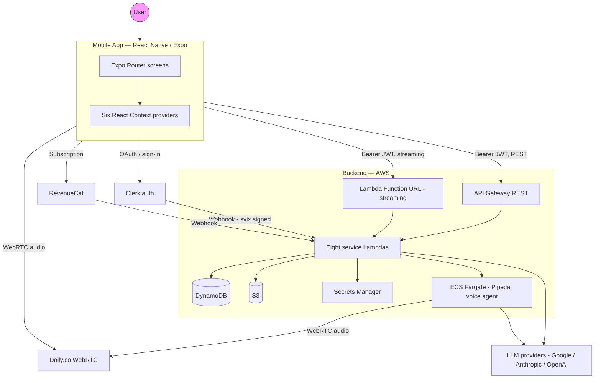

# Menthera

Menthera is a voice-enabled AI companion for mental health conversations — a full-stack product built end-to-end as a single cohesive system. Users have streaming text chats and real-time voice calls with AI personas, complete structured psychometric quests across five life domains, and track their progress through achievements and engagement streaks.

This repository contains both halves of the system: the AWS backend and the React Native mobile app.

```
menthera/
├── backend/    ← AWS CDK + TypeScript Lambdas + Python voice agent on ECS
└── mobile/     ← React Native + Expo 54, iOS and Android
```

Each half has its own detailed README. This top-level document is the system story — how the pieces fit together, why the architecture is what it is, and what a reviewer should understand in the first five minutes.

---

## Table of contents

- [What the product does](#what-the-product-does)
- [The full system at a glance](#the-full-system-at-a-glance)
- [End-to-end user journey](#end-to-end-user-journey)
- [Technology choices, summarised](#technology-choices-summarised)
- [What I think is interesting about this codebase](#what-i-think-is-interesting-about-this-codebase)
- [Repository layout](#repository-layout)
- [Running the system locally](#running-the-system-locally)
- [License](#license)

---

## What the product does

Menthera lets a user:

1. **Sign in** via Clerk (email or OAuth) on an iOS or Android device.
2. **Pick an AI persona** from a list of curated agents, each with different personalities tuned for supportive mental health dialogue.
3. **Chat with that persona** in a streaming text interface — the response appears token by token as the backend generates it, rendered as markdown.
4. **Place a voice call** to that persona. The call is a real-time, low-latency two-way audio conversation over WebRTC. The AI runs server-side, listens for turn endpoints, generates responses, and speaks them back in a natural voice.
5. **Complete structured quests** — psychometric assessments organised into five life domains (career, finance, health, relationships, wellness). Each quest is a guided conversation with an agent that asks you questions, scores your answers, and returns a report.
6. **Earn achievements and build streaks** for daily activity, completed quests, and conversation milestones.
7. **Subscribe to the BYOK (Bring Your Own Key) tier** via RevenueCat to get unlimited usage by providing their own LLM API key.

The mobile app is the only client surface. Everything the user sees runs on their phone. Everything else — authentication, state persistence, AI inference, voice pipeline, subscription logic — runs in AWS.

---

## The full system at a glance



**Two HTTP paths, not one.** The mobile app talks to the backend over **two separate HTTP surfaces**:

- **API Gateway REST** for everything that is a normal request/response — user CRUD, agents list, call initiation, quest sessions, history, achievements, engagement.
- **Lambda Function URL with streaming** for the chat endpoint specifically. API Gateway REST on AWS does not support response streaming, so the chat Lambda is exposed directly via a Function URL in `RESPONSE_STREAM` invoke mode. This is why the mobile `.env` needs both `EXPO_PUBLIC_BASE_URL` and `EXPO_PUBLIC_CHAT_URL` — they are different hosts serving different purposes.

**Voice calls run on ECS, not Lambda.** Lambda is the wrong tool for voice calls: it can't hold long-lived WebRTC connections, and the voice pipeline (Whisper-based turn detection via Smart Turn v3, TTS, LLM inference) wants a Python runtime with PyTorch. ECS Fargate gives us containers that live for the duration of a call, run the Pipecat voice framework natively, and tear down cleanly when the user hangs up.

**Authentication is Clerk, everywhere.** The mobile app signs users in with Clerk, gets a JWT, and attaches it as a `Bearer` token on every request. The backend validates the JWT using `@clerk/backend` inside a Hono middleware. When users sign up, Clerk fires a webhook to the backend, which upserts the user into DynamoDB. Signature verification on the webhook uses `svix` to prevent spoofing, and an idempotency table prevents double-processing on Clerk retries.

---

## End-to-end user journey

Following what happens when a user opens the app and has a voice conversation with an agent — touching every layer in the system:

### 1. App launch (mobile)

`app/_layout.tsx` mounts the Clerk provider with the publishable key from `EXPO_PUBLIC_CLERK_PUBLISHABLE_KEY`. It then composes six React Context providers (`AppProvider`, `AgentsProvider`, `AgentPreferencesProvider`, `ChatProvider`, `EngagementProvider`, `QuestProvider`) around the Expo Router `<Slot />`, so every route has access to the same state tree. If there's no cached Clerk session, the router redirects to `app/auth/welcome.tsx`.

### 2. Sign-in (mobile → Clerk → backend)

The user signs in via email or OAuth (Google / Apple) through `expo-auth-session`. Clerk issues a JWT which is cached in `expo-secure-store`. **Clerk also fires a `user.created` webhook to the backend**, which the `UsersStack` Lambda receives:

1. `svix` verifies the webhook signature against the Clerk signing secret.
2. The event ID is checked against `webhookIdempotencyTable` — if already processed, return early.
3. Otherwise, the user is upserted into the `users` DynamoDB table, the event ID is recorded, and the handler returns 200.

The mobile app now has a JWT and a corresponding user row in DynamoDB.

### 3. Picking an agent (mobile → API Gateway → Lambda → DynamoDB)

`AgentsProvider` fetches the list of agents from `GET /agents` on API Gateway. The request carries the Clerk JWT in the Authorization header. The `AgentsStack` Lambda validates the token via Hono middleware, reads the `agents` table in DynamoDB, and streams the response back. The provider caches the list.

### 4. Starting a voice call (mobile → API Gateway → CallStack → ECS + Daily)

The user taps "Start Call" on an agent screen. `useStartCall` posts to `POST /call` with the agent ID. The `CallStack` Lambda:

1. Validates the JWT.
2. Checks `rateLimitsTable` to prevent abuse.
3. Calls Daily.co's API to create a new room, receiving a room URL.
4. Creates a call record in the `calls` table.
5. Launches an ECS Fargate task running the Pipecat container, passing the room URL and call metadata as environment variables.
6. Returns the room URL to the mobile client.

Meanwhile, the mobile client navigates to `app/call/[agentId].tsx` and joins the same Daily room using `@daily-co/react-native-daily-js`. Two participants are now in the room: the user's phone and the ECS-side Pipecat container.

### 5. The voice conversation (ECS Pipecat ↔ Daily ↔ mobile)

Inside the ECS task, `pipecat/bot.py` runs the Pipecat pipeline. The stages are roughly:

1. **Silero VAD** detects when the user is speaking.
2. **Smart Turn v3** (a Whisper-based model) detects when the user has finished their turn.
3. The user's transcribed text is sent to an **LLM** (Google Gemini, Anthropic Claude, or OpenAI — configured per deployment).
4. The LLM response is sent to **Cartesia** (or ElevenLabs) for text-to-speech.
5. The synthesized audio is published back into the Daily room.

The audio flows through Daily's SFU peer-to-peer from ECS to the phone. Low latency, full duplex, no custom WebRTC code on the mobile side — Daily handles that.

### 6. Ending the call (mobile → backend → ECS cleanup)

When the user leaves the call screen, an `AuthGuard` effect in the mobile app fires `POST /call/:id/user-left`. The `CallStack` receives this and stops the ECS task immediately — preventing quota waste if the user backgrounds the app or drops their connection. A separate post-call processor Lambda writes the final call record with duration and metrics.

### 7. Engagement and achievements (automatic, server-side)

Every interaction — message sent, call completed, quest finished — writes to the `userActivityTable`. `EngagementStack` Lambdas compute streak values and roll them up to `userStreaksTable`. `AchievementsStack` Lambdas check unlock conditions across messaging, calls, and quest activity and write to `userAchievementsTable`. The mobile app's `EngagementProvider` reads these tables to render the home screen.

That single user journey — app launch to call end — touches **every** component in the system: all eight service stacks, three DynamoDB tables, Secrets Manager, S3, ECS Fargate, Daily.co, Clerk, and an LLM provider. There's no part of this repository that isn't exercised by that one flow.

---

## Technology choices, summarised

| Layer | Choice | Why |
| --- | --- | --- |
| **Mobile framework** | Expo 54 with the new architecture and Expo Router | File-based routing is the fastest path from "I want a new screen" to working code, and Expo 54's new arch gives us Fabric + TurboModules with minimal config |
| **Mobile state** | Six React Context providers, no global store | Small enough surface area that Redux / Zustand would be overkill. Each provider is 100–300 lines and reads like plain React |
| **Mobile styling** | NativeWind for new code, twrnc for older code, custom design tokens | NativeWind matches the Tailwind-on-web experience; twrnc predates the NativeWind adoption and is kept working rather than force-migrated |
| **Backend framework** | AWS CDK v2 with TypeScript | Infrastructure-as-code end to end. Every table, every Lambda, every IAM role is provisioned from code, and the whole stack can be `cdk deploy --all` in one command |
| **Backend runtime** | Node.js Lambdas running Hono | Hono is lightweight, has excellent TypeScript types, and is Lambda-friendly (no long-lived state, tree-shakable, fast cold starts) |
| **Streaming chat** | Lambda Function URL with `RESPONSE_STREAM` invoke mode | API Gateway REST can't stream responses. Function URL is the only native AWS option for streaming LLM tokens from a Lambda |
| **Voice pipeline** | Python Pipecat running on ECS Fargate | Needs long-lived processes for WebRTC, and the Python ML ecosystem (PyTorch + Whisper) for turn detection. Wrong shape for Lambda |
| **Database** | DynamoDB with 13+ tables, shaped around access patterns | Single-table-per-entity pattern. Writes scale, reads are cheap, and we never need cross-entity joins — the access patterns are known upfront |
| **Auth** | Clerk + `svix`-verified webhooks + idempotency table | Clerk owns the hard parts (password hashing, OAuth, MFA) and we subscribe to changes via webhooks rather than polling |
| **LLM provider abstraction** | Vercel AI SDK (`ai` package) with provider plugins for Google, Anthropic, OpenAI | One API, three providers, and trivial to add more. Streaming is first-class |
| **Long-term memory** | mem0 | Conversational context persistence across sessions without us implementing an embedding store from scratch |
| **Subscriptions** | RevenueCat with `react-native-purchases-ui` for the native paywall | The hosted paywall means pricing iterations don't require mobile releases |
| **WebRTC** | Daily.co | SFU, recording, low latency, and a mobile SDK that just works — the right scope of problem to buy rather than build |

---

## What I think is interesting about this codebase

A few things I'd point at if someone asked "what's worth looking at":

**The two HTTP surfaces problem.** Most apps have one backend. Menthera has two — API Gateway for everything and a Function URL for chat streaming specifically — because AWS doesn't support streaming responses on API Gateway REST. The mobile `.env.example` documents both endpoints explicitly, the sub-READMEs explain the split, and `ChatProvider` reads `EXPO_PUBLIC_CHAT_URL` while everything else reads `EXPO_PUBLIC_BASE_URL`. This is the kind of constraint that doesn't show up in tutorials and only becomes real when you actually ship streaming LLM responses on AWS.

**Fourteen CDK stacks, deliberately.** The backend is organised into 6 core infrastructure stacks and 8 service stacks, rather than one mega-stack. The payoff is independent deploys and small blast radius — a failed deploy in `QuestStack` cannot affect `CallStack`. The cost is explicit cross-stack wiring through props in `bin/menthera-app.ts`, which is visible and type-checked. See `backend/bin/menthera-app.ts` for the full wiring.

**`deploy: false` on API Gateway.** A common multi-stack API Gateway gotcha is the circular dependency between the gateway construct (which wants to deploy itself with all its methods) and the service stacks (which add methods to the gateway). The fix is creating the `RestApi` with `deploy: false` and then having a separate `DeploymentStack` that depends on every service stack and handles the deployment explicitly. This is in `backend/lib/stacks/core/api-gateway-stack.ts` and `backend/lib/stacks/core/deployment-stack.ts`.

**Secrets Manager placeholder bootstrap.** `SharedResourcesStack` creates the application secret with literal placeholder strings like `"REPLACE_WITH_ACTUAL_CLERK_SECRET_KEY"` — no real values ever enter the code or CDK context. Operators rotate the values out-of-band on first deploy. This is what makes the backend safe to open-source: there's no secret in the codebase, past, present, or future, because the infrastructure provisions shells that real values are injected into later.

**The `user-left` edge case.** Voice calls on ECS cost real money per minute, and a user backgrounding the app mid-call would leak compute. `components/auth/AuthGuard.tsx` fires a `POST /call/:id/user-left` on unmount, and `CallStack` uses that signal to stop the ECS task immediately. It's the kind of bug that only shows up in production and costs real money if you miss it.

**Theme composition layer, not a shim.** `mobile/constants/Theme.tsx` was previously labelled `DEPRECATED` which was misleading — it's 337 lines of actively-used code that composes a component-facing theme API on top of the raw design tokens in `lib/styles/core/tokens`, and includes style helpers (`buttonStyles`, `inputStyles`, `cardStyles`) plus the `ThemeProvider` React context. The label has been corrected. This is a small example of a bigger pattern: separating primitive design tokens from their component-shaped presentation lets you rename or restructure the primitives without touching component code.

---

## Repository layout

```
menthera/
├── README.md                        ← this file (full-system story)
├── LICENSE
├── backend/                         ← AWS CDK + Node.js Lambdas + Python voice agent
│   ├── README.md                    ← deep dive on the backend
│   ├── bin/menthera-app.ts          ← CDK app entry, wires 14 stacks
│   ├── lib/stacks/                  ← 6 core + 8 service stacks
│   ├── src/services/                ← Lambda handlers per service
│   ├── src/shared/                  ← shared runtime utilities
│   ├── seed/                        ← agent personas + quest definitions
│   ├── pipecat/                     ← Python voice agent (ECS Fargate container)
│   └── test/                        ← Jest tests
└── mobile/                          ← React Native + Expo 54
    ├── README.md                    ← deep dive on the mobile app
    ├── app/                         ← Expo Router screens (file-based routing)
    ├── providers/                   ← six React Context providers
    ├── components/                  ← UI component library
    ├── hooks/                       ← custom hooks
    ├── lib/                         ← API client, Clerk, RevenueCat, design tokens
    └── constants/                   ← Colors + Theme composition layer
```

**The two halves have no shared code**, no workspace linking, no monorepo tooling. You can `cd backend/ && npm install` or `cd mobile/ && npm install` and each directory works as a fully standalone project. The monorepo here is about narrative cohesion — they belong in the same repo because they are the same product — not about tooling integration.

---

## Running the system locally

Menthera is two independently-runnable projects living in the same repository. You don't have to run both at once to develop or review one of them.

**To explore the backend:**
```bash
cd backend
# Read backend/README.md for full setup
cat README.md
```

**To explore the mobile app:**
```bash
cd mobile
# Read mobile/README.md for full setup
cat README.md
```

Each sub-README contains prerequisites, environment variable documentation, the commands to install and run the project, and a "before first production deploy" / "before first production build" checklist calling out the work that remains before the code is genuinely production-ready.

If you want to run the **full system** end to end, you need to deploy the backend to your own AWS account first (so you have a real API URL and Chat URL), then point the mobile `.env` at your deployed backend. The sub-READMEs explain both halves.

---

## License

To be added.
