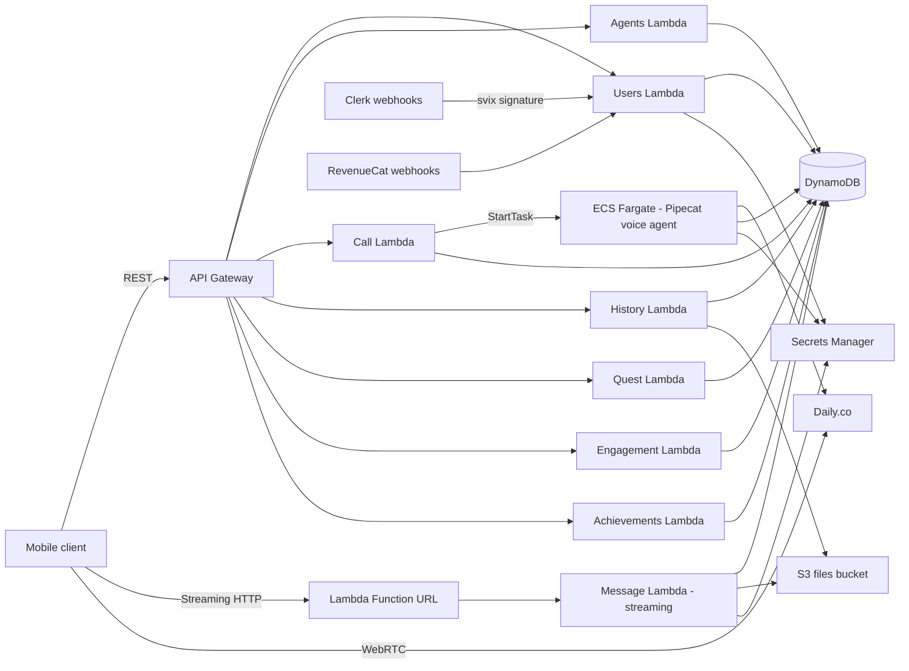

# Menthera Backend

Serverless AWS backend for Menthera — a voice-enabled AI companion for mental health conversations. Built as an AWS CDK application with TypeScript Lambdas behind API Gateway, a Python Pipecat voice agent running on ECS Fargate, DynamoDB for state, Clerk for authentication, and the Vercel AI SDK for LLM integration.

This is the backend half of the Menthera system. The mobile app (React Native + Expo) is the sibling `../mobile/` directory in this monorepo. For a full-system overview covering how both halves fit together, see the top-level [`README.md`](../README.md).

---

## Table of contents

- [What this is](#what-this-is)
- [Architecture at a glance](#architecture-at-a-glance)
- [Tech stack](#tech-stack)
- [Project structure](#project-structure)
- [How it works](#how-it-works)
- [Key design decisions](#key-design-decisions)
- [Getting started](#getting-started)
- [Configuration reference](#configuration-reference)
- [Before first production deploy](#before-first-production-deploy)
- [What is not in this repository](#what-is-not-in-this-repository)
- [License](#license)

---

## What this is

Menthera lets users have voice calls and text conversations with AI personas tuned for supportive mental health dialogue. Users also complete structured psychometric quests, earn achievements, and build engagement streaks. The backend owns everything server-side:

- **Authentication and user management** via Clerk, with webhook-driven user lifecycle.
- **Text chat** with streaming LLM responses via a Lambda Function URL.
- **Voice calls** via Daily.co WebRTC, with a Pipecat voice pipeline running on ECS Fargate.
- **Structured quests** with multiple categories (career, finance, health, relationships, wellness), each containing psychometric tasks and scoring.
- **Engagement tracking** — user activity, streaks, and achievements.
- **Long-term memory** via mem0 so agents can remember context across sessions.
- **Subscription and billing integration** via RevenueCat webhooks.

The whole stack is infrastructure-as-code. A single `cdk deploy --all` provisions everything: DynamoDB tables, Lambda functions, API Gateway, Secrets Manager entries, S3 buckets, Route53 records, ACM certificates, ECS cluster, IAM roles, and GitHub Actions OIDC provider.

---

## Architecture at a glance



The system is organized into **fourteen CDK stacks** split across two layers:

**Core infrastructure stacks (6):**

| Stack | Responsibility |
| --- | --- |
| `OidcStack` | GitHub Actions OIDC provider for CI deploys |
| `DatabaseStack` | All DynamoDB tables (users, agents, calls, messages, quest sessions, achievements, streaks, rate limits, webhook idempotency, etc.) |
| `SharedResourcesStack` | Central Secrets Manager entry and the shared S3 files bucket |
| `ApiGatewayStack` | The shared REST API Gateway that every service stack attaches to |
| `Route53Stack` | Hosted zone, ACM certificates, and CloudFront distribution for the chat subdomain |
| `DeploymentStack` | API Gateway deployment plus domain name mapping and API A record — kept separate to break circular dependencies between service stacks and the gateway deployment |

**Service stacks (8):**

| Stack | Responsibility |
| --- | --- |
| `UsersStack` | User CRUD, Clerk and RevenueCat webhook handlers, subscription management |
| `AgentsStack` | AI persona management (personalities the user can talk to) |
| `CallStack` | Voice call lifecycle — request validation, Daily room creation, ECS task launch, user-left signal, post-call processing |
| `HistoryStack` | Read APIs for past calls and messages |
| `QuestStack` | Quest definitions, sessions, and scoring for psychometric tasks |
| `EngagementStack` | User activity tracking and streak calculation |
| `AchievementsStack` | Achievement unlock logic across messaging, calls, and quests |
| `MessageStack` | Text chat. Uses a Lambda Function URL with `RESPONSE_STREAM` invoke mode so the LLM can stream tokens directly to the client — something API Gateway does not support |

Cross-stack wiring happens explicitly through stack props. Each service stack receives the tables it needs from `DatabaseStack`, the secrets and bucket it needs from `SharedResourcesStack`, and the REST API reference from `ApiGatewayStack`. This keeps each stack's blast radius small and makes it obvious which resources a given service touches.

---

## Tech stack

**Infrastructure**
- AWS CDK v2 with TypeScript
- AWS Lambda (Node.js runtime) for request handlers
- API Gateway REST API for authenticated endpoints
- Lambda Function URL (streaming mode) for chat
- ECS Fargate for the Pipecat voice agent
- DynamoDB for all persistent state
- S3 for file storage
- AWS Secrets Manager for third-party API keys
- Route53 and ACM for domains and certificates
- CloudWatch for logging and metrics

**Application runtime**
- [Hono](https://hono.dev/) as the lightweight HTTP framework running inside each Lambda
- [Clerk](https://clerk.com/) for authentication, with `@hono/clerk-auth` middleware and JWT verification
- [svix](https://www.svix.com/) for Clerk webhook signature verification
- [Vercel AI SDK](https://sdk.vercel.ai/) (`ai` package) with provider plugins for Anthropic, Google, and OpenAI models
- [mem0](https://mem0.ai/) for long-term conversational memory

**Voice pipeline (Python, in `pipecat/`)**
- [Pipecat](https://github.com/pipecat-ai/pipecat) `0.0.104` with the `daily`, `google`, `cartesia`, `silero`, `openai`, and `anthropic` extras
- PyTorch CPU build for Smart Turn v3 (the Whisper feature extractor used for turn detection)
- boto3 for AWS integration from the ECS task

**Testing**
- Jest with `ts-jest`

---

## Project structure

```
Menthera-Backend/
├── bin/
│   └── menthera-app.ts          # CDK app entry — wires all 14 stacks together
├── lib/
│   └── stacks/
│       ├── core/                # Infrastructure stacks
│       │   ├── database-stack.ts
│       │   ├── shared-resources-stack.ts
│       │   ├── api-gateway-stack.ts
│       │   ├── route53-stack.ts
│       │   ├── deployment-stack.ts
│       │   └── oidc-stack.ts
│       ├── users-stack.ts       # Service stacks
│       ├── agents-stack.ts
│       ├── call-stack.ts
│       ├── history-stack.ts
│       ├── quest-stack.ts
│       ├── engagement-stack.ts
│       ├── achievements-stack.ts
│       └── message-stack.ts
├── src/
│   ├── services/                # Lambda handler code, one folder per service
│   │   ├── users/               #   api.ts, webhook-processor.ts
│   │   ├── agents/
│   │   ├── call/                #   handler.ts, processor.ts, health.ts, user-left-handler.ts
│   │   ├── history/
│   │   ├── message/             #   api.ts, chat-helpers.ts
│   │   ├── quests/
│   │   ├── engagement/
│   │   └── achievements/
│   └── shared/                  # Shared runtime code across all services
│       ├── auth-middleware.ts   #   Clerk JWT validation
│       ├── clients/             #   AWS SDK client factories
│       ├── config/              #   Timeouts, quotas, and feature flags
│       ├── enum/
│       ├── external-apis/       #   Wrappers for Daily, ElevenLabs, mem0, etc.
│       ├── services/            #   Shared service-layer classes
│       └── utils/               #   Response builders, metrics, clerk-lambda-auth
├── seed/
│   ├── agents.ts                # Seed data for default AI personas
│   ├── quests.ts
│   └── quests/                  # One subdirectory per quest category
│       ├── career/
│       ├── finance/
│       ├── health/
│       ├── relationships/
│       └── wellness/
├── pipecat/                     # Python voice agent (ECS Fargate container)
│   ├── bot.py                   # Pipecat pipeline definition
│   ├── main.py                  # Task entry point
│   ├── config.py
│   ├── constants.py
│   ├── db_client.py             # DynamoDB access from Python
│   ├── Dockerfile
│   └── requirements.txt
├── test/                        # Jest tests
├── .env.example
├── cdk.json
├── package.json
└── tsconfig.json
```

---

## How it works

### Authentication flow

1. The mobile client signs the user in via Clerk and receives a JWT.
2. The client attaches the JWT as a `Bearer` token on every request to the backend.
3. Lambda handlers validate the JWT using `@clerk/backend` inside a Hono middleware (`src/shared/auth-middleware.ts`).
4. User creation and updates come through Clerk webhooks, not from the client. The `UsersStack` webhook handler verifies the webhook signature with `svix` and then upserts the user into DynamoDB. A dedicated `webhookIdempotencyTable` prevents double-processing on Clerk retries.

### Text chat flow

1. The client sends a chat request to the `MessageStack` Lambda Function URL — not to API Gateway.
2. The handler validates the Clerk token (since Function URLs do not have API Gateway's built-in auth) and loads the conversation context from DynamoDB and mem0.
3. It calls the Vercel AI SDK with the selected provider (Google, Anthropic, or OpenAI depending on configuration) and streams the response.
4. `RESPONSE_STREAM` invoke mode on the Function URL sends tokens back to the client as they are generated, so the user sees the response appear in real time.
5. On completion, the message is persisted to the `messages` table and mem0 is updated for long-term memory.

Function URL with streaming is used here because API Gateway REST APIs do not support streaming responses. This is the single most important reason the chat path lives outside the main API Gateway.

### Voice call flow

1. The client requests a new call through `CallStack` via API Gateway.
2. The Lambda validates the request, checks rate limits against `rateLimitsTable`, creates a Daily.co room via the Daily API, and stores a call record.
3. The same Lambda launches an ECS Fargate task running the Pipecat container, passing the room URL and call metadata.
4. The client joins the Daily room via WebRTC.
5. The Pipecat task connects to the same room, runs the full voice pipeline (Silero VAD → Whisper-based turn detection → LLM → TTS via Cartesia or similar), and streams audio back into the Daily room.
6. When the user leaves or the call ends, a `user-left` signal fires a cleanup Lambda, the ECS task stops, and a post-call processor writes the call transcript and metrics.

### Quest flow

1. Quest definitions are seeded into `questDefinitionsTable` from `seed/quests/`.
2. The client fetches available quests from `QuestStack`.
3. When the user starts a quest, a session is created in `questSessionsTable`.
4. Individual task responses are collected through the `MessageStack` chat interface (so every quest is a conversation with an agent).
5. On completion, `QuestStack` computes scores based on the psychometric scoring rules declared in the quest's meta file.

---

## Key design decisions

### Stack per service

Each service is its own CDK stack. This is more verbose than bundling everything into one stack, but it buys two things that matter for a long-lived project:

1. **Independent deploys** — fixing a bug in the quest service does not redeploy the call service.
2. **Small blast radius** — a CloudFormation failure in one service stack cannot roll back or interfere with another. Stacks fail in isolation.

The cost is cross-stack wiring through props, which is visible in `bin/menthera-app.ts`. We accept that cost because the wiring is explicit and type-checked.

### API Gateway is created with `deploy: false`

`ApiGatewayStack` creates the REST API but sets `deploy: false` on the construct. A separate `DeploymentStack` handles the deployment and depends on every service stack. This breaks the circular dependency that would otherwise exist: service stacks add methods to the API, the deployment references those methods, and the gateway construct would otherwise try to deploy itself at creation time with no methods attached. Splitting the deployment out is the canonical CDK pattern for multi-stack API Gateways.

### Lambda Function URL for chat instead of API Gateway

API Gateway does not support streaming responses. The chat endpoint needs to stream LLM tokens to the client as they are generated, so it uses a Lambda Function URL with `InvokeMode.RESPONSE_STREAM`. The trade-off is that Function URLs do not get API Gateway's built-in authorization, so the Lambda validates the Clerk JWT itself. CORS is handled by `defaultCorsPreflightOptions` for API Gateway paths and by the Function URL's own `cors` configuration for the streaming endpoint — both driven by the same `ALLOWED_ORIGINS` environment variable.

### Secrets Manager placeholder bootstrap

`SharedResourcesStack` provisions the application secret with placeholder values like `REPLACE_WITH_ACTUAL_CLERK_SECRET_KEY`. The infrastructure creates the secret shell, but real values are never committed to code or passed through CDK context. An operator rotates each value through the AWS console or CLI after the first deploy. This lets the repository be public without any secret ever touching source control.

### ECS Fargate for the voice agent, not Lambda

The Pipecat voice pipeline needs long-lived processes, persistent WebRTC connections to Daily, and the Python ML ecosystem (PyTorch with Whisper for Smart Turn v3). Lambda is wrong for all three. ECS Fargate gives us containers with minute-to-hour lifetimes, which matches the duration of a voice call, and lets us run the full Pipecat stack with its native Python dependencies.

### Idempotency tables for webhooks

Clerk and RevenueCat webhooks both retry on non-2xx responses, and a retried write that already succeeded would cause duplicate user records or billing events. `webhookIdempotencyTable` stores a hash of every webhook event ID we process, and handlers return early if the event is already recorded.

---

## Getting started

### Prerequisites

- Node.js 20 or later
- npm (or pnpm / yarn if you prefer — lockfile is npm)
- AWS CLI configured with credentials that have CDK deploy permissions
- AWS CDK v2 installed globally (`npm install -g aws-cdk`)
- An AWS account with CDK bootstrapped in your target region (`cdk bootstrap`)
- Python 3.11+ and Docker if you intend to build and run the Pipecat image locally
- Accounts and API keys for: Clerk, Daily.co, at least one LLM provider (Google / Anthropic / OpenAI), and the optional providers you want to enable (ElevenLabs, Cartesia, mem0, RevenueCat)

### First setup

```bash
# Clone and install
git clone <your-fork-url>
cd Menthera-Backend
npm install

# Copy env template and fill in your values
cp .env.example .env
# Edit .env — at minimum set ALLOWED_ORIGINS
```

### Synthesize and deploy

```bash
# Synthesize the CloudFormation templates
npx cdk synth

# Deploy everything
npx cdk deploy --all

# Or deploy a single stack
npx cdk deploy MentheraDatabase
```

**Important:** the first synth will fail with a clear error if `ALLOWED_ORIGINS` is not set. This is intentional — the API Gateway stack refuses to synth with wide-open CORS. Set the env var and retry.

### Rotate the bootstrapped secrets

After the first deploy, Secrets Manager contains an entry called `menthera-secret` with placeholder values. Every key that begins with `REPLACE_WITH_ACTUAL_` needs to be rotated before the backend is functional:

```bash
aws secretsmanager get-secret-value --secret-id menthera-secret
# Edit the JSON and update with real values, then:
aws secretsmanager update-secret --secret-id menthera-secret --secret-string '{...}'
```

See `lib/stacks/core/shared-resources-stack.ts` for the full list of keys that need real values.

### Running tests

```bash
npm test
```

---

## Configuration reference

### Environment variables

All environment variables used by the CDK app at synth time are documented in `.env.example`. The critical ones:

| Variable | Required | Description |
| --- | --- | --- |
| `ALLOWED_ORIGINS` | Yes | Comma-separated list of allowed CORS origin URLs. The API Gateway stack refuses to synth if this is unset. |
| `DOMAIN_NAME` | Yes for prod | Root domain for Route53 hosted zone and certs |
| `API_DOMAIN` | Yes for prod | Subdomain for the API Gateway |
| `AWS_REGION` | Yes | AWS region to deploy into |
| `CDK_DEFAULT_ACCOUNT` | Yes | AWS account ID (picked up automatically from CLI credentials) |
| `ENVIRONMENT` | No | `dev`, `staging`, or `prod` — drives naming and retention policies |

### Application secrets

Runtime API keys are **not** environment variables. They live in AWS Secrets Manager under the `menthera-secret` entry. The full set of keys is defined in `shared-resources-stack.ts`. Lambdas fetch them via the `@aws-sdk/client-secrets-manager` at cold start.

### CORS origins and lambda wiring

`ALLOWED_ORIGINS` is read in two places:

1. **At synth time** in `api-gateway-stack.ts` to configure the API Gateway CORS preflight response.
2. **At Lambda runtime** in `src/shared/utils/response-builder.ts` to set the `Access-Control-Allow-Origin` header on individual responses.

For the runtime read to work, each Lambda `Function` construct in the service stacks needs to pass `ALLOWED_ORIGINS` in its `environment` block. **This wiring is not yet complete across all service stacks** — see the note comment in `response-builder.ts`. Completing this is a required step before the first production deploy.

---

## Before first production deploy

A checklist of things that must happen before this backend is production-ready. Every item here is either a known incomplete piece or an operator action that cannot be committed to code:

- [ ] Set `ALLOWED_ORIGINS` in the deployment environment to the real client origins
- [ ] Set `DOMAIN_NAME` and `API_DOMAIN` to the real domain
- [ ] Verify every Lambda `Function` definition in `lib/stacks/*-stack.ts` passes `ALLOWED_ORIGINS` in its `environment` property — see the follow-up note in `src/shared/utils/response-builder.ts`
- [ ] Rotate every `REPLACE_WITH_ACTUAL_*` placeholder in the `menthera-secret` Secrets Manager entry
- [ ] Register the domain with Route53 or delegate NS records to the CDK-created hosted zone
- [ ] Build and push the Pipecat Docker image from `pipecat/` to ECR before the first `CallStack` deploy that references it
- [ ] Configure Clerk production instance and set the webhook endpoint to the `/users/webhook` URL
- [ ] Configure RevenueCat webhook endpoint and signing secret
- [ ] Review `cdk.json` context values for any account-specific overrides
- [ ] Set up CloudWatch alarms for Lambda errors, API Gateway 5xx rates, and ECS task failures

---

## What is not in this directory

- **The Menthera mobile app** — React Native with Expo. Lives at `../mobile/` in this monorepo.
- **The Menthera marketing website** — not open-sourced.
- **Any customer data, conversation transcripts, or production secrets.** Seed data in `seed/` is synthetic content used to bootstrap agent personas and quest definitions.
- **Production AWS account IDs, real domain names, or ARNs.** The `cdk.context.json` file is intentionally gitignored; CDK will regenerate it locally on your first synth.

---

## License

See the [LICENSE](../LICENSE) file at the monorepo root.
