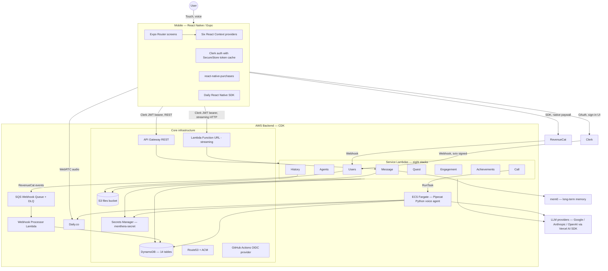

# Architecture

This document describes the Menthera system architecture in technical depth. It is intended for a reader who already knows what Menthera does (see the top-level [`README.md`](../README.md) for that) and now wants to understand **how the pieces fit together, why the boundaries are drawn where they are, and what the non-obvious design decisions were**.

Everything in this document is verified against the actual code in this repository. File paths are clickable and take you straight to the source.

---

## Table of contents

- [Scope and non-goals](#scope-and-non-goals)
- [High-level topology](#high-level-topology)
- [The two HTTP surfaces](#the-two-http-surfaces)
- [Stack layering](#stack-layering)
- [Cross-stack wiring](#cross-stack-wiring)
- [The `deploy: false` pattern](#the-deploy-false-pattern)
- [Data layer](#data-layer)
- [Secrets and identity](#secrets-and-identity)
- [Async vs sync processing](#async-vs-sync-processing)
- [Deployment order](#deployment-order)
- [Known architectural gaps](#known-architectural-gaps)

---

## Scope and non-goals

**In scope:** how the backend stacks are organised and wired, how the mobile app talks to the backend, how data flows through the system, and what the architectural trade-offs are.

**Not in scope:** feature-specific walkthroughs (those live in [`features/`](./features/)), the frontend component tree (that is [`mobile/README.md`](../mobile/README.md)'s territory), and operational topics like monitoring or incident response.

---

## High-level topology



Three things in this topology matter more than everything else:

1. **The backend has two HTTP entry points**, not one. API Gateway for REST; a Lambda Function URL for streaming chat.
2. **Voice calls are the only component that does not run on Lambda.** They run on ECS Fargate because Lambda cannot hold long-lived WebRTC connections or run Python ML models.
3. **Every service stack is its own CloudFormation stack.** The backend is fourteen stacks total, deployed independently, with explicit cross-stack wiring through props.

Everything else follows from those three decisions.

---

## The two HTTP surfaces

The backend exposes two HTTP paths to the mobile client, and this is the single most important thing to understand about the architecture.

### Surface 1 — API Gateway REST

File: [`backend/lib/stacks/core/api-gateway-stack.ts`](../backend/lib/stacks/core/api-gateway-stack.ts)

A single `RestApi` construct with all the authenticated REST endpoints. Routes are added to it by each of the eight service stacks. The mobile client hits it at `EXPO_PUBLIC_BASE_URL` for everything that is a normal request/response interaction: user CRUD, agent listing, call initiation, quest sessions, history, achievements, engagement.

### Surface 2 — Lambda Function URL with streaming

File: [`backend/lib/stacks/message-stack.ts`](../backend/lib/stacks/message-stack.ts)

A **separate** Lambda with `FunctionUrl` attached and `InvokeMode.RESPONSE_STREAM` enabled. The mobile client hits this at `EXPO_PUBLIC_CHAT_URL`, which is a completely different host from the REST API.

### Why two surfaces?

**API Gateway REST does not support response streaming.** Period. This is the limitation that forces the whole split. When you want an LLM's tokens to stream to the client as they are generated — not buffer the whole response and then send it — API Gateway REST is the wrong tool. Your only first-class AWS option for streaming from a Lambda is a Function URL with `RESPONSE_STREAM` invoke mode.

The alternatives were all worse:

- **WebSockets via API Gateway** — supported, but a totally different programming model (connection IDs, connect/disconnect lifecycle, message routing through another Lambda). Feels wrong for a stateless stream of tokens.
- **HTTP API with streaming** — HTTP API (v2) does not support streaming either.
- **Application Load Balancer + Lambda** — technically possible but adds an ALB for one endpoint.
- **Buffering the LLM response and sending once** — defeats the point. Users would wait 3–8 seconds staring at a loading spinner instead of seeing the response appear token by token.

Function URL with `RESPONSE_STREAM` is the clean answer, and it happens once in the system, for the chat Lambda specifically. Everything else is API Gateway.

### The Function URL is behind CloudFront with OAC

The chat Function URL is not exposed to the internet directly. It is created with `FunctionUrlAuthType.AWS_IAM` — meaning only IAM-signed requests can invoke it — and a CloudFront distribution sits in front of it, configured with Origin Access Control (OAC) so CloudFront can sign requests to the origin:

```typescript
// backend/lib/stacks/core/route53-stack.ts (excerpt)
this.chatDistribution = new cloudfront.Distribution(this, 'ChatDistribution', {
  defaultBehavior: {
    origin: FunctionUrlOrigin.withOriginAccessControl(messageFunctionUrl),
    viewerProtocolPolicy: cloudfront.ViewerProtocolPolicy.REDIRECT_TO_HTTPS,
    cachePolicy: cloudfront.CachePolicy.CACHING_DISABLED,
    // ...
  },
  domainNames: [chatSubdomain],
  certificate: chatCertificate,
});
```

The mobile client hits `chat.<domain>` (a Route53 A record aliased to CloudFront). CloudFront terminates TLS with an ACM cert, signs the upstream request to the Function URL with OAC, and proxies the streaming response back. The Function URL host is never touched directly by clients — a `curl` to the raw Function URL would return 403.

This is the same pattern as CloudFront → S3 with OAC, but applied to Lambda. It gives you:

- A clean custom domain (`chat.yourdomain.com` instead of the AWS-generated Function URL hostname)
- TLS termination with your own certs
- Origin isolation — the actual Function URL never sees internet traffic
- A single edge point for WAF rules, if you add them later

Caching is disabled (`cachePolicy: CachePolicy.CACHING_DISABLED`) because chat responses are per-user and streaming — there is nothing to cache. CloudFront is used purely for routing and origin protection, not for caching.

### Consequences of the split

The mobile app has to know about both surfaces. It reads `EXPO_PUBLIC_BASE_URL` (or `EXPO_PUBLIC_API_URL`) for REST calls and `EXPO_PUBLIC_CHAT_URL` for streaming chat. You can see this in [`mobile/providers/ChatProvider.tsx`](../mobile/providers/ChatProvider.tsx) where the chat endpoint is loaded from `EXPO_PUBLIC_CHAT_URL` specifically, while everything else reads the base URL.

**Authentication does not split.** Both the API Gateway Lambdas and the chat Function URL Lambda run Hono apps and use `@hono/clerk-auth`'s `clerkMiddleware` — full JWT signature verification in both places. The only Lambdas that use a different auth path are the call handlers in `call-stack.ts`, which are written as plain Lambda handlers (not Hono) and therefore use a lightweight helper in [`backend/src/shared/utils/clerk-lambda-auth.ts`](../backend/src/shared/utils/clerk-lambda-auth.ts). That helper has a known gap — see [Known architectural gaps](#known-architectural-gaps) and [`features/authentication.md`](./features/authentication.md#known-gap--call-handler-jwt-signature-not-verified).

---

## Stack layering

The backend is organised into **fourteen CDK stacks** split across two layers. They are all wired together in [`backend/bin/menthera-app.ts`](../backend/bin/menthera-app.ts).

### Layer 1 — Core infrastructure (6 stacks)

These stacks create shared resources that the service stacks depend on. They are deployed first and rarely change.

| Stack | File | What it owns |
| --- | --- | --- |
| `OidcStack` | [`core/oidc-stack.ts`](../backend/lib/stacks/core/oidc-stack.ts) | GitHub Actions OIDC identity provider so CI can assume an IAM role for deploys without long-lived access keys |
| `DatabaseStack` | [`core/database-stack.ts`](../backend/lib/stacks/core/database-stack.ts) | Every DynamoDB table. Fourteen tables total, exported as public readonly properties for service stacks to consume |
| `ApiGatewayStack` | [`core/api-gateway-stack.ts`](../backend/lib/stacks/core/api-gateway-stack.ts) | The shared `RestApi` construct. Created with `deploy: false` — see the [`deploy: false` pattern](#the-deploy-false-pattern) section below |
| `SharedResourcesStack` | [`core/shared-resources-stack.ts`](../backend/lib/stacks/core/shared-resources-stack.ts) | The central Secrets Manager entry (`menthera-secret`) and the shared S3 files bucket used for asset storage by multiple services |
| `Route53Stack` | [`core/route53-stack.ts`](../backend/lib/stacks/core/route53-stack.ts) | Hosted zone, ACM certificates, CloudFront distribution for the chat subdomain |
| `DeploymentStack` | [`core/deployment-stack.ts`](../backend/lib/stacks/core/deployment-stack.ts) | API Gateway `Deployment`, `Stage`, `DomainName`, `BasePathMapping`, and API A record. Depends on every service stack |

### Layer 2 — Service stacks (8 stacks)

Each service owns its own domain and is its own CloudFormation stack. Files live in [`backend/lib/stacks/`](../backend/lib/stacks/).

| Stack | File | Primary Lambdas | Webhook handling |
| --- | --- | --- | --- |
| `UsersStack` | [`users-stack.ts`](../backend/lib/stacks/users-stack.ts) | `usersHandler` (REST API + sync Clerk webhooks), `webhookProcessorHandler` (async RevenueCat webhooks via SQS) | Both — see [Async vs sync](#async-vs-sync-processing) |
| `AgentsStack` | [`agents-stack.ts`](../backend/lib/stacks/agents-stack.ts) | Agents API handler | — |
| `CallStack` | [`call-stack.ts`](../backend/lib/stacks/call-stack.ts) | Call handler, health endpoint, user-left handler, post-call processor | — |
| `HistoryStack` | [`history-stack.ts`](../backend/lib/stacks/history-stack.ts) | History read API | — |
| `QuestStack` | [`quest-stack.ts`](../backend/lib/stacks/quest-stack.ts) | Quest API, quest insights processor | — |
| `EngagementStack` | [`engagement-stack.ts`](../backend/lib/stacks/engagement-stack.ts) | Engagement API | — |
| `AchievementsStack` | [`achievements-stack.ts`](../backend/lib/stacks/achievements-stack.ts) | Achievements API | — |
| `MessageStack` | [`message-stack.ts`](../backend/lib/stacks/message-stack.ts) | Message Lambda exposed via Function URL with `RESPONSE_STREAM` | — |

### Why split by service instead of one mega-stack?

Three real wins:

1. **Independent deploys.** A change to the quest scoring logic redeploys `MentheraQuests` only. It does not touch `MentheraCall`, which means a failed synth in quests cannot stop calls from deploying.
2. **Small blast radius on failure.** CloudFormation rollbacks happen per-stack. A failed stack update in one service does not roll back another.
3. **Clear ownership.** Each service stack is the one place where all of that service's AWS resources are defined. If you want to know what the Call service needs in AWS, open `call-stack.ts` and you have the complete picture — Lambdas, permissions, environment variables, event sources, alarms.

The cost is that cross-stack wiring becomes explicit (see [Cross-stack wiring](#cross-stack-wiring) below). That cost is worth paying.

### Naming convention

Stacks are named `Menthera<Name>`: `MentheraDatabase`, `MentheraUsers`, `MentheraCall`, etc. This is set in `bin/menthera-app.ts` as the second argument to each stack constructor. The naming shows up in the AWS console, CloudFormation events, and stack ARNs.

---

## Cross-stack wiring

Because each service is its own stack, service stacks cannot directly reference resources created by other stacks. They have to import them. CDK gives you three mechanisms for this:

1. **Direct object reference via stack props** — pass the construct from one stack into another stack's props, and CDK generates CloudFormation `Export`/`Import` statements under the hood.
2. **Manual `CfnOutput` + `Fn.importValue`** — explicit exports, looked up by string name.
3. **AWS SDK calls at runtime** — resolve ARNs from Secrets Manager or SSM.

Menthera uses approach **(1)** for DynamoDB tables, Secrets Manager entries, the S3 bucket, and the Route53 hosted zone. It uses approach **(2)** implicitly for the API Gateway reference (service stacks import the `RestApi` by its ID via `RestApi.fromRestApiAttributes()`).

### Example — `UsersStack`'s wiring

[`users-stack.ts`](../backend/lib/stacks/users-stack.ts) declares this props interface:

```typescript
export interface UsersStackProps extends StackProps {
  environment: string;
  usersTable: TableV2;
  subscriptionAuditTable: TableV2;
  webhookIdempotencyTable: TableV2;
  messagesTable: TableV2;
  callsTable: TableV2;
  questSessionsTable: TableV2;
  userActivityTable: TableV2;
  userStreaksTable: TableV2;
  userAchievementsTable: TableV2;
  restApiId: string;
  rootResourceId: string;
  appSecret: Secret;
}
```

Nine DynamoDB table references, two API Gateway identifiers, and one Secret. All passed in from the outer `bin/menthera-app.ts` wiring. You can see the wiring call there:

```typescript
const usersStack = new UsersStack(app, 'MentheraUsers', {
  environment,
  usersTable: databaseStack.usersTable,
  subscriptionAuditTable: databaseStack.subscriptionAuditTable,
  webhookIdempotencyTable: databaseStack.webhookIdempotencyTable,
  messagesTable: databaseStack.messagesTable,
  callsTable: databaseStack.callsTable,
  questSessionsTable: databaseStack.questSessionsTable,
  userActivityTable: databaseStack.userActivityTable,
  userStreaksTable: databaseStack.userStreaksTable,
  userAchievementsTable: databaseStack.userAchievementsTable,
  restApiId: apiGatewayStack.apiGateway.restApiId,
  rootResourceId: apiGatewayStack.apiGateway.root.resourceId,
  appSecret: sharedResourcesStack.appSecret,
  // ...
});
```

Why does `UsersStack` need nine table references when users are only one entity? Because the users service also handles user **deletion**, and deleting a user needs to cascade delete their messages, calls, quest sessions, activity, streaks, and achievements. That cascade is one Lambda's responsibility, and CDK's grant-based permission model requires the Lambda to have explicit write access to every table it touches. Each table reference is paired with a `grantReadWriteData()` call later in the stack.

This is verbose but **it is also the entire IAM policy** for that Lambda, visible in one file. No hidden permissions, no "wonder why it works."

### Why service stacks receive table references instead of reading them at runtime

An alternative would be to have `DatabaseStack` publish table names to SSM Parameter Store or Secrets Manager, and have service Lambdas read them at cold start. That works, but it loses two things:

1. **Compile-time type safety.** `databaseStack.usersTable` is typed as `TableV2`. A typo in the name would fail at build time. A runtime SSM lookup only fails at runtime.
2. **CloudFormation dependency tracking.** By passing a `TableV2` object reference, CDK knows `UsersStack` depends on `DatabaseStack`. This shows up in the CloudFormation dependency graph and drives the deployment order automatically. Reading from SSM at runtime would hide this dependency from CDK.

The verbose wiring is the cost of those two benefits. It is visible in one place (`bin/menthera-app.ts`) and it is type-checked.

---

## The `deploy: false` pattern

This is the single cleverest CDK pattern in the backend and it is worth understanding in detail, because reviewers who have worked with CDK before will recognise the problem it solves.

### The problem

When you create an `ApiGateway.RestApi` in CDK, by default it includes a `Deployment` and `Stage`. The `Deployment` is a snapshot of all the methods defined on the API — every `addMethod()` call becomes part of that deployment. CDK auto-generates the `Deployment` at synth time.

In a multi-stack API Gateway setup, this creates a circular dependency:

1. `ApiGatewayStack` creates the `RestApi` and its auto-generated `Deployment`.
2. `UsersStack` imports the API Gateway and calls `addMethod()` to add `/users` routes.
3. The `Deployment` in `ApiGatewayStack` is frozen at step 1 — it does not know about the methods added in step 2.
4. When you deploy, the `ApiGatewayStack` is created first with an empty deployment, and the routes added by service stacks do not become live until something triggers a new deployment.

Worse, if `ApiGatewayStack` is a prerequisite for every service stack (because they import from it), but also needs to be redeployed after service stacks change, you get a circular dependency in CloudFormation's eyes. CDK synth will complain.

### The solution

`ApiGatewayStack` creates the `RestApi` with `deploy: false`:

```typescript
this.apiGateway = new RestApi(this, 'MentheraApi', {
  restApiName: `menthera-${environment}-api`,
  // ...
  deploy: false, // Critical: Prevents automatic deployment, breaks circular dependencies
});
```

With `deploy: false`, CDK does not auto-generate a `Deployment`. The `RestApi` exists as a container for methods, but nothing is live.

Then a separate [`DeploymentStack`](../backend/lib/stacks/core/deployment-stack.ts) exists specifically to handle the deployment. It:

1. Imports the `RestApi` by ID.
2. Creates a `Deployment` and `Stage` explicitly.
3. Handles the `DomainName`, `BasePathMapping`, and Route53 A record that point the custom domain at the API Gateway stage.

And critically, `DeploymentStack` **depends on every service stack**:

```typescript
deploymentStack.addDependency(usersStack);
deploymentStack.addDependency(agentsStack);
deploymentStack.addDependency(callStack);
deploymentStack.addDependency(historyStack);
deploymentStack.addDependency(questStack);
deploymentStack.addDependency(engagementStack);
deploymentStack.addDependency(achievementsStack);
```

This forces CloudFormation to deploy all the service stacks first (which add methods to the API), and only then deploy `DeploymentStack` (which creates the `Deployment` capturing all those methods).

### Why this pattern matters

Without it, every time you add a new endpoint to a service stack, you would have to manually trigger a new API Gateway deployment. With it, the deployment is rebuilt automatically as part of every `cdk deploy` cycle, in the correct order, without circular dependencies.

This is the canonical AWS CDK multi-stack API Gateway pattern and it is not obvious from reading the CDK docs. Seeing it applied correctly is signal.

---

## Data layer

All persistent state lives in DynamoDB, provisioned by [`DatabaseStack`](../backend/lib/stacks/core/database-stack.ts).

### Tables

There are fourteen DynamoDB tables. Each one is on-demand billing, uses point-in-time recovery in production (not in dev), and uses a retention policy that destroys in dev and retains in prod.

| Table | Partition key | Sort key | Notes |
| --- | --- | --- | --- |
| `users` | `user_id` | — | Clerk user ID is the partition key. Stores profile, subscription state, quota counters |
| `agents` | `agent_id` | `agent_type` | Agent personas and their metadata |
| `messages` | `user_id` | `composite_key` ("agent_id#message_id") | Composite sort key enables efficient per-agent message queries. TTL via `expiresAt` |
| `calls` | `user_id` | `call_id` | Call records with duration and status |
| `rooms` | `user_id` | `agent_id` | One Daily.co room reference per user-agent pair |
| `quest_definitions` | `pk` ("QUEST#\<id>#v\<version>") | `sk` ("METADATA\|TASK#\<id>\|QUESTION#\<id>#\<id>") | **Static** data — quest definitions, tasks, questions. Single-table design encoding hierarchy in sort keys |
| `quest_sessions` | `pk` ("USER#\<user_id>") | `sk` ("AGENT#\<agent_id>#SESSION#\<session_id>[#entity]") | **User execution data** — quest sessions, answers, scores, insights. Separated from definitions so static data can be cached and user data has different access patterns |
| `rate_limits` | `rate_limit_key` | — | Distributed rate limiting with TTL auto-expiry |
| `user_activity` | `user_id` | `timestamp` (ISO) | Every user interaction as an activity event. TTL after 90 days. Has a GSI `agent-timestamp-index` for per-agent queries |
| `user_streaks` | `user_id` | `streak_type` | Daily and per-agent streak counters |
| `subscription_audit` | `user_id` | `timestamp` | Every subscription lifecycle event (RevenueCat or Clerk). Immutable audit log |
| `webhook_idempotency` | `idempotency_key` | — | Dedup for webhook replays. TTL after 24h |
| `user_achievements` | `user_id` | `achievement_id` | Unlocked achievements per user |

### Single-table-ish patterns

Two tables use a single-table design with composite sort keys encoding hierarchy:

- **`quest_definitions`** encodes `METADATA`, `TASK#<id>`, and `QUESTION#<id>#<id>` entity types within one partition per quest version.
- **`quest_sessions`** encodes session-level and entity-level data within one partition per user.

This is the Rick Houlihan-style DynamoDB pattern where access patterns are known upfront and the table is shaped around them. It is not universal in this codebase — most other tables are simpler single-entity tables keyed by user ID — but it is used where the hierarchy justifies it.

### Why not RDS?

DynamoDB fits because:

- Every access pattern in the app is keyed by user ID. There are no cross-user joins at query time.
- Writes scale horizontally with on-demand billing. Hot partition risk is low because load spreads across users.
- Serverless Lambda + serverless DynamoDB gives you zero-idle-cost infrastructure, which matters for a side-project-scale deployment.
- The on-demand billing model means you pay only for the capacity you use. An app that's idle for a week costs almost nothing.

The trade-off is that any access pattern you did not anticipate at design time is expensive to add later — you either add a GSI or you denormalise. For a product with a fixed set of known operations, this is acceptable.

---

## Secrets and identity

### Secrets Manager

[`SharedResourcesStack`](../backend/lib/stacks/core/shared-resources-stack.ts) provisions a single Secrets Manager entry called `menthera-secret`. It contains every third-party API key and signing secret the system uses, structured as a JSON object with fields like `CLERK_SECRET_KEY`, `CLERK_WEBHOOK_SECRET`, `DAILY_API_KEY`, `ELEVENLABS_API_KEY`, and so on.

The stack provisions this secret with **placeholder values** like `REPLACE_WITH_ACTUAL_CLERK_SECRET_KEY`. No real values are committed to code, passed through CDK context, or exposed in CloudFormation templates. An operator rotates each value through the AWS console or CLI after the first deploy. This is what makes the repository safe to open-source — there is no path by which a real secret could enter the codebase.

Lambdas fetch values at cold start using the `@aws-sdk/client-secrets-manager` client, wrapped by [`backend/src/shared/utils/secrets-helper.ts`](../backend/src/shared/utils/secrets-helper.ts). Values are cached at the Lambda instance level so repeated reads do not hit the API.

### IAM identity for CI

[`OidcStack`](../backend/lib/stacks/core/oidc-stack.ts) provisions a GitHub Actions OIDC identity provider and an IAM role that CI can assume when running deploys. This removes the need to store long-lived AWS access keys in GitHub secrets — instead, the CI job exchanges its GitHub OIDC token for temporary AWS credentials scoped to the deployment role. The role trust policy restricts which repos and branches can assume it.

See `.github/workflows/deploy.yml` in the backend for the GitHub Actions side of the flow.

---

## Async vs sync processing

The backend deliberately handles webhooks differently based on whether the downstream work must happen synchronously.

### Clerk webhooks — synchronous

Clerk webhooks (`POST /webhooks/clerk`) are processed **synchronously** inside the main users Lambda in [`backend/src/services/users/api.ts`](../backend/src/services/users/api.ts). The webhook:

1. Is received by the `usersHandler` Lambda directly (not the async processor).
2. Has its signature verified using `svix` against the `CLERK_WEBHOOK_SECRET` from Secrets Manager.
3. Checks the idempotency table.
4. Upserts the user into DynamoDB.
5. Returns 200 to Clerk.

**Why sync?** Because user creation must happen before any other operation the user could perform. If the mobile app completes sign-in and immediately tries to fetch agents, there must be a user row in DynamoDB for the agents handler to associate the request with. An async path would introduce a race where Clerk has issued the JWT but the user does not yet exist server-side.

### RevenueCat webhooks — asynchronous via SQS

RevenueCat webhooks go through a queue. The flow is:

1. `usersHandler` receives the webhook at `POST /webhooks/revenuecat`, verifies signature, enqueues the event to SQS, and immediately returns 200.
2. SQS delivers the event to [`webhookProcessorHandler`](../backend/src/services/users/webhook-processor.ts), a separate Lambda.
3. The processor handles `INITIAL_PURCHASE`, `RENEWAL`, `CANCELLATION`, `EXPIRATION`, `PRODUCT_CHANGE`, and `BILLING_ISSUE` events.
4. Each event updates the user's subscription state in the `users` table and writes an audit entry to `subscription_audit`.
5. Failures trigger SQS retries (max 3) then go to a dead-letter queue.

The SQS queue is provisioned inline in [`users-stack.ts`](../backend/lib/stacks/users-stack.ts):

```typescript
this.webhookDLQ = new sqs.Queue(this, 'WebhookDLQ', {
  queueName: `${environment}-webhook-dlq`,
  retentionPeriod: cdk.Duration.days(14),
});

this.webhookQueue = new sqs.Queue(this, 'WebhookQueue', {
  queueName: `${environment}-webhook-queue`,
  visibilityTimeout: cdk.Duration.seconds(90),
  retentionPeriod: cdk.Duration.days(4),
  deadLetterQueue: {
    queue: this.webhookDLQ,
    maxReceiveCount: 3,
  },
});
```

**Why async?** Because RevenueCat events are eventually consistent with the user's actual state. A subscription change does not need to be reflected in DynamoDB within 50ms — it needs to be reflected eventually and reliably. Async with retries + DLQ gives "reliably" for free. And it means a temporary DynamoDB throttle does not cause RevenueCat to mark the webhook as failed.

The `reportBatchItemFailures: true` flag on the SQS event source (see `users-stack.ts:115`) means only the specific failed messages get retried, not the whole batch. That matters when the Lambda receives 10 messages and one fails — the other 9 are acked and only the failing one comes back.

### The split as a pattern

This sync-vs-async split based on **whether downstream operations must see the change immediately** is the right shape for webhook processing. It shows up again in the call service (ECS task launch is sync because the user is waiting for a room URL) and the achievements service (unlock checks are sync because the UI needs the updated achievement state).

---

## Deployment order

CloudFormation resolves the correct deployment order automatically from the cross-stack dependencies. Following `bin/menthera-app.ts`, the order is:

1. `MentheraOidc` — no dependencies
2. `MentheraDatabase` — no dependencies
3. `MentheraApiGateway` — no dependencies
4. `MentheraSharedResources` — no dependencies
5. **All eight service stacks in parallel** — `MentheraUsers`, `MentheraAgents`, `MentheraCall`, `MentheraHistory`, `MentheraQuests`, `MentheraEngagement`, `MentheraAchievements`, `MentheraMessage`. Each depends on some subset of the layer-1 core stacks. They deploy in parallel because they do not depend on each other.
6. `MentheraRoute53` — depends on `MessageStack.functionUrl`
7. `MentheraDeployment` — depends on all seven non-Message service stacks (message uses Function URL, not API Gateway)

`cdk deploy --all` resolves this graph and runs it. A single-stack deploy like `cdk deploy MentheraCall` only redeploys that stack plus any downstream dependencies (in this case, `MentheraDeployment`).

---

## Known architectural gaps

This is a showcase repository and not a production deployment. There are several architectural items that a production-hardened version would fix. They are called out here honestly so reviewers know what to look for:

### 1. `ALLOWED_ORIGINS` Lambda wiring is incomplete

The CORS cleanup in this repository made `ALLOWED_ORIGINS` an environment variable read at both CDK synth time (in `api-gateway-stack.ts`) and at Lambda runtime (in `response-builder.ts`). However, **not every service stack passes `ALLOWED_ORIGINS` in its Lambda `environment` block**. Lambdas that do not have the variable will read an empty value and emit no `Access-Control-Allow-Origin` header — which is actually the correct fail-closed behaviour, but it means CORS will not work until the wiring is complete. See the `NOTE` comment in [`backend/src/shared/utils/response-builder.ts`](../backend/src/shared/utils/response-builder.ts).

### 2. `ClerkLambdaAuth.verifyJwt()` does not verify the signature

[`backend/src/shared/utils/clerk-lambda-auth.ts`](../backend/src/shared/utils/clerk-lambda-auth.ts) is the JWT helper used by plain-handler Lambdas in the call service (`call/handler.ts`, `call/user-left-handler.ts`). Its `verifyJwt()` method decodes the JWT payload and checks the `iat` and `exp` claims, but **it does not verify the signature against the Clerk secret**. A crafted JWT with any `sub` would pass verification. This needs to be replaced with real signature verification (e.g. using `@clerk/backend`'s JWT verification or a library like `jose` with the Clerk JWKS endpoint) before any production deployment.

**Hono-based Lambdas are not affected.** Both the API Gateway REST paths and the chat Function URL path use `@hono/clerk-auth`'s `clerkMiddleware`, which performs full signature verification. The gap only affects the call handlers, which are written as plain Lambda handlers rather than Hono apps and therefore cannot use the middleware.

See [`features/authentication.md`](./features/authentication.md#known-gap--call-handler-jwt-signature-not-verified) for the full write-up.

### 3. Secrets Manager values are placeholders

`menthera-secret` is provisioned with literal `REPLACE_WITH_ACTUAL_*` strings. Any deployment of this repo requires manual secret rotation after the first synth. This is intentional for the showcase but is a manual operational step that would be automated (via Parameter Store, SSM Secrets, or deploy-time secret injection) in a production pipeline.

### 4. The `chatProcessingJobsTable` is declared but its construction is not visible

`DatabaseStack` declares a public readonly `chatProcessingJobsTable: TableV2` property, but the table construction is not visible in the current `database-stack.ts`. Either the table was planned and not yet built, or the construction is in a follow-up commit. A production-hardened version would either finish building it or remove the declaration.

### 5. No monitoring or alerting stacks

The backend provisions CloudWatch log groups for API Gateway and implicitly for each Lambda, but there is no explicit CloudWatch alarm stack for Lambda errors, API Gateway 5xx rates, ECS task failure rates, or DynamoDB throttling. A production deployment would add an `AlarmsStack` as a 15th stack.

---

## What this architecture is good at

- **Low idle cost.** Serverless across the board (except during active voice calls). An unused environment costs pennies per day.
- **Independent service deploys.** Service stacks are independent CloudFormation stacks, so a broken deploy in one service does not touch the others.
- **Explicit dependencies.** Cross-stack wiring is all in `bin/menthera-app.ts`. There are no hidden runtime lookups — every dependency is visible and type-checked at build time.
- **Secret safety.** No secrets in code, ever, by construction. `menthera-secret` ships empty and is filled by operators out-of-band.
- **Streaming LLM responses.** The Function URL + `RESPONSE_STREAM` path delivers tokens to the mobile client as they are generated, not buffered after completion.

## What this architecture is bad at

- **Cold starts.** Lambda cold starts add 500ms–2s to the first request in an idle environment. Keep-warm schedulers would mitigate this but are not included.
- **Cross-service transactions.** Because each service is its own stack and its own set of Lambdas, there is no atomic multi-service write. Deleting a user cascades across tables but any failure mid-cascade leaves the system in a partially-deleted state. A production version would use DynamoDB transactions or a saga pattern.
- **Operational visibility.** Without the monitoring stack mentioned above, production debugging would rely entirely on ad hoc CloudWatch log searches.
- **Cost at scale.** On-demand DynamoDB and pay-per-invocation Lambda are cheap when idle but expensive at high throughput. A scaled deployment would switch to provisioned DynamoDB and reserve concurrency on hot Lambdas.

These trade-offs are appropriate for a showcase / portfolio / side-project-scale system. They are explicitly not suitable for a high-scale production deployment without additional work.
