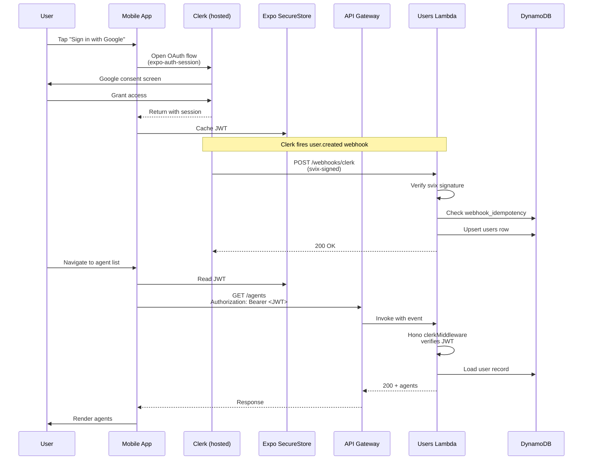

# Authentication

How a user signs into Menthera, how the mobile app stores and attaches credentials, how the backend validates them, and how Clerk webhooks keep the server-side user state in sync. This feature touches more of the system than any other — it is the gate everything else runs behind — so it is the right doc to read first if you are trying to understand how the pieces fit together.

---

## Table of contents

- [What the user experiences](#what-the-user-experiences)
- [End-to-end flow](#end-to-end-flow)
- [Mobile side — Clerk provider and token cache](#mobile-side--clerk-provider-and-token-cache)
- [Backend — two different auth paths](#backend--two-different-auth-paths)
- [Webhook flow — Clerk user lifecycle](#webhook-flow--clerk-user-lifecycle)
- [Why Clerk](#why-clerk)
- [Known gap — Function URL JWT signature not verified](#known-gap--function-url-jwt-signature-not-verified)
- [File reference](#file-reference)

---

## What the user experiences

1. On first launch, the user sees a welcome screen with "Sign in with Google", "Sign in with Apple", and email sign-in options.
2. They tap one and complete the OAuth flow (or email flow) through Clerk's hosted UI.
3. They are returned to the app, authenticated. A JWT is now cached on the device in the iOS Keychain or Android Keystore.
4. Every subsequent API call the app makes includes that JWT as a `Bearer` token in the Authorization header. The user does not think about auth again until their session expires, at which point Clerk silently refreshes the token.

No sign-in form is ever rendered inside the Menthera app itself. Clerk owns that surface entirely.

---

## End-to-end flow



The flow has three parallel things happening:

1. **User-facing OAuth** — the mobile app hands off to Clerk and gets a JWT back.
2. **Server-side webhook** — Clerk independently fires a `user.created` webhook so the backend has a user row before the user makes any requests.
3. **Per-request auth** — every subsequent API call is authenticated by validating the JWT.

Getting the webhook flow right is what makes the sync-then-async dance work without races. See [Webhook flow](#webhook-flow--clerk-user-lifecycle) below.

---

## Mobile side — Clerk provider and token cache

### The provider setup

The Clerk provider is the outermost state provider in the app, wrapping everything else in [`mobile/app/_layout.tsx`](../../mobile/app/_layout.tsx):

```tsx
const publishableKey = process.env.EXPO_PUBLIC_CLERK_PUBLISHABLE_KEY!;

if (!publishableKey) {
  throw new Error('Missing Clerk publishable key. Please add EXPO_PUBLIC_CLERK_PUBLISHABLE_KEY to your .env file');
}

export default function RootLayout() {
  // ...
  return (
    <ErrorBoundary>
      <ClerkProvider
        publishableKey={publishableKey}
        tokenCache={tokenCache}
        telemetry={false}
      >
        <RevenueCatProvider>
          <UsageProvider>
            <ThemeProvider>
              {/* ... */}
              <AuthGuard>
                {/* rest of the app */}
              </AuthGuard>
            </ThemeProvider>
          </UsageProvider>
        </RevenueCatProvider>
      </ClerkProvider>
    </ErrorBoundary>
  );
}
```

Three things worth noting:

1. **The publishable key is required at module load time.** If `EXPO_PUBLIC_CLERK_PUBLISHABLE_KEY` is unset, the app throws before the root component even renders. This is intentional — a mobile app without Clerk is meaningless in this system, so there is no "graceful fallback" to silently ignore.
2. **`telemetry={false}`** — the Clerk SDK collects usage telemetry by default. Menthera opts out.
3. **The `tokenCache` is a custom implementation** that stores tokens in Expo SecureStore rather than the default in-memory cache. Without this, the user would be signed out on every app restart. See below.

### The secure token cache

[`mobile/lib/clerk/tokenCache.ts`](../../mobile/lib/clerk/tokenCache.ts) is a 32-line file that wires Clerk's `TokenCache` interface to Expo's `SecureStore`:

```typescript
import * as SecureStore from 'expo-secure-store';
import type { TokenCache } from '@clerk/clerk-expo';
import { logger } from '../utils/logger';

export const tokenCache: TokenCache = {
  async getToken(key: string) {
    try {
      return SecureStore.getItemAsync(key);
    } catch (err) {
      logger.warn('Failed to get token from SecureStore:', err);
      return null;
    }
  },

  async saveToken(key: string, token: string) {
    try {
      return SecureStore.setItemAsync(key, token);
    } catch (err) {
      logger.warn('Failed to save token to SecureStore:', err);
    }
  },

  async clearToken(key: string) {
    try {
      return SecureStore.deleteItemAsync(key);
    } catch (err) {
      logger.warn('Failed to clear token from SecureStore:', err);
    }
  },
};
```

**Why SecureStore specifically?** On iOS, `expo-secure-store` wraps the iOS Keychain. On Android, it wraps the Android Keystore with encrypted storage. Both are designed for credential storage — they survive app restarts, they are sandboxed per-app, and on iOS they can optionally require Face ID / Touch ID / device passcode to unlock. Storing a JWT in `AsyncStorage` or in a plain file would be a real security issue; SecureStore is the right tool.

The logger catches and warns on errors instead of throwing. If SecureStore ever fails (for example, on a simulator in unusual states), the user will be signed out but the app will not crash. Sign-out on failure is the safe default here.

### Attaching the token to requests

Custom API fetches use the authenticated fetch hook in [`mobile/hooks/useAuthenticatedFetch.ts`](../../mobile/hooks/useAuthenticatedFetch.ts), which calls `getToken()` from Clerk's React hooks and attaches it as a `Bearer` header. This is the single place in the mobile code where the token is extracted and added to outgoing requests, so there is one place to update if the header conventions change.

The streaming chat path is slightly different — it uses `@ai-sdk/react` hooks that accept a `fetch` function, and that `fetch` is wrapped with the same token attachment logic. See [`features/text-chat.md`](./text-chat.md) for details.

---

## Backend — two different auth paths

The backend validates JWTs in two distinct places, because it has two HTTP surfaces (see [`architecture.md`](../architecture.md#the-two-http-surfaces)) and each one handles auth differently.

### Path 1 — Hono middleware (API Gateway REST routes)

All API Gateway REST routes run inside Hono apps in each service Lambda. Authentication is handled by a Hono middleware that wraps `@hono/clerk-auth`:

```typescript
// backend/src/shared/auth-middleware.ts
import { MiddlewareHandler } from 'hono';
import { clerkMiddleware } from '@hono/clerk-auth';
import { SecretsHelper } from './utils/secrets-helper';
import { AppSecretKeys } from './enum/secrets';

export const customClerkMiddleware: MiddlewareHandler = async (c, next) => {
  const publishableKey = await SecretsHelper.getSecretValue(AppSecretKeys.CLERK_PUBLISHABLE_KEY);
  const secretKey = await SecretsHelper.getSecretValue(AppSecretKeys.CLERK_SECRET_KEY);
  return clerkMiddleware({
    publishableKey,
    secretKey,
  })(c, next);
};

export default customClerkMiddleware;
```

The middleware:

1. Reads the Clerk publishable key and secret key from Secrets Manager at request time (cached at the Lambda instance level by `SecretsHelper`).
2. Delegates to `@hono/clerk-auth`'s `clerkMiddleware`, which performs **full signature verification** against the Clerk secret key and populates `c.get('clerkAuth')` with the decoded session data.
3. Service handlers downstream read `userId` and `sessionId` from that context.

This path is **cryptographically secure** — the JWT signature is verified against the Clerk secret, the claims are validated, and expired or tampered tokens are rejected.

One route explicitly bypasses this middleware: `/webhooks/*`. Webhooks authenticate via `svix` signature verification instead of Bearer tokens, so they cannot go through Clerk middleware. The bypass is in `api.ts`:

```typescript
// backend/src/services/users/api.ts (excerpt)
app.use('*', async (c, next) => {
  if (c.req.path.startsWith('/webhooks')) {
    return next();
  }
  return customClerkMiddleware(c, next);
});
```

### Path 2 — `ClerkLambdaAuth` helper (plain-handler Lambdas in the call service)

A subset of Lambdas are not written as Hono apps — they are plain Lambda handlers that take `APIGatewayProxyEvent` directly:

- [`backend/src/services/call/handler.ts`](../../backend/src/services/call/handler.ts) — the main call initiation handler
- [`backend/src/services/call/user-left-handler.ts`](../../backend/src/services/call/user-left-handler.ts) — the call teardown signal
- [`backend/src/services/call/health.ts`](../../backend/src/services/call/health.ts) — the health check

These handlers cannot use the Hono Clerk middleware because they are not running Hono. Instead they use a lightweight helper in [`backend/src/shared/utils/clerk-lambda-auth.ts`](../../backend/src/shared/utils/clerk-lambda-auth.ts):

```typescript
export class ClerkLambdaAuth {
  static async verifyToken(authHeader: string | undefined): Promise<AuthContext> {
    if (!authHeader) {
      throw new Error('Authorization header missing');
    }

    const token = authHeader.startsWith('Bearer ')
      ? authHeader.slice(7)
      : authHeader;

    // ... decode payload, check iat/exp ...

    return {
      userId: decoded.sub,
      sessionId: decoded.sid,
    };
  }
}
```

The chat Lambda, despite being exposed via a Function URL rather than API Gateway, **does use the Hono middleware path**. It is a Hono app that runs behind a Function URL with IAM auth (see the [Chat path and CloudFront OAC](#chat-path-and-cloudfront-oac) section below). So the split is not "API Gateway vs Function URL" — it is "Hono apps vs plain-handler Lambdas".

**However**, the `ClerkLambdaAuth` helper has a known gap — see [Known gap](#known-gap--call-handler-jwt-signature-not-verified) below.

### Chat path and CloudFront OAC

The chat Lambda uses a Function URL for response streaming (see [`features/text-chat.md`](./text-chat.md) for why). But the Function URL is not exposed to the internet directly — it is protected by IAM auth and sits behind a CloudFront distribution configured with Origin Access Control (OAC):

```typescript
// backend/lib/stacks/message-stack.ts (excerpt)
this.functionUrl = this.messageHandler.addFunctionUrl({
  authType: lambda.FunctionUrlAuthType.AWS_IAM,
  invokeMode: lambda.InvokeMode.RESPONSE_STREAM,
  // ...
});

// backend/lib/stacks/core/route53-stack.ts (excerpt)
this.chatDistribution = new cloudfront.Distribution(this, 'ChatDistribution', {
  defaultBehavior: {
    origin: FunctionUrlOrigin.withOriginAccessControl(messageFunctionUrl),
    // ...
  },
  // ...
});
```

The mobile client hits `chat.<domain>` which is a Route53 A record aliased to the CloudFront distribution. CloudFront terminates TLS with an ACM cert, signs requests to the Function URL with OAC (the AWS pattern for letting a CloudFront distribution invoke an IAM-protected origin), and forwards them. The Function URL accepts only OAC-signed requests — a direct `curl` to the Function URL host would be rejected.

Then inside the Lambda, Hono runs with `@hono/clerk-auth` middleware and authenticates the user's Clerk JWT just like every other Hono Lambda. **The chat Function URL is therefore cryptographically secure on the auth dimension** — it benefits from both CloudFront+OAC at the infrastructure layer and Hono+Clerk middleware at the application layer.

---

## Webhook flow — Clerk user lifecycle

When a user signs up or their profile changes, Clerk fires a webhook to the backend so the server-side user record can be kept in sync. Menthera registers this webhook at `POST /webhooks/clerk` on the API Gateway, and it routes to the `usersHandler` Lambda in `UsersStack`.

The handler flow, from [`backend/src/services/users/api.ts`](../../backend/src/services/users/api.ts):

1. **Skip auth middleware** — the request path starts with `/webhooks`, so the Hono Clerk middleware is bypassed. Webhooks do not have a Bearer token; they have a webhook signature instead.
2. **Fetch the signing secret** — `CLERK_WEBHOOK_SECRET` is loaded from Secrets Manager (cached at Lambda instance level).
3. **Verify the svix signature** — Clerk signs every webhook with HMAC-SHA256 and includes the signature in three headers: `svix-id`, `svix-timestamp`, `svix-signature`. The handler constructs a `svix` `Webhook` instance with the signing secret and calls `wh.verify(body, headers)`. If the signature does not match, the handler returns 401 immediately:

   ```typescript
   const wh = new Webhook(webhookSecret);
   const evt = wh.verify(body, {
     'svix-id': c.req.header('svix-id') || '',
     'svix-timestamp': c.req.header('svix-timestamp') || '',
     'svix-signature': c.req.header('svix-signature') || '',
   });
   ```

4. **Check idempotency** — the webhook event ID is looked up in the `webhook_idempotency` DynamoDB table. If this event has already been processed, the handler returns 200 immediately without re-processing. Clerk retries on non-2xx responses, so idempotency protects against duplicate processing on retry.
5. **Handle the event type** — `user.created`, `user.updated`, or `user.deleted`. Each upserts or removes the corresponding `users` table row.
6. **Mark as processed** — write the event ID to `webhook_idempotency` with a 24-hour TTL so the record cleans itself up.
7. **Return 200.**

### Why sync and not async?

Clerk webhooks are processed **synchronously** in the main `usersHandler` Lambda. RevenueCat webhooks, by contrast, are pushed onto an SQS queue and processed by a separate `webhookProcessorHandler` Lambda. Why the split?

Because **user creation must happen before any other operation the user could perform**. Consider this race:

1. User completes OAuth flow. Clerk issues a JWT and sends a `user.created` webhook asynchronously.
2. The mobile app immediately navigates to the home screen and calls `GET /agents`.
3. The agents handler validates the JWT (which is cryptographically valid — signed by Clerk), extracts `userId`, and tries to load the user's row from DynamoDB.
4. If the webhook has not yet been processed, the user row does not exist. The agents handler returns 404 or creates the user on-the-fly.

Neither of those outcomes is clean. The sync webhook path avoids the race entirely: Clerk sends the webhook synchronously during the OAuth completion, the backend creates the user row, and only then does the mobile app proceed.

RevenueCat events do not have this constraint — a subscription change does not need to be reflected in the user's state within 50ms. Async with retries is the right shape for RevenueCat. See [`architecture.md`](../architecture.md#async-vs-sync-processing) for the full sync-vs-async decision.

### Idempotency matters more than you think

The `webhook_idempotency` table is the quiet hero of this flow. Without it, the following sequence causes a bug:

1. Clerk sends `user.updated` event with ID `evt_abc123`.
2. Our Lambda processes it, updates DynamoDB, but then times out before returning 200.
3. Clerk sees no 200, retries the webhook.
4. Our Lambda receives `evt_abc123` again.

With idempotency, step 4 short-circuits — the event ID is already in the table, so we return 200 immediately without redoing the work. Without idempotency, the user update is applied twice (usually harmless, sometimes not — imagine an event that increments a counter).

The idempotency key is generated from the event source and event ID: `clerk:evt_abc123`. See [`backend/src/shared/utils/audit-logger.ts`](../../backend/src/shared/utils/audit-logger.ts) for the helpers (`generateIdempotencyKey`, `checkIdempotency`, `markAsProcessed`).

---

## Why Clerk

The system could have rolled its own auth. It deliberately does not. Three reasons:

1. **Clerk owns the hard parts.** Password hashing, OAuth integration with Google/Apple/etc., session management, account recovery, multi-factor auth, passwordless email flows, magic links, CAPTCHAs, bot protection. Building any of these correctly takes weeks. Clerk is already correct.

2. **The attack surface is a hosted service, not this codebase.** If an attacker finds a zero-day in a password reset flow, Clerk fixes it and deploys the fix without Menthera having to ship anything. The code in this repository cannot have a password reset bug because this repository has no password reset code.

3. **Webhook-based state sync is cleaner than query-driven sync.** Clerk sends webhooks for every user lifecycle event. The backend reacts to events as they happen instead of polling or lazy-loading on first request. Combined with idempotency, this gives the server-side user state strong eventual consistency with the source of truth.

The trade-off is vendor lock-in — if Clerk vanished or became unaffordable, migrating off would mean rewriting the auth surface. For a showcase system, this is an acceptable trade; for a production system with a 10-year horizon, the calculus is different.

---

## Known gap — call handler JWT signature not verified

This is the most important known issue in the current authentication implementation and it affects the plain-handler Lambdas in the call service (`call/handler.ts`, `call/user-left-handler.ts`).

### What the current code does

[`backend/src/shared/utils/clerk-lambda-auth.ts`](../../backend/src/shared/utils/clerk-lambda-auth.ts) exposes `ClerkLambdaAuth.verifyToken()` which is called by the chat handler to authenticate incoming requests. That method internally calls `verifyJwt()`:

```typescript
private static async verifyJwt(token: string, secret: string): Promise<any> {
  const parts = token.split('.');
  if (parts.length !== 3) {
    throw new Error('Invalid token format');
  }

  const [headerEncoded, payloadEncoded, signatureEncoded] = parts;

  const payload = JSON.parse(Buffer.from(payloadEncoded, 'base64').toString());

  if (!payload.iat || !payload.exp) {
    throw new Error('Token missing required claims');
  }

  const now = Math.floor(Date.now() / 1000);
  if (payload.exp < now) {
    throw new Error('Token has expired');
  }

  return payload;
}
```

The method:

1. Splits the JWT into header, payload, and signature parts.
2. Base64-decodes the **payload** only.
3. Checks `iat` and `exp` claims exist and that the token has not expired.
4. Returns the decoded payload.

Notice what is missing:

- **The `signatureEncoded` variable is extracted but never used.**
- **The `secret` parameter is passed in but never used.**
- **No HMAC or RSA signature verification against the Clerk signing key is performed.**

### What this means

Any JWT that:

1. Has the correct three-part structure
2. Has an unexpired `exp` claim
3. Has an `iat` claim
4. Has a `sub` claim

...will pass verification, regardless of whether it was issued by Clerk or crafted by an attacker. An attacker who knows a user's ID can construct a fake JWT locally and authenticate as that user on the call endpoints.

The Hono middleware path is **not affected** by this — `@hono/clerk-auth` performs full signature verification, so all Hono-based Lambdas are secure. That includes:

- Every API Gateway REST route served by a Hono app (users, agents, history, quest, engagement, achievements)
- The chat Lambda on the Function URL (it is a Hono app, so middleware still applies)

The gap affects only the plain-handler Lambdas that use `ClerkLambdaAuth.verifyToken()` directly:

- [`backend/src/services/call/handler.ts`](../../backend/src/services/call/handler.ts) — the call initiation handler
- [`backend/src/services/call/user-left-handler.ts`](../../backend/src/services/call/user-left-handler.ts) — the call teardown handler

### Why it exists

Most likely: `@hono/clerk-auth` was used first for the API Gateway routes, and then when the Function URL chat path was added, someone wrote a quick JWT helper that got the shape right but skipped the signature verification step. The bug is the kind of thing that would pass a casual code review — the method is named `verifyJwt()` and accepts a `secret` parameter, so at a glance it looks like it does the job.

### How to fix it

Two options:

1. **Use `@clerk/backend` directly.** Clerk provides a standalone backend SDK with token verification utilities: `verifyToken(token, { secretKey })`. This is the officially supported path. Replace the hand-rolled `verifyJwt()` with a call to `@clerk/backend`'s verifier.
2. **Use a generic JWT library plus the Clerk JWKS endpoint.** Clerk publishes its JWKS (JSON Web Key Set) at `https://<your-clerk-instance>/.well-known/jwks.json`. A library like `jose` can fetch it and verify tokens. This avoids the `@clerk/backend` dependency but adds JWKS fetching/caching logic.

Option 1 is simpler and is the recommended fix. The `@clerk/backend` package is already in use elsewhere in the codebase.

### Status

This issue is documented here and in [`architecture.md`](../architecture.md#2-clerklambdaauthverifyjwt-does-not-verify-the-signature) as a **known gap that must be fixed before any production deployment**. It does not affect the showcase repository because the showcase is not a live deployment and has no real users. A reviewer should understand that Menthera is in two states simultaneously: the API Gateway paths are production-quality in this respect; the Function URL path is not.

---

## File reference

Everything in this doc references real files you can open directly. Here is the full list:

### Mobile

- [`mobile/app/_layout.tsx`](../../mobile/app/_layout.tsx) — `ClerkProvider` setup, token cache wiring, publishable key validation, provider composition
- [`mobile/lib/clerk/tokenCache.ts`](../../mobile/lib/clerk/tokenCache.ts) — `TokenCache` implementation backed by Expo `SecureStore`
- [`mobile/hooks/useAuthenticatedFetch.ts`](../../mobile/hooks/useAuthenticatedFetch.ts) — The single wrapper that attaches `Bearer` tokens to outgoing requests
- [`mobile/hooks/auth/useOAuth.ts`](../../mobile/hooks/auth/useOAuth.ts) — OAuth sign-in flow wiring `expo-auth-session` to Clerk
- [`mobile/components/auth/AuthGuard.tsx`](../../mobile/components/auth/AuthGuard.tsx) — Route guard that redirects unauthenticated users to `auth/welcome`

### Backend — auth middleware and helpers

- [`backend/src/shared/auth-middleware.ts`](../../backend/src/shared/auth-middleware.ts) — Hono middleware wrapping `@hono/clerk-auth` for API Gateway routes
- [`backend/src/shared/utils/clerk-lambda-auth.ts`](../../backend/src/shared/utils/clerk-lambda-auth.ts) — Direct JWT helper for Function URL / direct-invoke Lambdas (**has the known gap**)
- [`backend/src/shared/utils/secrets-helper.ts`](../../backend/src/shared/utils/secrets-helper.ts) — Cached Secrets Manager access for Clerk keys

### Backend — webhook handling

- [`backend/src/services/users/api.ts`](../../backend/src/services/users/api.ts) — Main Users Lambda with the sync Clerk webhook handler at `POST /webhooks/clerk`
- [`backend/src/shared/utils/audit-logger.ts`](../../backend/src/shared/utils/audit-logger.ts) — Idempotency helpers (`generateIdempotencyKey`, `checkIdempotency`, `markAsProcessed`)
- [`backend/lib/stacks/users-stack.ts`](../../backend/lib/stacks/users-stack.ts) — CDK stack that provisions the Users Lambda, the webhook processor, the SQS queues, and the API Gateway routes

### Backend — relevant DynamoDB tables

- `users` — Primary user row keyed by Clerk user ID
- `webhook_idempotency` — Processed webhook event IDs with 24h TTL
- `subscription_audit` — Immutable log of every subscription state change (from Clerk and RevenueCat)
