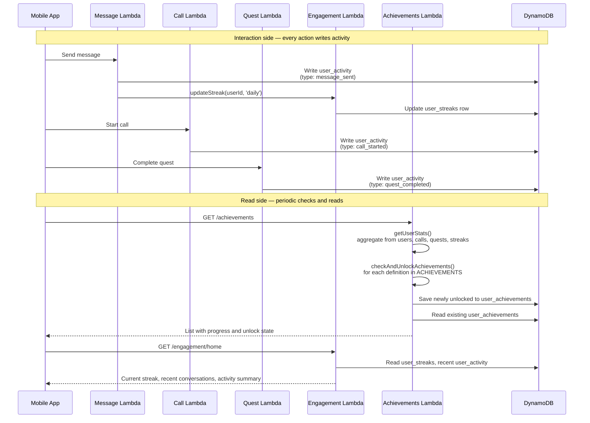

# Engagement and achievements

How every user interaction gets tracked, turned into activity events, rolled up into streaks, and checked against a static list of achievements that the mobile app surfaces as unlockable badges. These two features share tables, share code paths, and share the same mental model — an event-sourcing-flavoured design where writes are cheap, streaks are computed from the activity log, and achievements are pure functions of a snapshot of user stats.

---

## Table of contents

- [What the user experiences](#what-the-user-experiences)
- [End-to-end flow](#end-to-end-flow)
- [The `user_activity` table — event log as source of truth](#the-user_activity-table--event-log-as-source-of-truth)
- [Streak computation](#streak-computation)
- [Achievement definitions — static code, not dynamic data](#achievement-definitions--static-code-not-dynamic-data)
- [The unlock checker](#the-unlock-checker)
- [Hidden and special achievements](#hidden-and-special-achievements)
- [Why not event-sourcing with Kinesis or DynamoDB Streams](#why-not-event-sourcing-with-kinesis-or-dynamodb-streams)
- [File reference](#file-reference)

---

## What the user experiences

1. As the user sends messages, completes calls, or finishes quests, a small flame icon on the home screen starts showing a number — their current streak in days.
2. The achievements screen shows a grid of badges. Some are unlocked (full colour, tappable, show an unlock date). Some are locked (greyed out, show progress as a percentage).
3. When the user crosses a threshold — their 10th message, their first call, a 7-day streak — a subtle confetti animation plays and a toast appears: "Achievement unlocked: Week Warrior". The badge transitions to unlocked state.
4. Tapping any badge shows its description, category, and unlock date if applicable.

None of this is critical to the core chat or voice experience — it is a retention and motivation layer. But it matters for a mental health app specifically, because "I used the app for 7 days in a row" is itself a meaningful signal of consistency that the product wants to reinforce.

---

## End-to-end flow



The flow has three distinct write paths — chat, calls, quests — all writing into the same `user_activity` table with different `type` values. And it has two distinct read paths — achievements (which aggregates stats and evaluates unlock conditions) and engagement home (which reads streaks and recent activity for the home screen). The features are coupled by the underlying data but decoupled by the API surfaces, which means each one can evolve independently.

---

## The `user_activity` table — event log as source of truth

Every meaningful user action writes one row to [`user_activity`](../../backend/lib/stacks/core/database-stack.ts). The table shape:

- **Partition key:** `user_id`
- **Sort key:** `timestamp` (ISO 8601 string)
- **GSI:** `agent-timestamp-index` — partition by `agent_id`, sort by `timestamp`
- **TTL:** 90 days via the `ttl` attribute

Each row is one event:

```
{
  user_id: "user_abc",
  timestamp: "2026-04-05T14:32:18.432Z",
  activityType: "message_sent",
  agent_id: "2",
  durationSeconds: 0,
  metadata: { messageLength: 143 },
  ttl: 1720284738
}
```

Activity types include `message_sent`, `call_started`, `call_ended`, `quest_started`, `quest_completed`, and a few others. The `metadata` field is open-ended so new activity shapes do not require schema changes.

### Why partition by user

Every read pattern is "show me things about this user":

- What has this user been doing recently? → query by `user_id` with recent timestamps.
- What agents has this user engaged with? → query by `user_id`, filter by `agent_id` in memory.
- How many messages has this user sent? → count rows where `activityType = 'message_sent'`.

Partitioning by `user_id` makes every query a single-partition read. The `agent-timestamp-index` GSI flips this around for the rare case when you want "all activity for a given agent across users" — currently only used for per-agent analytics, not for user-facing features.

### Why TTL

90 days of activity retention is enough for the features that use it (streaks look at the last 30 days; home screen shows the last 14 days; achievements are evaluated from counters on the `users` table, not from the activity log). Beyond 90 days, the rows are dead weight and DynamoDB's built-in TTL deletion is the cheapest way to clear them. No cleanup job, no cron, no operational overhead — DynamoDB silently removes rows whose `ttl` epoch has passed.

The users table keeps permanent cumulative counters (`totalMessages`, `totalCalls`, `totalCallMinutes`, `totalActiveDays`) that are incremented on every activity write. Those counters are what achievements check against. The activity log is the detailed breadcrumbs; the user row is the summary.

### The `recordActivity` helper

From [`backend/src/services/engagement/helpers.ts`](../../backend/src/services/engagement/helpers.ts):

```typescript
export async function recordActivity(
  db: DynamoDBDocumentClient,
  userId: string,
  activityType: string,
  agentId?: string,
  durationSeconds: number = 0,
  metadata: Record<string, any> = {}
): Promise<ActivityEvent> {
  const timestamp = new Date().toISOString();
  const ttl = calculateTTL(); // 90 days from now

  const activity: ActivityEvent = {
    user_id: userId,
    timestamp,
    activityType,
    agent_id: agentId,
    durationSeconds,
    metadata,
    ttl,
  };

  await db.send(new PutCommand({
    TableName: USER_ACTIVITY_TABLE,
    Item: activity,
  }));

  return activity;
}
```

One function, called from anywhere an activity needs recording. The chat handler calls it on every successful message. The call handler calls it on call start and end. The quest handler calls it on quest start and complete. There is no central "activity router" — each service writes its own activities.

---

## Streak computation

Streaks are stored in the [`user_streaks`](../../backend/lib/stacks/core/database-stack.ts) table with partition key `user_id` and sort key `streak_type` (either `daily` or `agent#<agentId>`). Each row holds the current streak count, the longest streak ever, and the date of the last update.

### The `updateStreak` function

Called from the chat handler (and from other interaction handlers) on every activity:

```typescript
// From backend/src/services/engagement/helpers.ts
export async function updateStreak(
  db: DynamoDBDocumentClient,
  userId: string,
  streakType: string
): Promise<StreakData> {
  const today = getTodayDate();
  const yesterday = getYesterdayDate();

  // Load existing streak
  const existing = await getStreakRow(db, userId, streakType);

  if (!existing) {
    // First activity ever — create streak of 1
    return createStreakRow(db, userId, streakType, 1, today);
  }

  if (existing.lastDate === today) {
    // Already counted today — no change
    return existing;
  }

  if (existing.lastDate === yesterday) {
    // Consecutive day — increment
    const newCount = existing.currentStreak + 1;
    return updateStreakRow(db, userId, streakType, newCount, today);
  }

  // Gap — reset streak to 1
  return updateStreakRow(db, userId, streakType, 1, today);
}
```

The logic is deliberately simple:

1. If this is the first activity, streak starts at 1.
2. If the last activity was today, no change (multiple activities in one day do not compound the streak).
3. If the last activity was yesterday, increment by 1.
4. Any other gap (2+ days) resets the streak to 1.

The `currentStreak` and `longestStreak` are both tracked, so "longest streak" is a permanent high water mark that does not reset.

### Per-agent streaks

The same function handles per-agent streaks by passing a different `streak_type`. The chat handler updates both the daily streak (on any interaction) and the per-agent streak (when the user talks to a specific agent):

```typescript
// From backend/src/services/engagement/api.ts
const dailyStreak = await updateStreak(db, userId, 'daily');
if (agentId) {
  agentStreak = await updateStreak(db, userId, `agent#${agentId}`);
}
```

This gives two flavours of streaks in the data: "I talked to *any* agent for 7 days in a row" and "I talked to *this specific agent* for 5 days in a row". The home screen shows the daily streak; individual agent screens can optionally show per-agent streaks.

### Why not compute streaks from the activity log on read

The alternative design would be to not store streaks at all — just scan the activity log on every read and count consecutive days. This is simpler and has no consistency risk, but it is slower. A user who has been active for 300 days would have the last 30 days scanned on every home screen load.

Maintaining the streak table as a rolling counter avoids that read cost. It also means the streak value is always fresh after any write, with no async lag. The trade-off is that if a write to `user_activity` succeeds but the `updateStreak` call fails, the streak can drift from reality. In practice this is rare (both writes are to DynamoDB, in the same Lambda, with retries), and the worst case is the user's streak being one day behind until their next activity repairs it.

---

## Achievement definitions — static code, not dynamic data

[`backend/src/services/achievements/definitions.ts`](../../backend/src/services/achievements/definitions.ts) is the single source of truth for every achievement in the app. It exports a `const ACHIEVEMENTS` array with ~20 achievements across five categories:

| Category | Examples |
| --- | --- |
| **Messaging** | `first_message` (1), `message_10`, `message_50`, `message_100`, `message_500` |
| **Calls** | `first_call`, `call_5`, `call_10`, `call_30_min`, `call_60_min` |
| **Streaks** | `streak_3`, `streak_7`, `streak_14`, `streak_30` |
| **Quests** | `quest_first`, `quest_complete_1`, `quest_complete_3` |
| **Engagement** | `multi_agent`, `active_week`, `early_bird` (hidden) |

Each definition is a plain object:

```typescript
{
  id: 'streak_7',
  title: 'Week Warrior',
  description: 'Stayed engaged for 7 consecutive days',
  icon: '🔥',
  category: 'streaks',
  targetValue: STREAK_THRESHOLDS.tier2,
},
```

Thresholds are imported from [`backend/src/shared/config/achievements.config.ts`](../../backend/src/shared/config/achievements.config.ts) so they can be tuned in one place.

### Why static code instead of DynamoDB

Achievement definitions are:

1. **Small** — 20 items, each a few hundred bytes. Trivial to load into memory.
2. **Static per deploy** — they change at most once per release, never at runtime.
3. **Part of the app's design**, not user data. They are closer to feature flags than to content.

Storing them in DynamoDB would add a read on every `GET /achievements` call, introduce a cache layer, and create a deployment mismatch problem (new achievement IDs referenced by the mobile app before the DynamoDB seed has run). Storing them in code means:

- The mobile app and backend ship the same set of achievements in the same release.
- Adding a new achievement is a single-file change with an obvious diff.
- The full set is visible to anyone reading the codebase in one place.

The same rationale applies to quest interpretations in [`features/quests.md`](./quests.md#scoring--the-deterministic-part). Static data that is part of the product's design belongs in code, not in a database.

### What lives in DynamoDB instead

The [`user_achievements`](../../backend/lib/stacks/core/database-stack.ts) table stores only **unlock state** — which user has unlocked which achievement and when:

- **Partition key:** `user_id`
- **Sort key:** `achievement_id`

One row per unlocked achievement per user. A user who has unlocked 8 achievements has 8 rows. The row contains the unlock timestamp and any metadata. Achievement *content* (title, description, icon) comes from the static definitions and is joined in memory at read time.

---

## The unlock checker

The heart of the achievements service is `checkAndUnlockAchievements()` in [`backend/src/services/achievements/checker.ts`](../../backend/src/services/achievements/checker.ts). The function is pure given `userStats`:

```typescript
export async function checkAndUnlockAchievements(
  db: DynamoDBDocumentClient,
  userId: string
): Promise<{ newlyUnlocked: string[], allAchievements: AchievementDefinition[] }> {
  // 1. Aggregate user stats from multiple tables
  const stats = await getUserStats(db, userId);

  // 2. Load already-unlocked achievements for this user
  const existing = await getUserAchievements(db, userId);
  const unlockedIds = new Set(existing.map(a => a.achievement_id));

  // 3. For each achievement definition, check if it should unlock
  const newlyUnlocked: string[] = [];
  for (const achievement of ACHIEVEMENTS) {
    if (unlockedIds.has(achievement.id)) continue; // already unlocked
    if (shouldUnlockAchievement(achievement, stats)) {
      await saveAchievement(db, userId, achievement.id);
      newlyUnlocked.push(achievement.id);
    }
  }

  return { newlyUnlocked, allAchievements: ACHIEVEMENTS };
}
```

Three steps:

1. **Aggregate stats.** `getUserStats()` reads from `users` (for counters), `user_streaks` (for current streak), and potentially `quest_sessions` (for quest counts). It returns a single `UserStats` object with fields like `totalMessages`, `totalCalls`, `totalCallMinutes`, `currentStreak`, `questsCompleted`, `agentsEngaged`, and `totalActiveDays`.

2. **Load existing unlocks.** One DynamoDB query on `user_achievements` by `user_id` returns the set of already-unlocked achievement IDs.

3. **Evaluate each definition.** For each achievement in the static array, call `shouldUnlockAchievement(def, stats)` (which calls `calculateAchievementProgress` and checks if it's >= 100%). If yes and not already unlocked, write a row to `user_achievements` and add the ID to the newly-unlocked list.

The function returns both the list of newly-unlocked IDs (so the mobile app can show confetti/toasts for them) and the full list of achievement definitions (for rendering the badges grid with progress).

### When it runs

The checker is called from the achievements API endpoint that the mobile app hits on demand — specifically when the user opens the achievements screen. It does NOT run on every activity write. The philosophy is:

- **Writes are cheap and frequent** — just record the activity and increment counters.
- **Checks are on-demand** — evaluate against the current state when the user actually wants to see the result.

This avoids the overhead of running the unlock checker on every chat message or call. The user only sees achievement unlocks when they open the achievements screen, but the backend is always able to produce the correct state on demand.

The trade-off is that unlocks are not immediately visible to the user on the screen where they happened. A user who sends their 10th message and immediately stays on the chat screen does not see the `message_10` unlock until they navigate to achievements. In practice, the mobile app also calls the checker on the home screen and surfaces "you just unlocked..." toasts there.

### Progress calculation

The mobile app also displays progress toward not-yet-unlocked achievements ("7/10 messages"). This uses `calculateAchievementProgress(def, stats)` which returns `0–100` as a percentage of the target value:

```typescript
const progress = Math.min(
  100,
  Math.round((currentValue / achievement.targetValue) * 100)
);
```

The `currentValue` is looked up from the stats object based on the achievement's ID — a switch statement maps achievement IDs to the relevant stat field. This is mildly repetitive but it is also the one place where the mapping from achievement → stat is declared, so centralising it here makes it easy to audit.

---

## Hidden and special achievements

One achievement in the list is marked `hidden: true`:

```typescript
{
  id: 'early_bird',
  title: 'Early Adopter',
  description: 'One of our first users!',
  icon: '🐣',
  category: 'engagement',
  targetValue: 1,
  hidden: true, // Special achievement
},
```

Hidden achievements are not shown in the locked state on the achievements grid — the user does not know they exist until they unlock them. This is a classic gamification pattern: surprise rewards are more satisfying than expected ones.

The `early_bird` achievement is awarded on some other condition (likely a signup date check during onboarding). The unlock checker skips hidden achievements in the standard evaluation loop and they are unlocked by ad hoc code elsewhere.

This pattern generalises well — any achievement that should be awarded by an external signal (support team manually awarding a badge, event-based unlocks, promotional campaigns) can live in the same list with `hidden: true` and a manual trigger path.

---

## Why not event-sourcing with Kinesis or DynamoDB Streams

A more ambitious design would use DynamoDB Streams or Kinesis to publish every activity write as an event, then have a consumer Lambda that updates streaks, checks achievements, and maintains a read model. This has real benefits:

- **Decoupled** — the chat handler does not need to call `recordActivity` and `updateStreak` and `checkAchievements`. It just writes to DynamoDB, and downstream consumers react.
- **Scalable** — consumers run independently with their own throughput. The chat path does not get slower because achievement checking got expensive.
- **Replayable** — re-running the consumer against the event log rebuilds the derived state from scratch.

Menthera does not do this. Every activity write is synchronous: the handler explicitly calls `recordActivity` and `updateStreak` in the same transaction. The reasons:

1. **Complexity.** DynamoDB Streams + consumer Lambdas + dead letter queues + replay logic is real operational overhead.
2. **The volume does not justify it.** At showcase scale, synchronous writes are fine. At Uber scale, you need event sourcing. Menthera is not Uber.
3. **Debugging is harder.** When a write produces multiple downstream effects asynchronously, reasoning about state becomes harder. Synchronous writes are easier to trace.
4. **The consistency story is simpler.** Writing activity + streak in the same Lambda invocation means the streak is up to date the instant the activity record exists. Stream-based consumers introduce lag.

A production-hardened version of this system with 100× the current traffic would move to event sourcing. The current scale is well served by the simpler synchronous pattern.

---

## File reference

### Mobile

- [`mobile/providers/EngagementProvider.tsx`](../../mobile/providers/EngagementProvider.tsx) — Engagement state and home screen data
- [`mobile/app/achievements.tsx`](../../mobile/app/achievements.tsx) — Achievements screen with badge grid
- [`mobile/components/screens/home/RecentActivitySection.tsx`](../../mobile/components/screens/home/RecentActivitySection.tsx) — Recent activity feed on home screen
- [`mobile/components/screens/home/JourneyCard.tsx`](../../mobile/components/screens/home/JourneyCard.tsx) — Streak card on home screen

### Backend — engagement service

- [`backend/src/services/engagement/api.ts`](../../backend/src/services/engagement/api.ts) — Engagement Hono API (`GET /engagement/home`, activity recording)
- [`backend/src/services/engagement/helpers.ts`](../../backend/src/services/engagement/helpers.ts) — `recordActivity`, `updateStreak`, `getRecentActivities`, `getRecentConversations`, `getActivitySummary`, `getUserStreaks`
- [`backend/src/services/engagement/types.ts`](../../backend/src/services/engagement/types.ts) — Type definitions

### Backend — achievements service

- [`backend/src/services/achievements/api.ts`](../../backend/src/services/achievements/api.ts) — Achievements Hono API (`GET /achievements`)
- [`backend/src/services/achievements/definitions.ts`](../../backend/src/services/achievements/definitions.ts) — Static `ACHIEVEMENTS` array and progress helpers
- [`backend/src/services/achievements/checker.ts`](../../backend/src/services/achievements/checker.ts) — `getUserStats`, `checkAndUnlockAchievements`, `saveAchievement`
- [`backend/src/services/achievements/types.ts`](../../backend/src/services/achievements/types.ts) — Type definitions
- [`backend/src/shared/config/achievements.config.ts`](../../backend/src/shared/config/achievements.config.ts) — Threshold constants (messages, calls, minutes, streaks, quests, engagement, milestones)

### Backend — CDK infrastructure

- [`backend/lib/stacks/engagement-stack.ts`](../../backend/lib/stacks/engagement-stack.ts) — Engagement service stack
- [`backend/lib/stacks/achievements-stack.ts`](../../backend/lib/stacks/achievements-stack.ts) — Achievements service stack

### DynamoDB tables touched by this flow

- `user_activity` — Event log of every activity, keyed by user with 90-day TTL
- `user_streaks` — One row per user per streak type (daily, per-agent)
- `user_achievements` — Unlock state, one row per unlocked achievement per user
- `users` — Cumulative counters (`totalMessages`, `totalCalls`, `totalCallMinutes`, `totalActiveDays`) that feed `getUserStats`
