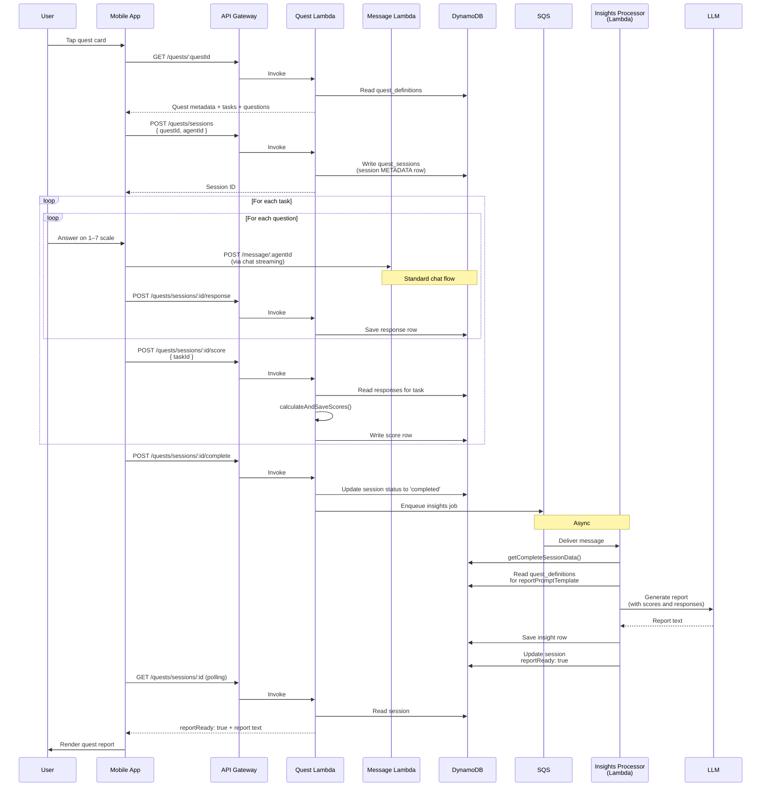

# Quests

Structured psychometric assessments that users complete through conversation with an agent. Each quest is a sequence of tasks, each task is a set of Likert-scale questions, and each completed task produces numeric scores that feed into a personalised LLM-generated report. This is the most "product" feature in the repository — it is where Menthera's mental-health framing shows up most concretely, and where the backend combines structured data, conversational UX, and LLM interpretation in an interesting way.

---

## Table of contents

- [What the user experiences](#what-the-user-experiences)
- [The five quest categories](#the-five-quest-categories)
- [Quest data model — two tables](#quest-data-model--two-tables)
- [End-to-end flow](#end-to-end-flow)
- [Scoring — the deterministic part](#scoring--the-deterministic-part)
- [Report generation — the LLM part](#report-generation--the-llm-part)
- [Why the hard split between scoring and interpretation](#why-the-hard-split-between-scoring-and-interpretation)
- [Quests reuse the chat infrastructure](#quests-reuse-the-chat-infrastructure)
- [File reference](#file-reference)

---

## What the user experiences

1. From the home screen, the user taps a quest card (for example, "Find Your Career Sweet Spot").
2. An intro screen explains what the quest measures, how long it takes (6 minutes for career), and what they will learn.
3. The quest begins. An agent greets them and asks the first question.
4. For each question, the user responds on a Likert 1–7 scale (mapped in the UI to "Strongly disagree" through "Strongly agree"). The UI is a conversational bubble with a slider or option buttons, not a form.
5. Questions are grouped into tasks (e.g., "Work Personality", "Career Motivation", "Career Adaptability", "Growth Mindset"). Each task takes a few questions to complete.
6. After the last question in a task, the user sees an intermediate "task complete" transition and the next task begins.
7. When all tasks are complete, the app shows a "generating your report" screen. A few seconds later, the report appears — a 500–700 word personalised narrative explaining the user's profile, strengths, risk awareness, patterns, and a specific action plan.
8. The report is saved and can be re-read from the quest report screen at any time.

The whole experience is framed as a conversation with an agent, not a form. Every question comes from the agent, every answer is returned through the chat UI. It feels like a structured interview, not a survey.

---

## The five quest categories

Menthera ships with five quest categories, each covering a different life domain. All of them are in [`backend/seed/quests/`](../../backend/seed/quests/):

| Category | Framework | Tasks |
| --- | --- | --- |
| **Career** | [Holland's RIASEC Model](https://en.wikipedia.org/wiki/Holland_Codes) | Work Personality, Career Motivation, Career Adaptability, Growth Mindset |
| **Wellness** | Mental health dimensions | Mindfulness, Resilience, Stress Response, Emotional Regulation |
| **Health** | Health behaviour change | Exercise Motivation, Activity Readiness, Self-Efficacy, Health Locus of Control |
| **Relationships** | Attachment and interpersonal psychology | Attachment Style, Communication Style, Emotional Intelligence, Empathy |
| **Finance** | Financial psychology | Risk Tolerance, Money Attitudes, Financial Behaviour, Locus of Control |

Each category uses **real psychometric frameworks** published in the academic literature. RIASEC has been used for career counselling since the 1970s. Attachment theory has a 70-year research history. These are not made-up question sets — they are abbreviated versions of established instruments, tuned for a 6-minute conversational format.

Each quest is versioned (`v1`) so future revisions can ship alongside the originals without breaking existing user data. The quest ID encodes both the category and the version: `career_psychometric` + version `1` → partition key `QUEST#career_psychometric#v1`.

---

## Quest data model — two tables

Quests use two DynamoDB tables that have fundamentally different access patterns, and separating them is one of the cleanest data-model decisions in the backend.

### `quest_definitions` — static, read-heavy

**Partition key:** `pk` in the form `QUEST#<questId>#v<version>`
**Sort key:** `sk` encoding the entity type and identity — `METADATA`, `TASK#<taskId>`, or `QUESTION#<taskId>#<questionId>`

This table stores the **static quest content** — metadata (title, description, framework), task definitions (with scoring logic and interpretation ranges), and individual questions (with text, scale, domain tags, and reverse-scoring flags).

All five categories load into this table from [`backend/seed/quests/`](../../backend/seed/quests/) via the seed runner. Once loaded, the table is read-only at runtime — the mobile app reads it to display quest intros and to render individual questions. No user-specific data lives here.

The single-table design collapses three entity types (quest metadata, tasks, questions) into one partition per quest version. A single query on `pk = "QUEST#career_psychometric#v1"` returns the full quest definition in one DynamoDB call — no joins, no N+1 fan-out.

### `quest_sessions` — dynamic, per-user execution

**Partition key:** `pk` in the form `USER#<userId>`
**Sort key:** `sk` in the form `AGENT#<agentId>#SESSION#<sessionId>[#<entity>]`

This table stores **user execution data** — which quests a user has started, their answers to each question, the computed scores, and the generated insights report. Partitioned by user so every query for a given user's quest state is a single partition lookup.

The composite sort key encodes session-level and entity-level data within one partition per user:

- `AGENT#2#SESSION#sess_abc#METADATA` — the session row itself (started_at, status, current_task)
- `AGENT#2#SESSION#sess_abc#RESPONSE#wp_q1` — user's answer to question `wp_q1`
- `AGENT#2#SESSION#sess_abc#SCORE#work_personality` — computed score for the `work_personality` task
- `AGENT#2#SESSION#sess_abc#INSIGHT` — the generated report row

A single query with `pk = "USER#<userId>"` and `begins_with(sk, "AGENT#2#SESSION#sess_abc#")` returns everything about one session in one call.

### Why two tables instead of one

Because they have opposite access patterns:

| Aspect | `quest_definitions` | `quest_sessions` |
| --- | --- | --- |
| **Write frequency** | Once per quest version (seeded) | Many per user interaction |
| **Read frequency** | Every quest start | Every question response and report read |
| **Cacheability** | Highly cacheable (static) | Not cacheable (user-specific) |
| **Partition key shape** | Keyed by quest version | Keyed by user |

If they were merged into one table, the static quest content would mix with per-user data, the partition key would have to be compromise-shaped, and the caching story would become much harder. Splitting them lets each table have an optimal shape for its own access pattern.

---

## End-to-end flow



Three phases worth noting:

1. **Interactive phase** — the user answers questions through the chat UI. Each answer does two things: it produces a chat message (handled by the normal chat path), and it persists to `quest_sessions` as a structured response row.
2. **Score calculation** — when all questions for a task are answered, the backend computes the scores deterministically. This is fast and synchronous. No LLM involved yet.
3. **Report generation** — when the entire quest completes, an async job generates the LLM report. The mobile app polls for report readiness and renders it when available.

The split between the synchronous scoring step and the async report step matters — see [Why the hard split](#why-the-hard-split-between-scoring-and-interpretation) below.

---

## Scoring — the deterministic part

Scoring is handled by `calculateAndSaveScores()` in [`backend/src/services/quests/quest-sessions-helpers.ts`](../../backend/src/services/quests/quest-sessions-helpers.ts). The algorithm is standard psychometric scoring:

1. **Load the task's questions** from `quest_definitions`, including each question's `domain` tag and `isReverse` flag.
2. **Load the user's responses** for those questions from `quest_sessions`.
3. **Apply reverse scoring** — questions with `isReverse: true` have their Likert value flipped: `value → (maxScale + 1) - value`. This is standard for psychometric instruments where half the items are phrased negatively to reduce acquiescence bias. A response of 7 on a reverse item becomes 1 after flipping.
4. **Group by domain** — each question has a `domain` tag (for work personality: `realistic`, `investigative`, `artistic`, `social`, `enterprising`, `conventional`). Scores are computed per domain, not per question.
5. **Compute the raw score** for each domain as the average of its questions' (reverse-adjusted) Likert values. Output is in the 1–7 range.
6. **Categorise** using the `interpretations` array in the task definition. Each interpretation specifies a `range: [number, number]` and a category label, so a raw score of 5.8 on `realistic` maps to "The Doer" interpretation.
7. **Save the score row** to `quest_sessions` with partition key `USER#<userId>` and sort key `AGENT#<agentId>#SESSION#<sessionId>#SCORE#<taskId>`.

Here is what a task definition's `interpretations` array looks like (from [`work-personality.task.ts`](../../backend/seed/quests/career/psychometric/v1/tasks/work-personality.task.ts)):

```typescript
interpretations: [
  {
    category: 'realistic',
    range: [5.01, 7],
    label: 'The Doer',
    description: 'You are a builder, a maker, a creator of tangible things...',
    traits: ['Thrives with hands-on work', 'Loves tangible results', ...],
    recommendations: ['Explore careers in engineering...', ...],
  },
  // ... five more categories ...
],
```

The critical detail: **the scoring logic knows nothing about "The Doer"**. It just computes a number. The interpretation lookup is a pure range match against the numeric score. The label, description, traits, and recommendations are static content in the definition file — they are not generated by an LLM and they are not computed at runtime.

This matters because it guarantees the scores are deterministic and reproducible. The same responses always produce the same scores and the same interpretation. Two users with identical answers get identical category labels.

---

## Report generation — the LLM part

Once all tasks are scored, an async SQS-triggered Lambda generates the personalised narrative report. The processor is in [`backend/src/services/quests/insights-processor.ts`](../../backend/src/services/quests/insights-processor.ts).

### The prompt template

Each quest category has a `reportPromptTemplate` field in its `quest.meta.ts` file. For career, it looks like this (abbreviated from [`career/psychometric/v1/quest.meta.ts`](../../backend/seed/quests/career/psychometric/v1/quest.meta.ts)):

```
<system_constraints>
You are a professional career psychologist generating a personalized analysis report.

<output_requirements>
- Total response: 500-700 words
- Use "you" language throughout
- Be empathetic and encouraging
- Make recommendations specific and actionable
- Frame challenges as growth opportunities
- Avoid corporate jargon
- Do not repeat the scores verbatim
</output_requirements>
</system_constraints>

<role>
You are a career psychologist analyzing a user's professional personality.
Framework: Work Personality, Career Motivation, Career Adaptability, Growth Mindset
</role>

<context>
## User Scores
{{scores}}

## User Responses
{{responses}}
</context>

<output_structure>
## Your Profile Summary
2-3 paragraphs integrating all dimensions.

## Risk Awareness
1 paragraph on their comfort with career transitions.

## Your Patterns
4-6 bullet points identifying key behavioral patterns.

## Your Action Plan
6-8 specific, actionable recommendations.
</output_structure>
```

The `{{scores}}` and `{{responses}}` placeholders are replaced at runtime with the actual computed scores and the user's responses. The processor formats them into readable blocks and substitutes them into the template.

### Rendering and LLM call

The insights processor:

1. **Receives an SQS message** with `sessionId` and `userId`.
2. **Loads complete session data** via `getCompleteSessionData()` — returns the session metadata, all response rows, all score rows, and any previously-generated insights. Single-partition query.
3. **Checks scores exist.** If `scores.length === 0`, logs and returns (the processor does not produce a report with no scores).
4. **Loads the quest definition** to get the `reportPromptTemplate`.
5. **Renders the template** — substitutes `{{scores}}` and `{{responses}}`.
6. **Calls the LLM** via `AiProviderService` (same abstraction as text chat — Anthropic is the default for insights, with full context in one non-streaming call).
7. **Saves the insight row** to `quest_sessions` with the rendered report text.
8. **Updates the session** with `reportReady: true`.

The mobile app polls `GET /quests/sessions/:id` after quest completion and sees `reportReady` flip to `true`, at which point it navigates to the quest report screen and renders the insight text.

### Why async via SQS

Report generation takes 8–15 seconds — an LLM call with a 500–700 word output budget. Running this synchronously in the quest completion endpoint would:

1. Make the quest completion request feel slow (user taps "complete" and waits 10 seconds).
2. Tie up a Lambda invocation on a long-running request.
3. Fail frustratingly if the LLM times out.

Async via SQS gives reliable retries, a dead letter queue for investigation, and fast quest completion. The mobile UX handles the async shape with a "generating your report" screen that polls for readiness — users perceive the 10-second wait as "the system is working on it" rather than "the system is slow."

---

## Why the hard split between scoring and interpretation

This is the single most important design decision in the quest feature and it is worth spelling out explicitly.

**Scoring is deterministic code. Interpretation is LLM text. The LLM never calculates raw scores — it only interprets structured results.**

This is stated verbatim as a comment in [`backend/src/services/quests/types.ts:207`](../../backend/src/services/quests/types.ts):

> LLM never calculates raw scores - only interprets structured results

### Why it matters

Because LLMs cannot be trusted to do arithmetic reliably. They hallucinate numbers, confuse which question belongs to which domain, and apply reverse-scoring inconsistently. For a psychometric instrument where the scores have academic provenance, having the LLM compute them would invalidate the whole exercise.

By computing scores deterministically in code:

- Scores are always reproducible. The same answers → the same numbers, every time.
- The academic framework is preserved. The RIASEC scoring rules from Holland's work are encoded in the task definition and applied by code, not reinterpreted by an LLM.
- Validation is straightforward. Unit tests can assert that specific answer sets produce specific scores.
- Category assignment is deterministic. A user who scores 5.2 on `social` is always "The Helper", never occasionally "The Persuader" because the LLM had a bad day.

The LLM is still used — and its contribution is valuable — but it is scoped to the one thing LLMs are good at: turning structured data into natural, personalised prose. The scores and interpretations are the skeleton; the LLM writes the connective tissue.

### The pattern generalises

This split — **deterministic code for anything that must be correct, LLM for anything that must be natural** — is a useful pattern for any app that combines structured logic with AI-generated output. Scores, categorisations, eligibility rules, and business logic stay in code. LLMs do the phrasing, the tone, and the personalisation. When the two layers are mixed together in the same prompt, both suffer.

---

## Quests reuse the chat infrastructure

Every quest is a conversation with an agent, and the conversation flows through exactly the same plumbing as a normal chat:

- The mobile app renders each question as a message from the agent (pushed into the chat log by the quest UI).
- The user's answer is rendered as their response in the chat log.
- Behind the scenes, the chat provider may or may not call the streaming `/message/:agentId` endpoint — for question delivery it may use pre-written question text rather than LLM-generating each question — but the UI is identical to a normal chat.
- The message handler ([`backend/src/services/message/api.ts`](../../backend/src/services/message/api.ts)) has quest-aware logic that checks if there is an active quest session for the user and includes quest context in the LLM prompt when appropriate.

This means the quest feature reuses:

- The chat UI components (message list, bubble rendering, markdown)
- The chat provider state management
- The authenticated fetch layer
- The agent persona system
- The message persistence layer

Only the **structured response collection** (which question was answered with which Likert value) is new. Everything else is the chat pipeline. The quest feature is maybe 30% new code and 70% composition of existing systems.

---

## File reference

### Mobile

- [`mobile/providers/QuestProvider.tsx`](../../mobile/providers/QuestProvider.tsx) — Quest session state, current task/question tracking
- [`mobile/app/quest/[agentId].tsx`](../../mobile/app/quest/[agentId].tsx) — The quest screen composed from chat and quest UI
- [`mobile/app/quest-report/[agentId].tsx`](../../mobile/app/quest-report/[agentId].tsx) — The report viewer
- [`mobile/components/quest/QuestContainer.tsx`](../../mobile/components/quest/QuestContainer.tsx) — Main quest flow container
- [`mobile/components/quest/QuestQuestion.tsx`](../../mobile/components/quest/QuestQuestion.tsx) — Likert question rendering
- [`mobile/components/quest/QuestProgress.tsx`](../../mobile/components/quest/QuestProgress.tsx) — Progress indicator
- [`mobile/components/quest/QuestCompletion.tsx`](../../mobile/components/quest/QuestCompletion.tsx) — Completion transition with report generation spinner
- [`mobile/lib/storage/quest-drafts.ts`](../../mobile/lib/storage/quest-drafts.ts) — Local draft persistence for in-progress quests

### Backend — quest service

- [`backend/src/services/quests/api.ts`](../../backend/src/services/quests/api.ts) — Quest Hono app with session CRUD, response submission, scoring endpoint
- [`backend/src/services/quests/quest-definitions-helpers.ts`](../../backend/src/services/quests/quest-definitions-helpers.ts) — Read/write helpers for `quest_definitions` table
- [`backend/src/services/quests/quest-sessions-helpers.ts`](../../backend/src/services/quests/quest-sessions-helpers.ts) — Read/write helpers for `quest_sessions` table, including `calculateAndSaveScores`
- [`backend/src/services/quests/scoring-engine.ts`](../../backend/src/services/quests/scoring-engine.ts) — Deterministic scoring math (averages, reverse scoring, categorisation)
- [`backend/src/services/quests/quest-utils.ts`](../../backend/src/services/quests/quest-utils.ts) — Shared utilities and key builders
- [`backend/src/services/quests/insights-processor.ts`](../../backend/src/services/quests/insights-processor.ts) — SQS-triggered Lambda that generates the LLM report
- [`backend/src/services/quests/types.ts`](../../backend/src/services/quests/types.ts) — Type definitions for quests, tasks, questions, scores, insights

### Backend — seed data

- [`backend/seed/quests/career/`](../../backend/seed/quests/career/) — Career quest definitions
- [`backend/seed/quests/wellness/`](../../backend/seed/quests/wellness/) — Wellness quest definitions
- [`backend/seed/quests/health/`](../../backend/seed/quests/health/) — Health quest definitions
- [`backend/seed/quests/relationships/`](../../backend/seed/quests/relationships/) — Relationships quest definitions
- [`backend/seed/quests/finance/`](../../backend/seed/quests/finance/) — Finance quest definitions
- [`backend/seed/quests/seed-helpers.ts`](../../backend/seed/quests/seed-helpers.ts) — Seed runner that populates `quest_definitions` from the category files

### Backend — CDK infrastructure

- [`backend/lib/stacks/quest-stack.ts`](../../backend/lib/stacks/quest-stack.ts) — Quest service stack with the API Lambda, the insights processor Lambda, and the SQS wiring

### DynamoDB tables touched by this flow

- `quest_definitions` — Static quest content (metadata, tasks, questions)
- `quest_sessions` — User execution data (sessions, responses, scores, insights)
- `users` — Referenced to associate quest sessions with user state
