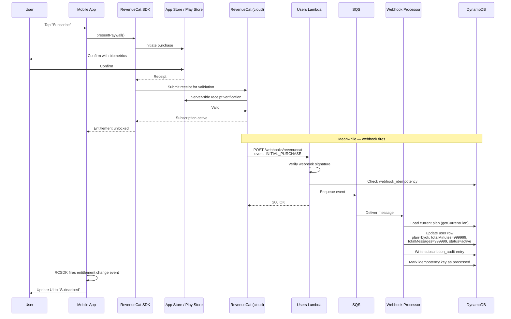

# Subscriptions and BYOK

How a user subscribes to Menthera's paid tier, how their subscription state flows from the App Store / Play Store through RevenueCat and back to Menthera's backend, and how the Bring Your Own Key (BYOK) model works — a subscription pattern where users unlock unlimited usage by providing their own Google Gemini API key. This is the most product-level feature in the system and it is where the security constraints get interesting.

---

## Table of contents

- [The subscription model](#the-subscription-model)
- [What the user experiences](#what-the-user-experiences)
- [End-to-end purchase flow](#end-to-end-purchase-flow)
- [The BYOK tier in detail](#the-byok-tier-in-detail)
- [RevenueCat webhook processing](#revenuecat-webhook-processing)
- [Subscription audit log](#subscription-audit-log)
- [Why RevenueCat instead of rolling our own](#why-revenuecat-instead-of-rolling-our-own)
- [Why the native paywall UI](#why-the-native-paywall-ui)
- [Known gaps](#known-gaps)
- [File reference](#file-reference)

---

## The subscription model

Menthera has exactly two plan tiers:

| Plan | Monthly minutes | Monthly messages | LLM usage |
| --- | --- | --- | --- |
| **`inactive`** | 0 | 0 | Blocked |
| **`byok`** | 999,999 (effectively unlimited) | 999,999 (effectively unlimited) | Unlimited via user's own Google Gemini API key |

From [`backend/src/shared/config/quotas.config.ts`](../../backend/src/shared/config/quotas.config.ts):

```typescript
export const SUBSCRIPTION_QUOTAS: Record<SubscriptionPlan, PlanQuota> = {
  inactive: {
    minutes: 0,
    messages: 0,
  },
  byok: {
    minutes: 999999,
    messages: 999999,
  },
};
```

Everything is either "you can use the app" or "you cannot." There is no metered middle tier in the current model. Legacy Pro and Premium tiers from an earlier pricing model map to `inactive` during the transition — a user who previously had Pro is shown as `inactive` in DynamoDB until they upgrade to BYOK.

### Why only two tiers

The original model had three paid tiers (Free, Pro, Premium) with different monthly minute and message allotments. The BYOK model replaced this because:

1. **Cost unpredictability.** Under the old model, Menthera paid for every LLM token the user consumed. A user sending 10× the average messages cost 10× in LLM fees while paying the same subscription price. Variable costs against fixed revenue is a bad shape for a bootstrapped product.
2. **Price sensitivity.** Users comparing $10 "Pro" to $5 "Free" anchor on the free tier and frequently do not upgrade. A BYOK tier reframes the decision: "bring your own key and use as much as you want" is a different kind of offer.
3. **Power user alignment.** The users who exceed free quotas are also the users who are most likely to already have a Google API key or be willing to get one. BYOK aligns incentives — heavy users pay for their own usage directly, Menthera earns the subscription fee as pure margin.

The trade-off is onboarding friction. A user who just wants to try the paid tier has to create a Google Cloud account, enable the Generative Language API, and copy their key into the app. This is a real drop-off point in the funnel, and the mobile UX has dedicated screens to walk users through it.

---

## What the user experiences

### Purchase flow

1. The user hits a paid feature (sends their first message, attempts their first call) and sees a prompt — they need an active subscription.
2. Tapping "Subscribe" opens the RevenueCat native paywall component, rendered by `react-native-purchases-ui`. The paywall is styled in the RevenueCat dashboard, not in Menthera code.
3. The user sees the BYOK plan, the price, and a "Subscribe" button. They tap it.
4. The native iOS or Android purchase sheet takes over. Face ID / Touch ID / passcode confirms the purchase.
5. The purchase completes. RevenueCat receives the receipt from Apple/Google, validates it, and sends a webhook to Menthera's backend.
6. The user is returned to the Menthera UI. They are now subscribed, but the UI does not yet know about it.
7. The mobile app polls or listens for subscription status changes (via RevenueCat's SDK) and updates the UI state to "subscribed."
8. If the user tries to use Google models without an API key, the API key prompt appears. The user enters their key, it is validated against Google's API, and saved to their user record.

### BYOK key setup flow

1. The user taps an agent that uses a Google Gemini model.
2. If no BYOK key is stored, the backend returns an error (`User API key is required for Google models (BYOK)`) and the mobile app catches it.
3. The [`useApiKeyGate`](../../mobile/hooks/useApiKeyGate.ts) hook opens the [`ApiKeyPrompt`](../../mobile/components/modals/ApiKeyPrompt.tsx) modal.
4. The modal explains what a Google Gemini API key is and has a direct link to Google AI Studio where the user creates one.
5. The user pastes their key into the input field.
6. The mobile app submits it to `POST /users/api-key`.
7. The backend validates the key format (must start with `AIza` and be at least 30 characters), then makes a live call to `https://generativelanguage.googleapis.com/v1beta/models?key=<key>` to verify it has access. A zero-cost API call that returns 200 if the key is valid.
8. On success, the key is stored in the user's DynamoDB row and the modal closes. The user's original action (sending a message to the Google-powered agent) retries and succeeds.
9. The user can manage, rotate, or remove their key later from the profile screen.

---

## End-to-end purchase flow



Two things worth noting:

1. **The mobile app and the backend learn about the subscription through different channels.** The mobile app is updated by RevenueCat's SDK directly (fast, user-facing). The backend is updated by RevenueCat's webhook (eventually consistent, authoritative). These two paths converge within a few seconds but the mobile app does not wait for the backend to confirm before unlocking the UI.

2. **The backend treats RevenueCat as the source of truth.** The backend does not validate App Store receipts itself. RevenueCat does the validation, and Menthera trusts the webhook events from RevenueCat (verified by signature). This is the right trade — receipt validation is a solved problem and reimplementing it is error-prone.

---

## The BYOK tier in detail

### Why BYOK is Google-specific

BYOK applies only to Google Gemini models. Anthropic and OpenAI models still use Menthera's system-level API keys from Secrets Manager. The asymmetry is enforced in [`backend/src/shared/services/ai-provider.service.ts`](../../backend/src/shared/services/ai-provider.service.ts):

```typescript
case 'google': {
  if (!userApiKey) {
    throw new Error('User API key is required for Google models (BYOK)');
  }
  const google = createGoogleGenerativeAI({ apiKey: userApiKey });
  return google(modelInfo.modelId);
}

case 'anthropic': {
  const anthropic = createAnthropic({ apiKey: activeSecrets.ANTHROPIC_API_KEY });
  return anthropic(modelInfo.modelId);
}
```

Why Google specifically? Because Google Gemini's API has the most generous free tier and the simplest key creation process. A user can get a Google AI Studio key in 2 minutes without a credit card, under a relatively generous free quota. Anthropic and OpenAI require a paid account with a credit card on file from the start, which is a harder sell for a "bring your own key" experience.

In practice, BYOK subscribers use Google models almost exclusively, and Menthera routes agents to Google when a BYOK key is available. Anthropic and OpenAI usage is reserved for admin/system-level functions (like quest insight generation, where the cost is known and bounded).

### Storing and validating the API key

The [`UserApiKeyService`](../../backend/src/shared/services/user-api-key.service.ts) handles the key lifecycle:

**Validation (format check + live verification):**

```typescript
async validateApiKey(apiKey: string): Promise<{ valid: boolean; error?: string }> {
  // Format check
  if (!apiKey || !apiKey.startsWith('AIza') || apiKey.length < 30) {
    return { valid: false, error: 'Invalid key format. Gemini API keys start with "AIza"...' };
  }

  // Live verification against Google's API
  const response = await fetch(
    `https://generativelanguage.googleapis.com/v1beta/models?key=${apiKey}`,
    { method: 'GET', signal: AbortSignal.timeout(10000) }
  );

  if (response.ok) return { valid: true };
  if (response.status === 400 || response.status === 403) {
    return { valid: false, error: 'API key is invalid or does not have access to Gemini models.' };
  }
  return { valid: false, error: `Validation failed with status ${response.status}.` };
}
```

The validation is two-stage: a format check (fast, free) and a live API call to Google's `models` list endpoint (costs nothing, takes ~300 ms). The live check is necessary because a syntactically valid key can still be expired, revoked, or restricted. Failing validation at submission time is much better than failing on the user's first message — if the user pastes the wrong key, they see the error immediately in the modal rather than later in the chat UI.

**Storage:**

```typescript
async storeApiKey(userId: string, apiKey: string): Promise<{ stored: boolean; error?: string }> {
  const validation = await this.validateApiKey(apiKey);
  if (!validation.valid) {
    return { stored: false, error: validation.error };
  }

  const keyPrefix = apiKey.substring(0, 8);
  const keySuffix = apiKey.substring(apiKey.length - 4);

  await this.db.send(new UpdateCommand({
    TableName: this.tableName,
    Key: { user_id: userId },
    UpdateExpression: 'SET byokApiKey = :key, byokKeyPrefix = :prefix, byokKeySuffix = :suffix, byokKeyValidatedAt = :validatedAt, ...',
    ExpressionAttributeValues: {
      ':key': apiKey,
      ':prefix': keyPrefix,
      ':suffix': keySuffix,
      ':validatedAt': new Date().toISOString(),
      // ...
    },
  }));

  return { stored: true };
}
```

Four fields are written:

- **`byokApiKey`** — the full API key.
- **`byokKeyPrefix`** — the first 8 characters (`AIzaSyA4`).
- **`byokKeySuffix`** — the last 4 characters (`wXy2`).
- **`byokKeyValidatedAt`** — the timestamp of successful validation.

The prefix and suffix are stored separately so the UI can show a masked version (`AIzaSyA4...wXy2`) without needing to read the full key. This is a small optimisation that also serves as a defence-in-depth measure — code paths that only need to display the key never touch the full value.

### Masked display for the UI

`getKeyInfo()` is the read helper used by any UI that needs to show whether the user has a key configured:

```typescript
async getKeyInfo(userId: string): Promise<ApiKeyInfo> {
  // ...
  if (!result.Item?.byokApiKey) {
    return { hasKey: false };
  }
  return {
    hasKey: true,
    keyPrefix: result.Item.byokKeyPrefix,
    keySuffix: result.Item.byokKeySuffix,
    validatedAt: result.Item.byokKeyValidatedAt,
  };
}
```

This is the only method that should be called when the Lambda wants to check "does this user have a key" — it projects only the metadata fields and never loads `byokApiKey` into memory unnecessarily. Code paths that need the actual key (the chat handler, when calling Google) use `getUserApiKey()` instead, which explicitly reads the full value.

---

## RevenueCat webhook processing

RevenueCat posts to `POST /webhooks/revenuecat` whenever a subscription state changes. The handler is in [`backend/src/services/users/api.ts`](../../backend/src/services/users/api.ts), and the async processor is [`backend/src/services/users/webhook-processor.ts`](../../backend/src/services/users/webhook-processor.ts).

### The two-stage pipeline

Unlike Clerk webhooks (which are processed synchronously — see [`features/authentication.md`](./authentication.md#why-sync-and-not-async)), RevenueCat webhooks are processed **asynchronously via SQS**:

1. **Stage 1 — receive and enqueue.** The `usersHandler` Lambda receives the webhook at `POST /webhooks/revenuecat`, verifies the signature, checks the idempotency table, and enqueues the event to an SQS queue. It returns 200 immediately.

2. **Stage 2 — process.** A separate `webhookProcessorHandler` Lambda consumes from SQS, runs the actual database updates, and writes to the subscription audit log. Failures trigger SQS retries (max 3) then go to a dead-letter queue for investigation.

This split is why [`users-stack.ts`](../../backend/lib/stacks/users-stack.ts) provisions both a `usersHandler` (REST API) and a `webhookProcessorHandler` (SQS consumer), with an SQS queue in between:

```typescript
this.webhookQueue = new sqs.Queue(this, 'WebhookQueue', {
  queueName: `${environment}-webhook-queue`,
  visibilityTimeout: cdk.Duration.seconds(90),
  retentionPeriod: cdk.Duration.days(4),
  deadLetterQueue: {
    queue: this.webhookDLQ,
    maxReceiveCount: 3,
  },
});

this.webhookProcessorHandler.addEventSource(
  new lambdaEventSources.SqsEventSource(this.webhookQueue, {
    batchSize: 1,
    maxBatchingWindow: cdk.Duration.seconds(0),
    reportBatchItemFailures: true,
  })
);
```

`batchSize: 1` ensures each SQS message is processed independently — a slow RevenueCat event cannot block other events. `reportBatchItemFailures: true` means only the specific failed messages get retried, not the whole batch.

### Event types handled

The processor handles six RevenueCat event types:

```typescript
async function processRevenueCatEvent(event: any): Promise<void> {
  const eventType = event.event?.type;

  switch (eventType) {
    case 'INITIAL_PURCHASE':   return await processInitialPurchase(event);
    case 'RENEWAL':            return await processRenewal(event);
    case 'CANCELLATION':       return await processCancellation(event);
    case 'EXPIRATION':         return await processExpiration(event);
    case 'PRODUCT_CHANGE':     return await processProductChange(event);
    case 'BILLING_ISSUE':      return await processBillingIssue(event);
    default:
      console.log(`Event type '${eventType}' not handled`);
  }
}
```

Each handler updates the user's `plan`, `totalMinutes`, `totalMessages`, `subscriptionStatus`, `subscriptionProductId`, and `subscriptionExpiresAt` fields in the `users` table, then writes an audit entry. The updates are idempotent — the full row is overwritten with the new state, so a duplicated event produces the same result.

### Why async for RevenueCat but sync for Clerk

This is the same decision documented in [`features/authentication.md`](./authentication.md#why-sync-and-not-async), with the key question being: **does the mobile app need the backend state to be updated before the user can proceed?**

- **Clerk `user.created`:** Yes. The user must exist in DynamoDB before any authenticated request succeeds. Sync path prevents the race.
- **RevenueCat `INITIAL_PURCHASE`:** No. The mobile app learns about the subscription from the RevenueCat SDK directly, so the UI unlocks before the backend has processed the webhook. The backend can take 5–10 seconds to catch up without any user-visible impact.

Async via SQS gives retries, dead-lettering, and independent failure domains. It is the right shape for events where downstream consumers can tolerate eventual consistency.

---

## Subscription audit log

Every subscription state change writes an immutable audit entry to the [`subscription_audit`](../../backend/lib/stacks/core/database-stack.ts) table:

- **Partition key:** `user_id`
- **Sort key:** `timestamp` (ISO 8601)

Each entry captures the event type, source (`revenuecat` or `clerk`), old and new plan, product ID, subscription status, and the raw webhook event body. From [`webhook-processor.ts`](../../backend/src/services/users/webhook-processor.ts):

```typescript
await logSubscriptionAudit(db, {
  userId,
  eventType: 'INITIAL_PURCHASE',
  source: 'revenuecat',
  oldPlan: oldPlan || 'unknown',
  newPlan: plan,
  productId,
  subscriptionStatus: 'active',
  rawEvent: event,
});
```

### Why an audit log matters

Three reasons:

1. **Billing disputes.** If a user reports "I was charged but did not get access" or "I was downgraded unexpectedly", the audit log is the authoritative record of what happened and when. Without it, debugging a subscription state bug would require reading through raw RevenueCat dashboard logs and correlating by timestamp.

2. **Compliance.** Some regulatory frameworks require an immutable record of billing state changes. Even when not strictly required, it is a good practice to have.

3. **Analytics.** Plan transitions (new subscribers, cancellations, churn) are computed from the audit log, not from the current state of the `users` table. The current state is "where you are"; the audit log is "how you got here."

### Immutability

The audit table is append-only by convention — the application code never issues `UpdateCommand` or `DeleteCommand` against it, only `PutCommand` with new rows. This is not enforced at the IAM level (Lambda's IAM policy grants full table access), but it would be a reasonable production hardening to restrict write permissions to `PutItem` only.

---

## Why RevenueCat instead of rolling our own

Menthera could have built its own subscription management: server-side receipt validation against Apple's and Google's servers, a webhook listener for billing events, a state machine for subscription lifecycle. It is a known pattern with open-source libraries.

The decision to use RevenueCat is deliberate, for four reasons:

### 1. Server-side receipt validation is non-trivial

Apple and Google each have their own receipt formats, validation endpoints, sandbox vs production distinctions, auto-renewal notification schemas, and edge cases (grace periods, billing retries, family sharing). Getting this right for both platforms takes weeks of focused work and ongoing maintenance as the platforms evolve.

### 2. Cross-platform subscription state

A user might subscribe on iOS and then install the app on Android. Without RevenueCat, syncing the subscription state across platforms requires custom account-linking logic. RevenueCat handles this automatically via its `app_user_id` concept.

### 3. The webhook contract is stable

RevenueCat's webhook schema is well-documented, versioned, and does not change. Menthera's backend implements the webhook once and does not need to track platform SDK updates.

### 4. Testing and sandboxes

RevenueCat provides a sandbox mode that simulates purchases without going through Apple's TestFlight or Google's internal test track. This dramatically speeds up iteration on subscription logic.

### The trade-offs

- **Vendor lock-in.** Migrating off RevenueCat later would mean reimplementing receipt validation and rewriting the webhook path.
- **Price per conversion.** RevenueCat takes a percentage of subscription revenue above a free tier. For a large product this adds up.
- **Less control.** If RevenueCat has an outage or bug, Menthera is affected.

For a bootstrapped showcase-scale product, these trade-offs clearly favour using RevenueCat. For a growth-stage startup with a full-time billing team, the calculation might flip.

---

## Why the native paywall UI

Menthera uses `react-native-purchases-ui` to render the subscription paywall, not a custom UI. The paywall template is configured in the RevenueCat dashboard — colors, copy, plan layout, testimonials, images — and `react-native-purchases-ui` renders it natively on iOS and Android using platform-appropriate components.

The alternative would be a custom paywall built with Menthera's own components, matching the app's design system.

### Reasons for the native paywall

1. **Pricing iteration without mobile releases.** Changing the paywall copy, layout, or pricing display is a dashboard change in RevenueCat. It takes effect immediately for all users, with no App Store review, no EAS build, no mobile update rollout. For a product iterating on conversion rate, this is a huge win.

2. **A/B testing.** RevenueCat supports paywall experiments natively. Menthera can run "variant A vs variant B" tests from the dashboard without writing experiment infrastructure.

3. **Platform compliance.** Apple and Google both have strict rules about subscription disclosures, restore purchases buttons, and link-out limitations. The native paywall is maintained by RevenueCat to stay compliant with both platforms' current rules.

### The trade-off

Less visual control. The paywall is styled in RevenueCat's templates, which are flexible but not infinitely flexible. If Menthera wanted a radically different paywall — an interactive calculator, a video hero, custom animations — the native paywall would not support it.

For a showcase product iterating on conversion, the trade is correct. For a flagship product with a bespoke design language, it would be wrong.

---

## Known gaps

### 1. The BYOK API key is stored in plaintext in DynamoDB

The single most important gap in this feature. `UserApiKeyService.storeApiKey()` writes the full API key directly to the `users` table:

```typescript
UpdateExpression: 'SET byokApiKey = :key, ...',
ExpressionAttributeValues: {
  ':key': apiKey,
  // ...
},
```

The table has **DynamoDB at-rest encryption** (AWS's default), but no application-level encryption. This means:

- **Any Lambda with read access to the `users` table can read the plaintext key.** Menthera's own Lambdas grant read access broadly — at least nine Lambdas can read user rows.
- **Logs or error messages that include the user row will leak the key.** A stray `console.log(user)` anywhere in the code path is a potential leak.
- **DynamoDB backups and exports contain plaintext keys.** If a backup is ever shared with an external party (support investigation, data analysis), the keys go with it.

The right fix is to encrypt the key with a KMS customer-managed key before writing it to DynamoDB, and decrypt it only when needed (inside the chat handler, right before calling Google). The decrypted value should never be written to logs, never be returned to the client, and should live in memory only for the duration of the request.

A more elaborate fix would use AWS Secrets Manager with a secret per user. This adds operational complexity (creating/deleting secrets alongside users) and costs more, but gives stronger isolation.

Neither is implemented in the current codebase. **This must be fixed before production deployment.** The `byokKeyPrefix`/`byokKeySuffix` display pattern is good (it avoids reading the full key for UI purposes), but the underlying storage is still plaintext.

### 2. No server-side key rotation schedule

Google API keys do not automatically expire, but best practice is to rotate them periodically. The current system has no rotation mechanism — if a user stores a key and never updates it, the same key is reused indefinitely. A production version would either:

- Prompt the user to re-validate their key every N months.
- Track the last successful Google API call per key and warn when a key has been unused for an extended period.
- Automatically rotate on validation failures (detect 403 responses from Google and ask the user for a new key).

### 3. The legacy pro/premium → inactive mapping is silent

The comment in [`webhook-processor.ts`](../../backend/src/services/users/webhook-processor.ts) notes that legacy Pro and Premium products map to `inactive` during the transition. If a user had an active Pro subscription under the old model, their webhook events now map them to `inactive`, effectively revoking their access. There is no grace period logic or migration path to move existing Pro/Premium subscribers to BYOK.

A production rollout would need either:

- A grandfather clause keeping old subscribers on their existing tier until they voluntarily upgrade.
- A forced migration with email notification and a discount coupon for BYOK.
- A manual audit of existing subscribers and individual handling.

### 4. No idempotency on BYOK key storage

`storeApiKey()` does not check whether the user already has a key before overwriting it. A user submitting their key twice just overwrites the previous value. This is not a correctness issue but it could be surprising — there is no "are you sure you want to replace your existing key?" prompt, and the previous key is lost.

### 5. Key validation hits Google's API on every submission

Every BYOK key storage operation makes a live call to `https://generativelanguage.googleapis.com/v1beta/models?key=<key>` to validate the key. This is free (the endpoint lists models, does not consume tokens), but it is an external dependency — if Google's API is slow or unavailable, key storage is blocked. A production hardening would add a fallback path that stores the key with a `validationPending: true` flag and validates asynchronously.

---

## File reference

### Mobile

- [`mobile/providers/RevenueCatProvider.tsx`](../../mobile/providers/RevenueCatProvider.tsx) — Initialises the RevenueCat SDK with the user's Clerk ID as `app_user_id`
- [`mobile/hooks/useSubscription.ts`](../../mobile/hooks/useSubscription.ts) — Subscription state hook
- [`mobile/hooks/useEntitlements.ts`](../../mobile/hooks/useEntitlements.ts) — Entitlement check hook (wraps RevenueCat's customer info)
- [`mobile/hooks/usePaywall.ts`](../../mobile/hooks/usePaywall.ts) — Opens the native paywall component
- [`mobile/hooks/useApiKeyGate.ts`](../../mobile/hooks/useApiKeyGate.ts) — Handles the "user needs a BYOK key" error flow
- [`mobile/components/modals/ApiKeyPrompt.tsx`](../../mobile/components/modals/ApiKeyPrompt.tsx) — Modal for entering/updating the BYOK key
- [`mobile/components/screens/profile/SubscriptionManager.tsx`](../../mobile/components/screens/profile/SubscriptionManager.tsx) — Profile screen subscription display
- [`mobile/components/screens/profile/ApiKeyManager.tsx`](../../mobile/components/screens/profile/ApiKeyManager.tsx) — Profile screen BYOK key management
- [`mobile/lib/revenuecat/config.ts`](../../mobile/lib/revenuecat/config.ts) — RevenueCat entitlement IDs, offering IDs, and product ID placeholders

### Backend — subscription logic

- [`backend/src/services/users/api.ts`](../../backend/src/services/users/api.ts) — Users Hono API with `POST /webhooks/revenuecat`, `POST /users/api-key`, `GET /users/api-key`, `DELETE /users/api-key`
- [`backend/src/services/users/webhook-processor.ts`](../../backend/src/services/users/webhook-processor.ts) — SQS-triggered async processor for all six RevenueCat event types
- [`backend/src/shared/services/user-api-key.service.ts`](../../backend/src/shared/services/user-api-key.service.ts) — `validateApiKey`, `storeApiKey`, `getUserApiKey`, `removeApiKey`, `getKeyInfo`
- [`backend/src/shared/services/ai-provider.service.ts`](../../backend/src/shared/services/ai-provider.service.ts) — Provider factory that enforces the Google BYOK constraint
- [`backend/src/shared/utils/audit-logger.ts`](../../backend/src/shared/utils/audit-logger.ts) — `logSubscriptionAudit`, idempotency helpers
- [`backend/src/shared/config/quotas.config.ts`](../../backend/src/shared/config/quotas.config.ts) — `SUBSCRIPTION_QUOTAS` and `getQuotaForPlan`

### Backend — CDK infrastructure

- [`backend/lib/stacks/users-stack.ts`](../../backend/lib/stacks/users-stack.ts) — Users service stack with the API Lambda, the webhook processor Lambda, the SQS queue and DLQ, and the API Gateway routes including the webhook endpoints

### DynamoDB tables touched by this flow

- `users` — Stores plan, quota counters, subscription status, and BYOK key fields (`byokApiKey`, `byokKeyPrefix`, `byokKeySuffix`, `byokKeyValidatedAt`)
- `subscription_audit` — Immutable log of every plan transition with old and new state
- `webhook_idempotency` — Dedup for RevenueCat and Clerk webhook replays
