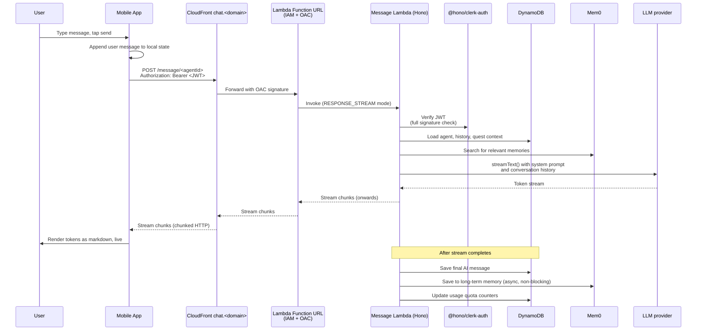

# Text chat

How a user sends a message to an AI agent and sees the response appear token by token, across the full round trip: mobile keyboard → Lambda Function URL → LLM streaming → markdown rendering. This is the single most architecturally unusual feature in the system, because it does not go through API Gateway and because of that one constraint, everything else about it is shaped differently from the rest of the app.

---

## Table of contents

- [What the user experiences](#what-the-user-experiences)
- [End-to-end flow](#end-to-end-flow)
- [Why not API Gateway](#why-not-api-gateway)
- [CloudFront in front of the Function URL](#cloudfront-in-front-of-the-function-url)
- [Inside the Lambda — Hono + Vercel AI SDK](#inside-the-lambda--hono--vercel-ai-sdk)
- [The AI provider abstraction](#the-ai-provider-abstraction)
- [mem0 long-term memory](#mem0-long-term-memory)
- [Mobile consumption — streaming fetch and markdown rendering](#mobile-consumption--streaming-fetch-and-markdown-rendering)
- [Message persistence and audit](#message-persistence-and-audit)
- [Rate limiting](#rate-limiting)
- [File reference](#file-reference)

---

## What the user experiences

1. The user opens a chat with an agent from the home screen or the chat tab.
2. They type a message and tap send.
3. The user's message appears immediately in the chat log.
4. After a brief connection pause, the agent's response begins appearing — one word at a time, then one paragraph at a time, streaming in real time.
5. Markdown is rendered as it arrives. Bold, bullet lists, headings, and links all render without waiting for the full response.
6. When the response finishes, a "completed" state is set and the input box re-enables.

The user never sees a loading spinner of more than a few hundred milliseconds. The streaming experience is the whole point — it turns a 5–10 second wait into an immediate-feeling interaction.

---

## End-to-end flow



Two things in this diagram matter more than the others:

1. **The path from LLM → Lambda → Function URL → CloudFront → mobile is a single end-to-end stream.** Nothing buffers the response mid-flight. Each component either supports streaming natively (LLM provider, Lambda `RESPONSE_STREAM`, CloudFront with `CACHING_DISABLED`) or passes bytes through without buffering.

2. **Persistence happens after the stream completes.** The user sees every token before DynamoDB is written. This is counter to the usual "persist first, then respond" pattern and is intentional — latency to first token is the metric that matters for chat UX, and waiting for a write before sending the first token would add 20–50 ms that the user would feel.

---

## Why not API Gateway

The single sentence that explains this entire feature's architecture: **API Gateway REST does not support response streaming**.

If you proxy a streaming Lambda response through an API Gateway REST stage, API Gateway buffers the entire response, waits for the Lambda to finish, and then delivers the buffered result to the client. For a 5-second LLM response this means the user waits 5 seconds staring at a loading spinner and then sees the entire response appear at once. That is exactly the experience streaming was invented to avoid.

The alternatives AWS offers:

| Option | Verdict |
| --- | --- |
| **API Gateway REST** | Buffers responses. Unsuitable |
| **API Gateway HTTP API (v2)** | Also buffers responses. Unsuitable |
| **API Gateway WebSockets** | Supports streaming, but a totally different programming model — connection IDs, connect/disconnect lifecycle, message routing through a separate Lambda. The state overhead is absurd for what is effectively a one-shot stream of tokens |
| **Application Load Balancer + Lambda** | Supports streaming, but adds a per-hour ALB cost (~$16/month) for one endpoint |
| **Lambda Function URL with `RESPONSE_STREAM`** | **The answer.** Native streaming, zero extra infrastructure, billed per invocation |

`RESPONSE_STREAM` invoke mode was added to Lambda specifically to enable this use case (AI chat being the canonical example). It lets a Lambda incrementally write response bytes via `awslambda.streamifyResponse`, and the Lambda service passes them to the caller as they are written. The Hono framework has an adapter for this: [`hono/aws-lambda`'s `streamHandle`](https://hono.dev/getting-started/aws-lambda), which wraps a Hono app so its streaming responses become Lambda stream writes.

---

## CloudFront in front of the Function URL

The Function URL is not exposed to the internet directly. If you look at [`backend/lib/stacks/message-stack.ts`](../../backend/lib/stacks/message-stack.ts), you will see it is created with `FunctionUrlAuthType.AWS_IAM`:

```typescript
this.functionUrl = this.messageHandler.addFunctionUrl({
  authType: lambda.FunctionUrlAuthType.AWS_IAM,
  invokeMode: lambda.InvokeMode.RESPONSE_STREAM,
  cors: {
    allowedMethods: [lambda.HttpMethod.POST, lambda.HttpMethod.GET],
    allowedOrigins: [appDomain || 'https://app.example.com'],
    allowedHeaders: ['Content-Type', 'Authorization'],
  },
});
```

`AWS_IAM` means the Function URL will only accept requests that carry a valid AWS SigV4 signature. Without a signature, the Function URL returns 403. So who signs the requests? CloudFront does, via **Origin Access Control (OAC)**. See [`backend/lib/stacks/core/route53-stack.ts`](../../backend/lib/stacks/core/route53-stack.ts):

```typescript
this.chatDistribution = new cloudfront.Distribution(this, 'ChatDistribution', {
  defaultBehavior: {
    origin: FunctionUrlOrigin.withOriginAccessControl(messageFunctionUrl),
    viewerProtocolPolicy: cloudfront.ViewerProtocolPolicy.REDIRECT_TO_HTTPS,
    cachePolicy: cloudfront.CachePolicy.CACHING_DISABLED,
    originRequestPolicy: cloudfront.OriginRequestPolicy.ALL_VIEWER_EXCEPT_HOST_HEADER,
    allowedMethods: cloudfront.AllowedMethods.ALLOW_ALL,
  },
  domainNames: [chatSubdomain],
  certificate: chatCertificate,
});
```

The mobile client hits `chat.<domain>` — a Route53 A record aliased to this distribution. CloudFront:

1. Terminates TLS with an ACM cert issued to `chat.<domain>`.
2. Forwards the request to the Function URL origin, signing it with OAC so the Function URL accepts it.
3. Passes the streaming response back to the client without caching.

### Why CloudFront for something that isn't cached

This is the question a reviewer might ask: if `cachePolicy: CachePolicy.CACHING_DISABLED`, what is CloudFront actually doing? Four things:

1. **Custom domain.** Function URLs have ugly AWS-generated hostnames like `abcdef.lambda-url.us-east-1.on.aws`. CloudFront lets you put `chat.yourdomain.com` in front.
2. **TLS with your own cert.** The ACM cert covers `chat.yourdomain.com`. The Function URL still terminates HTTPS upstream, but with an AWS-managed cert on an AWS-owned hostname.
3. **Origin isolation.** With IAM + OAC, the Function URL itself is unreachable from the internet. A `curl` to the raw Function URL returns 403. Only CloudFront can invoke it, which removes a whole class of direct-URL attacks.
4. **WAF hook point.** If you later want to add a Web Application Firewall, CloudFront is where you attach it. Free option to keep open.

The caching feature is disabled because streaming per-user responses are never cacheable. But CloudFront gives you four other things for free, and the cost is single-digit dollars per month for the edge capacity.

This pattern — **IAM-protected Lambda Function URL with CloudFront + OAC in front** — is the same shape as CloudFront → S3 with OAC, applied to Lambda instead of S3. It is the canonical AWS pattern for custom-domained streaming Lambdas and is worth knowing.

---

## Inside the Lambda — Hono + Vercel AI SDK

The Lambda entry point is [`backend/src/services/message/api.ts`](../../backend/src/services/message/api.ts). It is a Hono app with streaming adapter:

```typescript
import { Hono } from 'hono';
import { streamHandle } from 'hono/aws-lambda';
import { getAuth } from '@hono/clerk-auth';
import customClerkMiddleware from '../../shared/auth-middleware';
import { streamText, UIMessage, convertToModelMessages } from 'ai';
import { AiProviderService } from '../../shared/services/ai-provider.service';

const app = new Hono();

app.use(logger());
app.use('*', customClerkMiddleware);
app.use('*', cors());

app.post('/message/:agentId', async (c) => {
  const auth = getAuth(c);
  if (!auth?.userId) {
    throw new HTTPException(401, { message: 'Unauthorized' });
  }

  // ... load agent, load history, build system prompt, truncate context ...

  const result = streamText({
    model,
    system: agentPrompt,
    messages: coreMessages,
    onFinish: async (e) => {
      // Persist the completed AI message to DynamoDB
      await chatHelpers.saveAiMessage({ userId, agentId, content: e.text, ... });
      // Save to mem0 async, non-blocking
      if (userMessageContent.length > 20) {
        Mem0Client.addAsync(...);
      }
    },
  });

  return result.toUIMessageStreamResponse();
});

export default streamHandle(app);
```

### The `streamHandle` adapter

The `export default streamHandle(app)` line is how Hono adapts to Lambda's `RESPONSE_STREAM` invoke mode. `streamHandle` wraps the Hono app so the HTTP response body becomes Lambda stream writes. The [`message-stack.ts`](../../backend/lib/stacks/message-stack.ts) CDK code references this entry point with `handler: 'default'`:

```typescript
this.messageHandler = new NodejsFunction(this, `${id}-message-handler`, {
  runtime: lambda.Runtime.NODEJS_22_X,
  memorySize: 1024, // Increased from 512 for LLM streaming
  timeout: cdk.Duration.seconds(60),
  entry: 'src/services/message/api.ts',
  handler: 'default',
  // ...
});
```

1024 MB memory (up from the 512 MB default) because streaming + LLM inference calls need more headroom. 60-second timeout because some responses take that long to fully complete.

### Authentication is the same as every other Hono Lambda

Because the message Lambda is a Hono app, it uses the same `customClerkMiddleware` that every other API Gateway Lambda uses. The middleware is wired on line 40 with `app.use('*', customClerkMiddleware)`, and handlers read the authenticated user via `getAuth(c)` on line 54. There is no special auth path for the Function URL — it is the same Clerk middleware, same signature verification, same security properties. The only thing that makes this Lambda different from the API Gateway ones is that it ships streaming responses through `streamHandle` instead of normal Hono responses.

### Context truncation

Before calling `streamText`, the handler truncates the conversation to the most recent 20 messages:

```typescript
if (messages.length > 20) {
  console.log(`[Message API] Truncating ${messages.length} messages to last 20`);
  messages = messages.slice(-20);
}
```

This is a simple sliding window — it keeps the token count bounded and stops the conversation from blowing up the LLM context window. Twenty messages is enough for meaningful continuity without becoming expensive. Longer-term memory is handled separately by [mem0](#mem0-long-term-memory), which is summarised into the system prompt rather than kept in the messages array.

---

## The AI provider abstraction

Menthera does not hardcode a single LLM provider. The [`AiProviderService`](../../backend/src/shared/services/ai-provider.service.ts) is a factory that returns a Vercel AI SDK `LanguageModelV2` based on the configured provider:

```typescript
async getAiProvider({ modelInfo, secrets, userApiKey }): Promise<LanguageModelV2> {
  switch (modelInfo.modelProvider) {
    case 'google': {
      if (!userApiKey) {
        throw new Error('User API key is required for Google models (BYOK)');
      }
      const google = createGoogleGenerativeAI({ apiKey: userApiKey });
      return google(modelInfo.modelId);
    }
    case 'anthropic': {
      const anthropic = createAnthropic({ apiKey: activeSecrets.ANTHROPIC_API_KEY });
      return anthropic(modelInfo.modelId);
    }
    case 'openai': {
      const openai = createOpenAI({ apiKey: activeSecrets.OPENAI_API_KEY });
      return openai(modelInfo.modelId);
    }
  }
}
```

Three providers: Google Gemini, Anthropic Claude, and OpenAI GPT. Any of them can serve any agent in the app — the model selection is per-agent configuration (see [`backend/src/shared/config/ai-models.config.ts`](../../backend/src/shared/config/ai-models.config.ts)).

### The Google BYOK constraint

There is one critical asymmetry in this abstraction: **Google Gemini models require a user-provided API key (BYOK), not a system key**. Anthropic and OpenAI fall back to system secrets from Secrets Manager; Google does not.

This is an intentional product decision. Menthera's BYOK (Bring Your Own Key) subscription tier lets users provide their own Google Gemini API key in exchange for unlimited usage of Google models, bypassing Menthera's own usage quotas. The system-level keys are reserved for Anthropic and OpenAI; any user who wants Google has to supply their own key.

The user's BYOK key is stored encrypted in the `users` DynamoDB table via the [`UserApiKeyService`](../../backend/src/shared/services/user-api-key.service.ts), and retrieved at request time when the chat handler initialises the provider for a Google model. See [`features/subscriptions-and-byok.md`](./subscriptions-and-byok.md) for the full BYOK flow.

If a user selects a Google agent without a BYOK key configured, the provider service throws `User API key is required for Google models (BYOK)` and the chat handler returns a clear error. The mobile app catches this error in [`hooks/useApiKeyGate.ts`](../../mobile/hooks/useApiKeyGate.ts) and opens the API key prompt modal.

---

## mem0 long-term memory

Context truncation to 20 messages would make the agent feel amnesiac for long-term conversations. [mem0](https://mem0.ai/) solves this by acting as a semantic long-term memory layer.

The flow:

1. **On every message**, before calling `streamText`, the handler searches mem0 for memories relevant to the user's current message:
   ```typescript
   const memories = await Mem0Client.search(userMessageContent, { userId });
   ```
2. Relevant memories are formatted into the system prompt so the model sees them as context, alongside the agent's personality and the last 20 messages.
3. **After the stream completes**, in the `onFinish` callback, the handler asynchronously saves the new exchange to mem0 for future retrieval:
   ```typescript
   if (userMessageContent.length > 20) {
     Mem0Client.addAsync(userMessageContent, { userId, agentId });
   }
   ```
4. The `async` save does not block the response — by the time `onFinish` fires, the user has already seen the full streaming response. The mem0 save is fire-and-forget with its own error handling.

The `MEM0_SEARCH_THRESHOLD` environment variable (set to `0.1` in [`message-stack.ts`](../../backend/lib/stacks/message-stack.ts)) tunes the similarity cutoff — lower values return more memories, at the cost of some irrelevant ones slipping through. mem0 handles the embedding, the vector search, and the summarisation; Menthera just calls the client.

### Why not build memory ourselves?

Menthera could have implemented its own embedding store: use an embedding model, write vectors to a pgvector or Pinecone, do similarity search on each request. It's a known pattern. But mem0 handles three things that would otherwise need to be built:

1. **Summarisation.** mem0 does not store raw messages — it extracts facts and stores summarised memories. "User works as a designer in Berlin" is stored once and reused, instead of every message mentioning work.
2. **Conflict resolution.** When new information contradicts old (user moves cities, changes jobs), mem0 updates the memory rather than accumulating stale facts.
3. **Per-user isolation.** Memories are keyed by `userId`, so there is no cross-user leakage, without having to implement access control on an embedding store.

The trade-off is the usual one: external dependency, vendor lock-in, API cost per call. For this product and at this scale, mem0 is the right call.

---

## Mobile consumption — streaming fetch and markdown rendering

On the mobile side, [`mobile/providers/ChatProvider.tsx`](../../mobile/providers/ChatProvider.tsx) owns the chat state and the network layer. The core flow for a streaming response:

1. **Get the chat URL** from the environment:
   ```typescript
   const messageUrl = process.env.EXPO_PUBLIC_CHAT_URL || API_CONFIG.CHAT_URL;
   ```
   This is the CloudFront domain, not the API Gateway base URL. ChatProvider is the only place in the mobile app that reads this variable.

2. **Build an authenticated fetch** — the provider wraps `fetch` with a Clerk token attachment. The token comes from Clerk's React hooks (`useAuth().getToken()`) at request time, so it is always fresh:
   ```typescript
   // From useAuthenticatedFetch
   const token = await getToken();
   const response = await fetch(url, {
     headers: {
       Authorization: `Bearer ${token}`,
       'Content-Type': 'application/json',
     },
     body: JSON.stringify({ messages, timezone }),
   });
   ```

3. **Read the response stream.** The response body is a `ReadableStream` of SSE-formatted events produced by `result.toUIMessageStreamResponse()` on the server. The provider reads chunks with the standard Web Streams API:
   ```typescript
   const reader = response.body.getReader();
   const decoder = new TextDecoder();
   while (true) {
     const { done, value } = await reader.read();
     if (done) break;
     const chunk = decoder.decode(value);
     // Parse SSE, update message state
   }
   ```

4. **Incrementally update local state.** As each token arrives, the current assistant message's content is appended and React re-renders the chat view. Because the chat is rendered with `react-native-markdown-display`, markdown formatting updates as the tokens come in — headings render when `#` closes, bold renders when the second `**` arrives, bullet lists update as each item completes.

5. **Handle end-of-stream.** When the reader reports `done`, the provider marks the message as complete, clears the "assistant is typing" indicator, and re-enables the input box.

### Why not use `@ai-sdk/react`'s `useChat` hook?

The Vercel AI SDK provides a `useChat` React hook that handles all of this automatically — state management, streaming, message history. Menthera uses a manual fetch instead because:

1. **Multi-provider streaming.** The mobile app needs to work with custom backend logic (quest chat, agent selection, rate limit handling) that `useChat` does not support natively.
2. **Custom state shape.** ChatProvider manages more than just messages — agent selection, streaming status, typing indicators, connection state. A hook-based approach would fight with the provider pattern used across the rest of the app.
3. **Full control of retry and error semantics.** The manual fetch path can catch rate limit errors and trigger the paywall or API key modal; the `useChat` hook abstracts these away.

The trade-off is more code in ChatProvider. The benefit is complete control over the streaming lifecycle.

---

## Message persistence and audit

Messages are persisted to DynamoDB after the stream completes, in the Vercel AI SDK's `onFinish` callback. The `ChatHelpers.saveAiMessage()` method in [`chat-helpers.ts`](../../backend/src/services/message/chat-helpers.ts) writes both the user message and the AI response to the `messages` table:

```typescript
await chatHelpers.saveAiMessage({
  userId,
  agentId,
  content: e.text,
  result: e,
  timezone,
});
```

### Composite sort key for efficient per-agent queries

The `messages` table uses a composite sort key `agent_id#message_id` (see [`architecture.md`](../architecture.md#data-layer)). This allows two query patterns without adding a GSI:

1. **All messages for a user across all agents** — query by `user_id` partition key, no sort key filter.
2. **All messages for a user with a specific agent** — query by `user_id` partition key with a `begins_with(composite_key, "<agent_id>#")` sort key condition.

Both queries are efficient because the partition is bounded by a single user. The composite sort key trick avoids needing an `agent_id` GSI.

### TTL on messages

Messages have an `expiresAt` TTL attribute (see `database-stack.ts`). This is intentionally set for dev environments to auto-clean stale test data. Production can leave it unset or set a long retention — the field is there if needed.

### Token usage tracking

The `onFinish` callback receives a `usage` object from the AI SDK with `inputTokens`, `outputTokens`, and `totalTokens`. These are logged and can be rolled into per-user usage analytics. The `users` table tracks aggregate message counts against the user's quota, and the message Lambda increments them on each successful chat.

---

## Rate limiting

The message handler uses a distributed rate limiter backed by the `rate_limits` DynamoDB table. Each user has a per-minute and per-day rate limit (configured in [`backend/src/shared/config/rate-limits.config.ts`](../../backend/src/shared/config/rate-limits.config.ts)), and the limiter uses a simple token bucket pattern with TTL-based auto-expiry of old keys.

If a user exceeds the limit, the handler returns 429 with `Retry-After` headers. The mobile app sees this and displays a "slow down, you're sending messages too fast" toast.

BYOK users bypass quotas — their rate limits are effectively unbounded because they are paying for their own LLM usage directly. The chat handler checks the user's plan and applies different limit presets accordingly.

---

## File reference

### Mobile

- [`mobile/providers/ChatProvider.tsx`](../../mobile/providers/ChatProvider.tsx) — Chat state, streaming network layer, agent selection, message history
- [`mobile/hooks/useChat.ts`](../../mobile/hooks/useChat.ts) — Hook consumed by chat screens
- [`mobile/hooks/useAuthenticatedFetch.ts`](../../mobile/hooks/useAuthenticatedFetch.ts) — Wraps `fetch` with Clerk Bearer token attachment
- [`mobile/components/chat/MessagesList.tsx`](../../mobile/components/chat/MessagesList.tsx) — Virtualised list of messages (FlashList)
- [`mobile/components/chat/MarkdownText.tsx`](../../mobile/components/chat/MarkdownText.tsx) — Markdown rendering for AI messages

### Backend — Lambda code

- [`backend/src/services/message/api.ts`](../../backend/src/services/message/api.ts) — Hono app with `POST /message/:agentId` streaming handler
- [`backend/src/services/message/chat-helpers.ts`](../../backend/src/services/message/chat-helpers.ts) — Message persistence helpers
- [`backend/src/shared/services/ai-provider.service.ts`](../../backend/src/shared/services/ai-provider.service.ts) — LLM provider factory with Google BYOK constraint
- [`backend/src/shared/clients/mem0-client.ts`](../../backend/src/shared/clients/mem0-client.ts) — mem0 client wrapper
- [`backend/src/shared/utils/rate-limiter.ts`](../../backend/src/shared/utils/rate-limiter.ts) — DynamoDB-backed rate limiter
- [`backend/src/shared/config/ai-models.config.ts`](../../backend/src/shared/config/ai-models.config.ts) — Per-agent model configuration

### Backend — CDK infrastructure

- [`backend/lib/stacks/message-stack.ts`](../../backend/lib/stacks/message-stack.ts) — Message Lambda + Function URL with `RESPONSE_STREAM` + IAM auth
- [`backend/lib/stacks/core/route53-stack.ts`](../../backend/lib/stacks/core/route53-stack.ts) — CloudFront distribution with OAC pointing at the Function URL + Route53 alias for `chat.<domain>`

### DynamoDB tables touched by this flow

- `messages` — Every user and AI message, keyed by `user_id` + composite sort key
- `users` — Quota counters, BYOK API key, plan state
- `agents` — Agent personas and model configuration
- `rate_limits` — Per-user rate limiting with TTL
