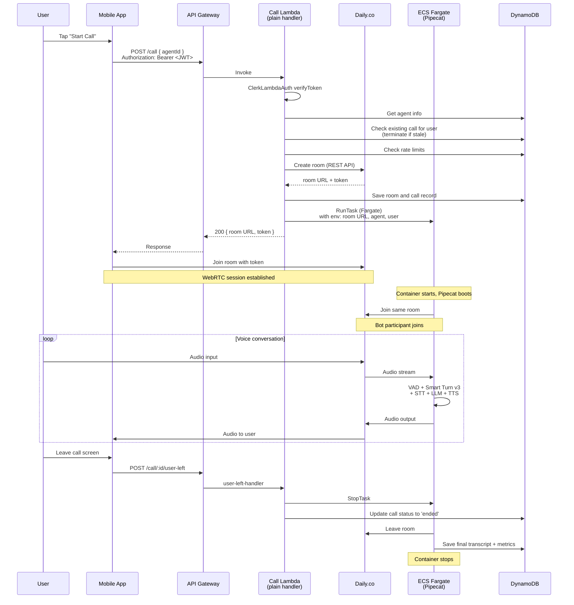

# Voice calls

Real-time, low-latency voice conversations between a user and an AI agent over WebRTC. This is the single most infrastructurally demanding feature in Menthera — it combines Daily.co for transport, Pipecat for the voice pipeline, ECS Fargate for long-lived compute, and a careful lifecycle protocol between mobile, backend, and ECS to handle starts, teardowns, and user disconnects without leaking resources.

---

## Table of contents

- [What the user experiences](#what-the-user-experiences)
- [Why ECS and not Lambda](#why-ecs-and-not-lambda)
- [End-to-end flow](#end-to-end-flow)
- [Call initiation — the backend orchestrator](#call-initiation--the-backend-orchestrator)
- [The Pipecat pipeline](#the-pipecat-pipeline)
- [The Daily.co SFU pattern](#the-dailyco-sfu-pattern)
- [The `user-left` teardown protocol](#the-user-left-teardown-protocol)
- [VPC and networking](#vpc-and-networking)
- [Context-aware idle prompts](#context-aware-idle-prompts)
- [Known gaps](#known-gaps)
- [File reference](#file-reference)

---

## What the user experiences

1. The user opens an agent screen and taps the "Start Call" button.
2. A connecting animation plays for 2–5 seconds while the backend provisions the call.
3. The call screen appears in full-screen modal mode. The agent's avatar is visible and the app shows that the microphone is active.
4. The user speaks naturally. There is no push-to-talk, no on-screen "I'm done" button — the system detects when the user has finished a turn and the agent responds.
5. The agent's voice plays through the device speaker (or Bluetooth headset) with natural cadence. The avatar animates subtly to show the bot is speaking.
6. Silence is respected — if the user is processing something emotionally heavy, the agent does not interrupt after 2 seconds of silence. The idle timeout is context-aware.
7. When the user ends the call (closes the screen, backgrounds the app, loses connectivity), the voice agent disconnects and the conversation is saved.

The quality bar is a Google Meet-level experience: low latency (<500 ms end-to-end perceived), natural turn-taking, and minimal setup friction.

---

## Why ECS and not Lambda

Every other request handler in Menthera runs on Lambda. Voice calls are the single exception, running on ECS Fargate instead. There are four reasons:

### 1. Long-lived connections

A voice call is a persistent WebRTC session that can last 5 seconds or 30 minutes. Lambda has a hard maximum execution time of 15 minutes, which puts an upper bound on call length even if nothing else goes wrong. ECS Fargate tasks can run for hours or days without being killed by the platform.

### 2. WebRTC signaling state

WebRTC is a stateful protocol. The Pipecat process needs to maintain the connection to the Daily SFU, track the peer's media state, and respond to ICE candidate changes. Lambda's execution model — one invocation per request, no shared memory between invocations — is fundamentally incompatible with this kind of per-connection state.

### 3. Python ML dependencies

The voice pipeline uses **Smart Turn v3**, a Whisper-based turn detection model that runs locally in the container (no external API call per turn). This brings in PyTorch and the `transformers` library as dependencies. PyTorch alone is ~700 MB on disk (CPU-only build; the full CUDA version is 2+ GB). Lambda's 250 MB layer limit and 10 GB container image limit are technically large enough for the CPU build, but the cold-start time would be brutal — loading PyTorch into a fresh Lambda takes 5–8 seconds. On ECS, the task starts once and keeps the model warm for the lifetime of the call.

### 4. Cost shape

Lambda bills per 1ms of execution time. A 20-minute voice call with 50% active compute time would cost around $0.40 per call. ECS Fargate at 256 CPU / 512 MB bills around $0.012 per minute (us-east-1), so a 20-minute call costs around $0.24. The economics flip in ECS's favour above about 5 minutes of active compute per invocation.

### The trade-off

ECS Fargate tasks take 15–30 seconds to start from cold (image pull, container init, Pipecat startup, model loading). Lambda cold starts are 500 ms – 2 s. For a voice call this is hidden by the connecting animation, but it does mean the user sees a connection screen for longer than they would for a text message. The call handler optimizes for this — it sends the ECS `RunTask` call and immediately returns the Daily room URL, so the mobile client can join the Daily room before the ECS task has fully started. When the Pipecat task joins the same room a few seconds later, it is treated as a new participant, and the conversation begins.

---

## End-to-end flow



Four parallel things are happening:

1. **Call orchestration** — the backend provisions a Daily room and launches an ECS task.
2. **Mobile joins Daily** — the mobile app joins the room via Daily's React Native SDK.
3. **ECS joins Daily** — the Pipecat container joins the same room a few seconds later and becomes the AI participant.
4. **Teardown** — the mobile client signals `user-left` when it leaves the screen, and the backend stops the ECS task immediately to prevent quota leak.

The non-obvious detail is that **mobile and ECS do not connect directly** — they both connect to Daily's SFU, which handles the media routing between them. See [The Daily.co SFU pattern](#the-dailyco-sfu-pattern) below.

---

## Call initiation — the backend orchestrator

The entry point is [`backend/src/services/call/handler.ts`](../../backend/src/services/call/handler.ts). Unlike most of the Menthera Lambdas, this is **not** a Hono app — it is a plain Lambda handler that takes `APIGatewayProxyEvent` directly:

```typescript
export const handler = async (
  event: APIGatewayProxyEvent
): Promise<APIGatewayProxyResult> => {
  // ...

  // Verify authentication and extract userId from token
  const authHeader = event.headers.Authorization || event.headers.authorization;
  const authContext = await ClerkLambdaAuth.verifyToken(authHeader);
  userId = authContext.userId;

  // ... parse body, validate agentId ...
};
```

The plain-handler shape is why this service uses `ClerkLambdaAuth.verifyToken()` instead of the Hono middleware — Hono middleware only runs inside Hono apps. The lightweight helper extracts the `sub` claim from the JWT so the handler can look up the user. **This is the known gap path** — see [`features/authentication.md`](./authentication.md#known-gap--call-handler-jwt-signature-not-verified). In production this needs to switch to full signature verification.

### Orchestration steps

After auth, the handler runs through a sequence of orchestration steps via helpers in [`call/helpers.ts`](../../backend/src/services/call/helpers.ts):

1. **`getAgentInfo(agentId)`** — load the agent's row from the `agents` table. This gives us the persona, voice configuration, and LLM model choice.
2. **`getActiveCallForUser(userId)`** — check if the user already has an active call. If yes, **`terminateExistingCall`** stops it. A user can only be in one call at a time; starting a new one supersedes any stale session. This guards against the case where a previous call did not tear down cleanly.
3. **Rate limit check** — using the DynamoDB-backed `RateLimiter` against the `rate_limits` table. Exceeding the limit returns 429 immediately.
4. **`getExistingRoom(userId, agentId)`** — check the `rooms` table. Menthera maintains one room per user-agent pair, reused across calls for conversation continuity in the Daily dashboard. If an existing room is still valid, reuse it; otherwise create a fresh one.
5. **`createDailyRoom()`** — call Daily.co's REST API to provision a new room with a short-lived TTL.
6. **`createDailyToken()`** — generate a Daily room access token for the user. Tokens are scoped to the specific room and expire after the call.
7. **`saveRoomToDatabase()`** and **`saveCallToDatabase()`** — persist the room reference and create a new row in the `calls` table with status `connecting`.
8. **`startEcsTask()`** — call ECS `RunTask` to launch a Fargate container from the Pipecat image. Environment variables include the room URL, the user ID, the agent ID, the conversation history hint, and the user's BYOK API key if they are a BYOK subscriber.
9. **`sendBotAssignment()`** — mark the call record with the ECS task ARN so future status updates can find it.

The handler returns `200` with the room URL and user token. The mobile client can now join the room, and a few seconds later the ECS task will come up and join it too.

### Why return before ECS is ready

This is a latency optimization. If the handler waited for the ECS task to be fully ready before returning, the user would see a 15–30 second connecting screen. By returning the room URL immediately, the mobile client can join Daily and start its own side of the connection in parallel with ECS startup. When the bot finally joins, the user perceives a 1–2 second transition from "connecting" to "in call" — because most of that time was hidden behind the mobile-side join flow.

The trade-off is that for a brief window, the user is in the room alone. The mobile UI handles this with a "connecting" state until the bot participant appears in the Daily room, at which point the UI transitions to the active call state.

---

## The Pipecat pipeline

The voice agent runs inside [`backend/pipecat/bot.py`](../../backend/pipecat/bot.py), a Python script built on [Pipecat](https://github.com/pipecat-ai/pipecat) `0.0.104`. Pipecat is a voice-AI framework that provides a pipeline abstraction for wiring together audio transport, VAD, turn detection, STT, LLM, and TTS into a single end-to-end processor chain.

### The pipeline stages


1. **`DailyTransport`** — bidirectional audio I/O with the Daily room. Handles WebRTC signaling, participant events, and audio frame delivery in both directions.

2. **`SileroVADAnalyzer`** — [Silero VAD](https://github.com/snakers4/silero-vad) is a lightweight voice activity detection model that classifies each audio chunk as speech or silence. Used to skip transcribing silence (saves STT cost and avoids hallucinated transcriptions).

3. **`LocalSmartTurnAnalyzerV3`** — [Smart Turn v3](https://github.com/pipecat-ai/smart-turn) is a Whisper-based turn detection model that decides whether the user has finished speaking. This is not the same as VAD — VAD detects speech vs silence, but turn detection also has to decide whether a pause is "user is thinking" (don't interrupt) or "user is done" (respond now). Smart Turn v3 looks at prosody, sentence structure, and contextual cues. It runs locally in the container (no API call per turn) which is why the pipecat container needs PyTorch.

4. **`CartesiaSTTService`** — speech-to-text via [Cartesia](https://cartesia.ai/). The user's audio, after turn detection has flagged a complete turn, is sent to Cartesia for transcription. Cartesia was chosen over Deepgram and Whisper for its low-latency streaming STT.

5. **`GoogleLLMService` or `AnthropicLLMService`** — the LLM call. Which one is used depends on the agent's configured model. Google is used with a user BYOK key (matching the text chat BYOK constraint); Anthropic is used with the system secret. OpenAI is supported by Pipecat but not currently wired into this codebase's bot.

6. **`CartesiaTTSService`** — text-to-speech. The LLM's response is streamed to Cartesia for voice synthesis. Cartesia produces natural-sounding voices with per-agent voice selection, configurable via the agent row in DynamoDB.

7. **`DailyTransport`** — back out to the Daily room. The synthesized audio is published into the room and Daily routes it to the mobile client.

### Why run VAD and turn detection locally instead of using Daily's built-in turn events

Daily provides basic voice activity events, but they are not sophisticated enough for natural conversation. Daily can tell you "user is speaking" or "user stopped speaking", but "user stopped speaking" fires on any pause longer than 300 ms — which includes thinking pauses, breath pauses, and the tail ends of sentences. Responding to those pauses means interrupting the user constantly.

Smart Turn v3 solves this by looking at prosody and syntactic completeness. A sentence that ends with rising intonation and a verb is usually not complete ("I was thinking maybe we should..."). A sentence that ends with falling intonation and a period-like cadence is complete ("...and that's what happened."). The model is trained to distinguish these.

The cost is model size and inference time per turn. Smart Turn v3 adds roughly 100–200 ms of latency to each turn decision, and the model is ~200 MB on disk. For a mental health chat where unnecessary interruption is actively harmful to the experience, this is the right trade-off.

### Pipeline wiring

The pipeline is constructed in bot.py with standard Pipecat idioms:

```python
pipeline = Pipeline([
    transport.input(),
    vad,
    smart_turn,
    stt,
    llm_context_aggregator,
    llm,
    tts,
    transport.output(),
])

task = PipelineTask(pipeline, params=PipelineParams(...))
runner = PipelineRunner()
await runner.run(task)
```

(The actual code has more moving parts — frame processors for conversation state tracking, RTVI support, user idle handling. See [`bot.py`](../../backend/pipecat/bot.py) for the full construction.)

---

## The Daily.co SFU pattern

Daily.co uses a **Selective Forwarding Unit (SFU)** architecture rather than a mesh or MCU. This means:

- Every participant connects to Daily's SFU, not to each other.
- The SFU receives each participant's audio/video stream and forwards copies to the other participants.
- There is no peer-to-peer connection between the mobile client and the ECS task.

### Why SFU

For a two-participant call (one user, one bot), a direct peer-to-peer WebRTC connection would work and would be cheaper. SFU is chosen anyway because:

1. **NAT traversal is Daily's problem, not ours.** WebRTC peer-to-peer requires STUN/TURN for NAT traversal. With an SFU, we upload to a known public endpoint and download from a known public endpoint. The mobile client and ECS container never need to find each other.
2. **The bot has a stable public IP via ECS's NAT Gateway (or direct public IPs for Fargate in public subnets).** Either way, it is a server-side outbound connection to Daily, which always works.
3. **Daily handles recording, bandwidth adaptation, and call quality metrics.** These are non-trivial to build on a raw WebRTC mesh.
4. **Scaling to group calls is free.** If Menthera ever supports multi-user voice chat (group therapy-style), the SFU pattern extends to N participants without changing anything. A mesh would not.

### Consequences

The mobile client sees the bot as a normal remote participant in the Daily room — same API as it would use for a human remote participant. The ECS container is symmetric — it sees the user as a normal remote participant. Neither side knows or cares that the other is a different kind of endpoint. All the routing happens inside Daily.

This also means Menthera does not need its own WebRTC stack on either side. The mobile client uses `@daily-co/react-native-daily-js`, and the ECS container uses Pipecat's `DailyTransport` — both wrap Daily's WebRTC SDK. We never touch RTP, SDP, or ICE directly.

---

## The `user-left` teardown protocol

This is the single cleverest edge-case handling in the voice feature, because it solves a real cost problem that production voice apps run into.

### The problem

ECS Fargate bills per minute of container runtime. If a user closes the app mid-call (phone rings, they background the app, they lose connectivity), the Pipecat container will keep running until one of these triggers it to stop:

- **Daily's participant timeout** — Daily eventually decides the room is dead when the user disconnects. Default timeout is ~60 seconds of no participants.
- **The Pipecat `UserIdleProcessor`** — detects no user speech for N seconds and ends the session. Default is similar.
- **ECS task max duration** — set in the task definition. Default is long.

In the worst case, a user abandoning the app leaks 1–2 minutes of ECS runtime per incident. At scale, this adds up. At $0.012/minute, 10,000 abandoned calls per month would leak ~$120.

### The solution

The mobile app fires an explicit `POST /call/:id/user-left` signal when the user navigates away from the call screen. The [`AuthGuard`](../../mobile/components/auth/AuthGuard.tsx) component has an effect that detects unmount and fires this request:

```typescript
// Mobile-side user-left effect
useEffect(() => {
  return () => {
    if (pendingCallId) {
      fetch(`${API_URL}/call/${pendingCallId}/user-left`, {
        method: 'POST',
        headers: { Authorization: `Bearer ${token}` },
      });
    }
  };
}, [pendingCallId]);
```

The request goes to [`backend/src/services/call/user-left-handler.ts`](../../backend/src/services/call/user-left-handler.ts), which:

1. Validates the JWT (via `ClerkLambdaAuth` — same known gap as the main call handler).
2. Looks up the call record in DynamoDB.
3. Calls ECS `StopTask` on the Pipecat task ARN stored in the call record.
4. Updates the call status to `ended` with the end timestamp.

The ECS task receives a SIGTERM and Pipecat shuts down cleanly within a few seconds. The `GRACEFUL_SHUTDOWN_CONFIG` timeout setting in [`backend/src/shared/config/timeouts.config.ts`](../../backend/src/shared/config/timeouts.config.ts) controls how long ECS waits before force-killing.

### Why this pattern matters for a showcase

The `user-left` signal is the kind of edge case that only shows up in production with real users behaving in real ways (hanging up, backgrounding, losing signal). Getting it right upfront — before you have a billing surprise — is a signal of someone who has thought about operational cost. For a portfolio reviewer, this is the kind of detail that says "I've worked on production voice apps before" even if you haven't.

---

## VPC and networking

The Call service is the only service in Menthera that needs a VPC. The reason is ECS Fargate: ECS tasks need network connectivity to ECR (for pulling images), CloudWatch Logs (for log shipping), Secrets Manager (for API keys), and DynamoDB (for reads/writes), as well as outbound internet connectivity for Daily.co and LLM providers.

[`CallStack`](../../backend/lib/stacks/call-stack.ts) provisions a dedicated VPC:

```typescript
const vpc = new ec2.Vpc(this, 'CallVpc', {
  maxAzs: 2,
  natGateways: environment === 'production' ? 1 : 0,
});

vpc.addGatewayEndpoint('S3Endpoint', {
  service: ec2.GatewayVpcEndpointAwsService.S3,
});
[
  ec2.InterfaceVpcEndpointAwsService.ECR,
  ec2.InterfaceVpcEndpointAwsService.ECR_DOCKER,
  ec2.InterfaceVpcEndpointAwsService.CLOUDWATCH_LOGS,
].forEach((svc, i) => vpc.addInterfaceEndpoint(`Endpoint${i}`, { service: svc }));
```

### VPC endpoints instead of NAT Gateway routing

Notice the VPC endpoint construction. Rather than routing all AWS API calls through a NAT Gateway (which costs $0.045/hour plus data transfer), VPC endpoints keep the traffic inside the AWS network. ECR image pulls, CloudWatch log writes, and DynamoDB operations all go through endpoints instead of the public internet. This saves significant data transfer cost when the ECS tasks are busy.

The NAT Gateway is only provisioned in production (`natGateways: environment === 'production' ? 1 : 0`), and is only used for outbound traffic to Daily.co and the LLM providers — which must go over the public internet because no VPC endpoint exists for them.

### Dev vs production

In development, there is no NAT Gateway, so ECS tasks cannot make outbound calls to the public internet. This means **voice calls do not work in local dev deploys** — they only work in production. This is a deliberate cost trade-off: NAT Gateways cost money even when idle, and developers can test the call flow against a deployed dev environment or against a dedicated prod-like environment with NAT enabled.

---

## Context-aware idle prompts

This is a subtle but important detail in [`bot.py`](../../backend/pipecat/bot.py) that shows how the voice feature is tuned for mental health use. Most voice bots handle silence by playing a scripted "Are you still there?" after a fixed timeout. Menthera does something more nuanced.

### The state tracker

The bot tracks what kind of thing it just said:

```python
class BotActionType(Enum):
    GREETING = "greeting"
    QUESTION = "question"           # Bot asked something → shorter wait feels natural
    STATEMENT = "statement"         # Bot made a statement → medium wait
    EMOTIONAL_SUPPORT = "emotional" # Bot offered support → longer wait, softer prompt
    REFLECTION = "reflection"       # Bot summarized user's words → medium wait
```

After each bot response, `ConversationState.update_from_assistant()` classifies the action by matching linguistic cues:

```python
if text.rstrip().endswith("?"):
    self.last_bot_action = BotActionType.QUESTION
elif any(phrase in text_lower for phrase in [
    "i understand", "that sounds", "i hear you",
    "that must be", "i'm here for you", "it's okay",
    # ...
]):
    self.last_bot_action = BotActionType.EMOTIONAL_SUPPORT
    self.emotional_moment = True
```

### Why it matters

When the user falls silent:

- **After a question** — wait ~3 seconds, then gently re-prompt.
- **After a statement** — wait ~6 seconds.
- **After emotional support** — wait ~15 seconds, then check in softly (never "are you still there?", more like "take your time").

The emotional support case is the important one. If a user has just shared something heavy and needs 10 seconds to process, an interrupting bot breaks the therapeutic moment. Most voice bots get this wrong because they treat all silence identically. Menthera's idle handler respects that silence is sometimes valuable.

This is the kind of small detail that distinguishes a well-designed voice experience from a generic one. It does not require ML, does not require a huge amount of code, and pays off directly in how the product feels.

---

## Known gaps

### 1. Call handler JWT signature verification

As covered in [`authentication.md`](./authentication.md#known-gap--call-handler-jwt-signature-not-verified), the call handlers (`handler.ts`, `user-left-handler.ts`) use `ClerkLambdaAuth.verifyToken()` which decodes the JWT and checks expiry but does not verify the signature. A forged JWT with a valid `exp` claim would pass verification on these endpoints. This must be fixed before production deployment.

### 2. ECS task launch is not idempotent

If the call Lambda's `startEcsTask()` succeeds but the handler crashes before returning the response, the ECS task will be running but the mobile client will not know about it. The next call attempt from the same user will hit `terminateExistingCall` and clean it up, but there is a window where a zombie task could exist. A production hardening would add a claim-check pattern or use SQS FIFO with deduplication.

### 3. Daily room reuse across environments

The `rooms` table stores one room per user-agent pair and reuses it across sessions. This is good for continuity (Daily dashboard sees "one room with many calls" instead of "many rooms"), but it means a dev environment and a prod environment sharing the same `rooms` table would collide on room names. The current setup keys tables by environment prefix (`${environment}-rooms`) so this is not an actual problem, but it is something to know if you ever consolidate tables across environments.

### 4. No graceful reconnection

If the user's network drops mid-call, their Daily connection disconnects. The Pipecat container will keep running and will eventually time out via its `UserIdleProcessor`. The mobile app does not attempt to reconnect to the same room — the user starts a new call, and the `terminateExistingCall` logic cleans up the old one. A more polished version would detect network drops and attempt to rejoin the existing room within a grace window.

### 5. Cold-start latency on ECS

Fargate tasks take 15–30 seconds to start from cold. The mobile UI hides most of this behind the connecting animation, but a user who is already on the agent screen and taps "Start Call" still waits a noticeable amount of time. Options to reduce this:

- **Pre-warm a pool of ECS tasks.** Keep N tasks running idle, ready to receive a call assignment. Costs money during idle time; amortises well under high concurrency.
- **Use Fargate Spot for pre-warmed tasks.** Lower cost, but tasks can be reclaimed with 2 minutes notice.
- **Switch to a longer-lived process pool.** Run Pipecat as a persistent service with a work queue. Better cold start but more operational complexity.

None of these are implemented. The current approach accepts the cold start for the simpler architecture.

---

## File reference

### Mobile

- [`mobile/app/call/[agentId].tsx`](../../mobile/app/call/[agentId].tsx) — Full-screen call modal, handles Daily room joining
- [`mobile/hooks/useStartCall.ts`](../../mobile/hooks/useStartCall.ts) — POST to `/call` and navigation to call screen
- [`mobile/hooks/useDaily.ts`](../../mobile/hooks/useDaily.ts) — Daily React Native SDK wiring
- [`mobile/components/auth/AuthGuard.tsx`](../../mobile/components/auth/AuthGuard.tsx) — Contains the `user-left` unmount effect
- [`mobile/components/animations/AudioReactiveOrb.tsx`](../../mobile/components/animations/AudioReactiveOrb.tsx) — Avatar animation driven by audio level
- [`mobile/components/animations/ConnectingAnimation.tsx`](../../mobile/components/animations/ConnectingAnimation.tsx) — The connecting screen the user sees during ECS cold start

### Backend — orchestration

- [`backend/src/services/call/handler.ts`](../../backend/src/services/call/handler.ts) — Main call initiation Lambda (plain handler, not Hono)
- [`backend/src/services/call/helpers.ts`](../../backend/src/services/call/helpers.ts) — All the helper functions: `createDailyRoom`, `startEcsTask`, `terminateExistingCall`, etc.
- [`backend/src/services/call/user-left-handler.ts`](../../backend/src/services/call/user-left-handler.ts) — Stops the ECS task on user disconnect
- [`backend/src/services/call/processor.ts`](../../backend/src/services/call/processor.ts) — Post-call processor that finalises call records
- [`backend/src/services/call/health.ts`](../../backend/src/services/call/health.ts) — Health check for the call service

### Backend — Pipecat

- [`backend/pipecat/bot.py`](../../backend/pipecat/bot.py) — The main voice pipeline construction and the `ConversationState` tracker
- [`backend/pipecat/main.py`](../../backend/pipecat/main.py) — ECS task entry point
- [`backend/pipecat/config.py`](../../backend/pipecat/config.py) — Bot configuration loaded from environment variables
- [`backend/pipecat/db_client.py`](../../backend/pipecat/db_client.py) — DynamoDB client for reading agent config and writing call metrics
- [`backend/pipecat/Dockerfile`](../../backend/pipecat/Dockerfile) — Container image definition
- [`backend/pipecat/requirements.txt`](../../backend/pipecat/requirements.txt) — Python dependencies including `pipecat-ai[daily,google,cartesia,silero,openai,anthropic]==0.0.104` and CPU-only PyTorch

### Backend — CDK infrastructure

- [`backend/lib/stacks/call-stack.ts`](../../backend/lib/stacks/call-stack.ts) — VPC, ECS cluster, Fargate task definition, IAM roles, API Gateway routes
- [`backend/lib/constructs/call-alarms.ts`](../../backend/lib/constructs/call-alarms.ts) — CloudWatch alarms construct for ECS task failures and call metrics

### DynamoDB tables touched by this flow

- `calls` — Primary call records with status, duration, and ECS task ARN
- `rooms` — One Daily.co room per user-agent pair, reused across sessions
- `agents` — Agent personas with voice configuration (Cartesia voice ID) and LLM model choice
- `users` — BYOK API key lookup, quota enforcement
- `rate_limits` — Per-user call rate limiting
- `user_activity` — Call start/end events written for engagement tracking
