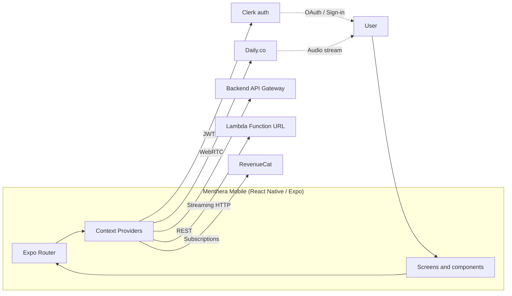

# Menthera Mobile

React Native mobile client for Menthera — a voice-enabled AI companion for mental health conversations. Built with Expo 54 and the React Native new architecture, using Clerk for authentication, RevenueCat for subscriptions, Daily.co for voice calls, and the Vercel AI SDK for streaming chat.

This is the mobile half of the Menthera system. The AWS backend (CDK + Lambda + ECS) is the sibling `../backend/` directory in this monorepo. For a full-system overview covering how both halves fit together, see the top-level [`README.md`](../README.md).

---

## Table of contents

- [What this is](#what-this-is)
- [Architecture at a glance](#architecture-at-a-glance)
- [Tech stack](#tech-stack)
- [Project structure](#project-structure)
- [How it works](#how-it-works)
- [Key design decisions](#key-design-decisions)
- [Getting started](#getting-started)
- [Configuration reference](#configuration-reference)
- [Before first production build](#before-first-production-build)
- [What is not in this repository](#what-is-not-in-this-repository)
- [License](#license)

---

## What this is

Menthera lets users have voice calls and text conversations with AI personas tuned for supportive mental health dialogue. The mobile app is the primary surface:

- **Authenticated text chat** with streaming LLM responses rendered as markdown.
- **Voice calls** over WebRTC via Daily.co, with the backend launching a Python voice agent on demand.
- **Structured psychometric quests** across five categories (career, finance, health, relationships, wellness).
- **Achievements and engagement** — activity tracking, streaks, and unlockable achievements.
- **BYOK (Bring Your Own Key) subscription tier** via RevenueCat, letting users supply their own LLM API keys for unlimited usage.

The app runs on iOS and Android (and the web target is enabled in Expo config). It is a single TypeScript codebase using Expo Router for file-based navigation and React Context for state.

---

## Architecture at a glance



State is composed from six top-level React Context providers in `providers/`:

| Provider | Responsibility |
| --- | --- |
| `AppProvider` | Root app-level state, network status, and global feature flags |
| `AgentsProvider` | List of available AI personas and the currently selected agent |
| `AgentPreferencesProvider` | Per-user, per-agent settings (memory opt-in, voice preferences) |
| `ChatProvider` | Active chat session, streaming state, message history, and the text-chat network layer |
| `EngagementProvider` | Activity tracking, streaks, and home-screen engagement surface |
| `QuestProvider` | Quest sessions, task progression, and scoring state |

The providers are composed in `app/_layout.tsx` around the Expo Router `<Slot />`, so every route has access to the full state tree.

---

## Tech stack

**Framework and runtime**
- [Expo](https://expo.dev/) 54 with the React Native new architecture enabled
- [Expo Router](https://docs.expo.dev/router/introduction/) for file-based navigation
- [React Native](https://reactnative.dev/) — TypeScript throughout
- [react-native-worklets](https://github.com/margelo/react-native-worklets) and [reanimated](https://docs.swmansion.com/react-native-reanimated/) for high-performance animations
- [@shopify/react-native-skia](https://shopify.github.io/react-native-skia/) for advanced drawing

**Authentication**
- [Clerk](https://clerk.com/) via `@clerk/clerk-expo`
- `expo-auth-session` and `expo-web-browser` for OAuth flows
- `expo-secure-store` for token persistence

**AI and chat**
- [Vercel AI SDK](https://sdk.vercel.ai/) React hooks (`@ai-sdk/react`) for streaming responses
- `react-native-markdown-display` for rendering agent messages
- Streaming consumed directly from the backend Lambda Function URL (bypassing API Gateway, which does not support response streaming)

**Voice calls**
- [Daily.co](https://www.daily.co/) via `@daily-co/react-native-daily-js` and `@daily-co/react-native-webrtc`
- WebRTC sessions are initiated by the backend, which launches a Pipecat voice agent on ECS and passes the Daily room URL to both the mobile client and the agent

**Payments and subscriptions**
- [RevenueCat](https://www.revenuecat.com/) via `react-native-purchases` and `react-native-purchases-ui`

**Styling**
- [NativeWind](https://www.nativewind.dev/) — Tailwind classes on React Native components
- [twrnc](https://github.com/jaredh159/tailwind-react-native-classnames) — the parallel tailwind-native system the older parts of the codebase use
- Custom design tokens in `lib/styles/core/tokens` composed into a component-facing API in `constants/Theme.tsx`

**Storage**
- `expo-secure-store` for auth tokens and sensitive values
- `@react-native-async-storage/async-storage` for general persistence

**Lists and performance**
- [@shopify/flash-list](https://shopify.github.io/flash-list/) for virtualized lists (chat history, calls list, agent list)

---

## Project structure

```
Menthera-Mobile/
├── app/                              # Expo Router — every file is a route
│   ├── _layout.tsx                   #   Root layout: providers, auth guard, splash
│   ├── (tabs)/                       #   Tab bar group
│   │   ├── _layout.tsx               #     Tab bar config
│   │   ├── index.tsx                 #     Home
│   │   ├── chat.tsx                  #     Chat list
│   │   └── calls.tsx                 #     Calls list
│   ├── agent/[id].tsx                #   Agent detail
│   ├── auth/welcome.tsx              #   Sign-in screen
│   ├── call/[agentId].tsx            #   Active voice call
│   ├── onboarding/                   #   First-run onboarding
│   ├── quest/[agentId].tsx           #   Active quest session
│   ├── quest-report/[agentId].tsx    #   Quest completion report
│   ├── achievements.tsx              #   Achievements screen
│   └── profile.tsx                   #   Profile and settings
├── components/                       # Reusable UI
│   ├── ui/                           #   Primitive widgets (buttons, inputs, avatars)
│   ├── cards/                        #   Composite card layouts
│   ├── chat/                         #   Chat-specific components
│   ├── quest/                        #   Quest-specific components
│   ├── modals/                       #   Bottom sheets and modals
│   ├── navigation/                   #   Tab bar, headers
│   ├── auth/                         #   Auth flow components
│   ├── onboarding/                   #   Onboarding steps
│   ├── screens/                      #   Screen-level compositions
│   ├── animations/                   #   Reanimated / Skia effects
│   ├── common/                       #   Small shared pieces
│   └── shared/                       #   Cross-feature primitives
├── providers/                        # React Context providers (composed in _layout.tsx)
│   ├── AppProvider.tsx
│   ├── AgentsProvider.tsx
│   ├── AgentPreferencesProvider.tsx
│   ├── ChatProvider.tsx
│   ├── EngagementProvider.tsx
│   └── QuestProvider.tsx
├── hooks/                            # Custom hooks
│   ├── apis/                         #   Backend API hooks (useChat, useStartCall, etc.)
│   ├── auth/                         #   useOAuth, useSignIn, etc.
│   ├── user/                         #   User-state hooks
│   └── use*.ts                       #   Feature hooks (usePaywall, useSubscription, useDaily, useChat, etc.)
├── lib/                              # Non-UI utilities and config
│   ├── api/                          #   Backend API client config
│   ├── clerk/                        #   Clerk setup helpers
│   ├── revenuecat/                   #   Subscription config and product IDs
│   ├── styles/                       #   Design token source of truth
│   ├── storage/                      #   Storage wrappers
│   ├── routes.ts                     #   Route name constants
│   ├── tailwind.ts                   #   Tailwind compile target
│   ├── utils/                        #   General utilities
│   └── types/                        #   Shared types
├── constants/
│   ├── Colors.ts                     #   Palette
│   └── Theme.tsx                     #   Theme composition layer (see below)
├── assets/                           # Fonts, images, icons, splash, adaptive icon
├── .github/workflows/                # EAS preview + production build workflows
├── app.config.ts                     # Expo config (dynamic)
├── eas.json                          # EAS build profiles
├── .env.example                      # Environment template
├── package.json
└── tsconfig.json
```

### A note on `constants/Theme.tsx`

The file has a history of being labelled "DEPRECATED" because the raw design tokens live in `lib/styles/core/tokens`. That label was misleading and has been corrected: `constants/Theme.tsx` is not a shim. It is a **theme composition layer** that builds a component-facing API on top of the raw tokens, plus style helpers (`buttonStyles`, `inputStyles`, `cardStyles`) and the `ThemeProvider` / `useTheme` React context. It is imported by 13+ files across the app.

- To add a new **primitive** (colors, spacing, sizing), edit `lib/styles/core/tokens`.
- To add a new **component-shaped helper** or theme context value, edit `constants/Theme.tsx`.

---

## How it works

### Authentication flow

1. On first launch, the root layout in `app/_layout.tsx` mounts the Clerk provider with the publishable key from `EXPO_PUBLIC_CLERK_PUBLISHABLE_KEY`.
2. If the user is unauthenticated, the router redirects to `app/auth/welcome.tsx`, which offers sign-in via email or OAuth (Google, Apple) using `expo-auth-session` with the URL scheme set to `menthera` (or whatever `EXPO_PUBLIC_REDIRECT_SCHEME` overrides it to).
3. After sign-in, Clerk issues a JWT, which is cached by `expo-secure-store` and attached as a `Bearer` token on every backend request via an authenticated fetch hook.
4. The backend trusts Clerk tokens and validates them using `@clerk/backend` inside a Hono middleware.

### Text chat flow

1. The user opens a chat with an agent from the tab bar.
2. `ChatProvider` initialises the session and loads prior messages from the backend.
3. When the user sends a message, the provider POSTs to the backend **Lambda Function URL** (`EXPO_PUBLIC_CHAT_URL`) — not the REST API — because only Function URLs support response streaming on AWS.
4. The backend streams the LLM tokens back as the response body. The app consumes this stream using `@ai-sdk/react` hooks and renders it with `react-native-markdown-display` as the tokens arrive.
5. On completion, the message history is persisted server-side and the chat scroll position follows the new content.

### Voice call flow

1. The user taps "Start Call" on an agent page. `useStartCall` posts to the backend `/call` endpoint through API Gateway.
2. The backend creates a Daily.co room, launches a Pipecat voice agent on ECS Fargate with the room URL, and returns the room URL to the client.
3. The client navigates to `app/call/[agentId].tsx`, which joins the same Daily room via `@daily-co/react-native-daily-js`.
4. The ECS-side Pipecat agent and the mobile client are now both in the same room. Audio flows peer-to-peer via Daily while Pipecat runs the voice pipeline (VAD, turn detection, LLM, TTS) on the server side.
5. When the user leaves the screen, an `AuthGuard` effect fires a `user-left` POST to the backend so the ECS task can shut down gracefully — preventing quota waste if the user backgrounds the app.

### Quest flow

1. Quests are fetched from the backend by `QuestProvider` on mount.
2. Starting a quest creates a session server-side and navigates to `app/quest/[agentId].tsx`.
3. Quests are structured conversations — each task is a message exchange between the user and an agent. The UI pipes through the same `ChatProvider` plumbing.
4. On completion, the backend computes psychometric scores and the client navigates to `app/quest-report/[agentId].tsx` to render them.

### Subscription and paywall flow

1. `useSubscription` and `useEntitlements` wrap `react-native-purchases` to read the user's current entitlement status from RevenueCat.
2. Features that require the BYOK tier check the `BYOK` entitlement via `useEntitlements`.
3. If unentitled, `usePaywall` opens the RevenueCat UI paywall component (`react-native-purchases-ui`) — a native, template-driven paywall that Menthera does not have to build itself.
4. RevenueCat webhooks on the backend (`UsersStack` in the backend repo) update the user's subscription state in DynamoDB.

---

## Key design decisions

### Expo Router with providers composed at the root layout

Using Expo Router means navigation is file-based: the directory structure under `app/` **is** the route map. This trades away some configurability for a large win in legibility — a reviewer opening `app/` in GitHub can see every screen at a glance without reading any router registration code. Providers are composed once in `app/_layout.tsx` so every route has the same context tree.

### Lambda Function URL for chat, API Gateway for everything else

The backend has two HTTP entry points: API Gateway for authenticated REST endpoints, and a Lambda Function URL for streaming chat. The mobile app hits both, with two separate env vars (`EXPO_PUBLIC_BASE_URL` / `EXPO_PUBLIC_API_URL` for REST, `EXPO_PUBLIC_CHAT_URL` for streaming). This is driven by an AWS platform limitation — API Gateway REST does not support streaming responses — and is worth knowing because it explains why the chat code path looks different from everything else in the app.

### Six providers instead of a single global store

No Redux, no Zustand, no MobX. Just React Context, split by concern. The trade-off is that each provider holds its own state shape and callers import the specific provider they need. The benefit is zero cognitive load for new readers — state flows follow standard React patterns and every provider file is 100–300 lines that can be read in one sitting.

### NativeWind and twrnc coexist intentionally

The codebase has both `nativewind` (Tailwind classes as a Babel plugin on native components) and `twrnc` (a runtime `tw\`...\`` tagged-template API). NativeWind is used in newer code because it matches the Tailwind-on-web developer experience, but twrnc is still present in older components. Rather than force a single migration, both are kept working. New components should prefer NativeWind.

### Theme composition layer over raw tokens

Design tokens live in `lib/styles/core/tokens` as the single source of truth for colors, spacing, typography, etc. But components don't consume them directly — they go through `constants/Theme.tsx`, which reshapes them into a component-facing API and adds helpers like `buttonStyles()` and `cardStyles()`. This means the primitive tokens can be renamed or restructured without touching component code, and component-shaped helpers can evolve without polluting the primitive layer.

### RevenueCat UI paywall instead of a custom paywall

`react-native-purchases-ui` ships a native, template-driven paywall component that reads directly from the RevenueCat dashboard. Building a custom paywall would mean shipping a new release every time we want to tweak pricing copy or offer layout. Using the hosted paywall lets the product side iterate on pricing without mobile release cycles. The trade-off is less visual control.

### Graceful call teardown via `user-left` signal

Voice calls run on ECS Fargate, which is priced per task-minute. If the user closes the app mid-call, the ECS task would otherwise keep running until it hit its max timeout. An `AuthGuard` effect fires a `POST /call/:id/user-left` on unmount to signal the backend to stop the ECS task immediately. This is the kind of edge case that only shows up in production and costs real money if missed.

---

## Getting started

### Prerequisites

- Node.js 22 or later
- npm (the lockfile is npm-based)
- Either the **Expo Go** app (for quick iteration on simple screens) or a **development build** installed on your device/simulator (required for native modules — Daily.co, RevenueCat, and secure-store all need native code that Expo Go does not provide)
- Xcode (for iOS) or Android Studio (for Android)
- An EAS account at [expo.dev](https://expo.dev/)
- Accounts and keys for: Clerk, RevenueCat, and the running Menthera backend (see `Menthera-Backend` repo)

### First setup

```bash
# Clone and install
git clone <your-fork-url>
cd Menthera-Mobile
npm install

# Copy env template and fill in your values
cp .env.example .env
# Edit .env — EAS_PROJECT_ID and EXPO_OWNER are required
```

**Important:** `app.config.ts` will throw at config resolution time if `EAS_PROJECT_ID` or `EXPO_OWNER` are unset. This is intentional — the app refuses to build with placeholder identity values. Set the env vars and retry.

### Running locally

```bash
# Start the Metro bundler
npx expo start

# Run on iOS simulator
npx expo run:ios

# Run on Android emulator
npx expo run:android
```

The first `run:ios` or `run:android` builds a development client with the native modules linked. After that, only JavaScript-layer changes trigger a rebuild — Metro hot-reloads everything else.

### Building with EAS

Preview and production builds are handled by EAS. There are two GitHub workflows in `.github/workflows/`:

- `preview.yml` — internal distribution builds, triggered manually via `workflow_dispatch`
- `production.yml` — production builds with auto-submit to App Store / Play Store

Both workflows read `EXPO_OWNER`, `EAS_PROJECT_ID`, and `EXPO_TOKEN` from GitHub Environment variables and secrets — no values are hardcoded. You need to configure these in your GitHub repository's environments (`preview` and `production`) before the workflows will run.

---

## Configuration reference

All environment variables read by the app are listed in `.env.example`. The critical ones:

| Variable | Required | Description |
| --- | --- | --- |
| `EAS_PROJECT_ID` | Yes | EAS project ID from your Expo dashboard. `app.config.ts` throws if unset. |
| `EXPO_OWNER` | Yes | Your Expo account / organisation name. `app.config.ts` throws if unset. |
| `IOS_BUNDLE_IDENTIFIER` | Recommended | iOS bundle ID. Defaults to `com.example.menthera` — must be replaced before App Store submission. |
| `ANDROID_PACKAGE` | Recommended | Android package name. Same default. |
| `EXPO_PUBLIC_BASE_URL` | Yes | Backend REST API base URL (API Gateway stage). |
| `EXPO_PUBLIC_API_URL` | Yes | Some call sites read this name instead of `EXPO_PUBLIC_BASE_URL`. Set both to the same value until the naming is unified. |
| `EXPO_PUBLIC_CHAT_URL` | Yes | Backend Lambda Function URL for streaming chat. Different host from the REST API. |
| `EXPO_PUBLIC_CLERK_PUBLISHABLE_KEY` | Yes | Clerk publishable key. Safe to embed in client builds. |
| `EXPO_PUBLIC_REVENUECAT_API_KEY` | Yes | RevenueCat public SDK key. |
| `EXPO_PUBLIC_REDIRECT_SCHEME` | No | OAuth redirect URL scheme. Defaults to `menthera`. Must match `scheme` in `app.config.ts`. |
| `EXPO_PUBLIC_ONBOARDING_URL` | No | Optional override for the onboarding endpoint. Falls back to `EXPO_PUBLIC_BASE_URL`. |
| `EXPO_PUBLIC_PREFER_LOCALHOST` | No | Set to `"true"` for local development OAuth flows. |

All `EXPO_PUBLIC_*` variables are embedded into the client JS bundle at build time and are visible to end users. Do not put server-side secrets here — the only things in `.env` should be publishable keys and public URLs.

### Product identifiers

Bundle identifiers and RevenueCat product IDs use placeholder values (`com.example.menthera*`) in the public source. They must be replaced with real values in `app.config.ts` (via env vars) and `lib/revenuecat/config.ts` (inline) before you publish builds to App Store or Play Store. Changing a bundle identifier after a build has been submitted creates a new app listing — pick the right one before your first submission.

---

## Before first production build

A checklist of things that must happen before this app is ready for App Store / Play Store submission:

- [ ] Set real values for `EAS_PROJECT_ID` and `EXPO_OWNER` from your EAS account
- [ ] Set real values for `IOS_BUNDLE_IDENTIFIER` and `ANDROID_PACKAGE` (these become permanent once submitted)
- [ ] Replace the RevenueCat product IDs in `lib/revenuecat/config.ts` with your real product identifiers from App Store Connect and Google Play Console
- [ ] Configure production Clerk instance and set `EXPO_PUBLIC_CLERK_PUBLISHABLE_KEY` accordingly
- [ ] Point `EXPO_PUBLIC_BASE_URL`, `EXPO_PUBLIC_API_URL`, and `EXPO_PUBLIC_CHAT_URL` at your deployed production backend
- [ ] Configure RevenueCat products, offerings, and entitlements in the RevenueCat dashboard
- [ ] Set up GitHub Environments `preview` and `production` with `EXPO_OWNER`, `EAS_PROJECT_ID`, and `EXPO_TOKEN`
- [ ] Build a development client at least once and test the voice call path end-to-end on a real device (Expo Go cannot run Daily.co)
- [ ] Review and replace the placeholder assets in `assets/` (icon, splash, adaptive icon) with your own branding
- [ ] Submit test builds through EAS and verify OAuth redirect flows work with your production Clerk configuration

---

## What is not in this directory

- **The Menthera backend** — AWS CDK + Lambda + DynamoDB + ECS. Lives at `../backend/` in this monorepo.
- **Any production Clerk keys, RevenueCat keys, or backend URLs.** The `.env.example` contains placeholders; you supply real values in your own `.env`.
- **Real bundle identifiers.** Placeholders are `com.example.menthera` — must be replaced before submission.
- **Real EAS project ID or Expo owner name.** Must be supplied via environment variables; the app refuses to build without them.
- **Customer data or real conversation transcripts.** Any fixture data in the directory is synthetic.

---

## License

See the [LICENSE](../LICENSE) file at the monorepo root.
